# Multi-Repository PR Review Architecture

## Document Information

| Field | Value |
|-------|-------|
| **Version** | 1.0.0 |
| **Created** | 2025-12-09 |
| **Status** | Draft |
| **Author** | Architecture Mode |
| **Related** | [pr-review-architecture.md](./pr-review-architecture.md) |

## Executive Summary

This document defines the architecture for extending the GitHub Copilot PR review system across three repositories while **minimizing file replication**. The goal is to maintain rules centrally in the Context repository and have Backend and Frontend repositories reference these shared rules.

### Repository Landscape

| Repository | Purpose | Technology |
|------------|---------|------------|
| **Context** | Central rules, constitution, SpecKit commands | N/A (configuration only) |
| **Backend** | Application backend | Next.js / TypeScript |
| **Frontend** | Application frontend | Next.js / TypeScript |

### Key Constraints

- All repositories are in the **same GitHub organization**
- All repositories are **private**
- Backend and Frontend should use **Context rules only** (no repo-specific rules)
- Organization has **GitHub Copilot Business** subscription

---

## Architecture Options Analysis

### Option 1: GitHub Reusable Workflows

**Description**: Create a reusable workflow in the Context repository that Backend and Frontend repos call.


#### Implementation

**Context Repository** - `.github/workflows/pr-review-reusable.yml`:
```yaml
name: Reusable PR Review

on:
  workflow_call:
    inputs:
      constitution-ref:
        description: Git ref for constitution version
        required: false
        type: string
        default: main
    secrets:
      GITHUB_TOKEN:
        required: true

jobs:
  copilot-review:
    runs-on: ubuntu-latest
    steps:
      - name: Checkout calling repository
        uses: actions/checkout@v4
        
      - name: Checkout context repository
        uses: actions/checkout@v4
        with:
          repository: ${{ github.repository_owner }}/inventory-management-context
          path: .context
          ref: ${{ inputs.constitution-ref }}
          
      - name: Aggregate rules from context
        run: |
          .context/.github/scripts/aggregate-rules.sh /tmp/review-context.md
          
      - name: Request Copilot Code Review
        uses: github/copilot-code-review-action@v1
        with:
          custom-instructions-file: .context/.github/agents/speckit.pr-review.agent.md
```

**Backend/Frontend Repository** - `.github/workflows/pr-review.yml`:
```yaml
name: PR Review

on:
  pull_request:
    types: [opened, synchronize, reopened]
    branches: [main, develop]

jobs:
  review:
    uses: ORG_NAME/inventory-management-context/.github/workflows/pr-review-reusable.yml@main
    secrets:
      GITHUB_TOKEN: ${{ secrets.GITHUB_TOKEN }}
```

#### Pros
| Benefit | Description |
|---------|-------------|
| ✅ **Minimal duplication** | Only 10-15 lines in caller repos |
| ✅ **Centralized logic** | All review logic in Context repo |
| ✅ **Version control** | Can pin to specific Context repo version |
| ✅ **Easy updates** | Update once, all repos get changes |
| ✅ **Native GitHub feature** | Well-supported, documented |

#### Cons
| Limitation | Description |
|------------|-------------|
| ❌ **Cross-repo checkout required** | Must checkout Context repo in workflow |
| ❌ **Token permissions** | Needs access to read Context repo |
| ❌ **Copilot action limitation** | Custom instructions file must be in calling repo |
| ❌ **Debugging complexity** | Errors span multiple repos |

#### Critical Limitation
**The `github/copilot-code-review-action@v1` requires the custom instructions file to exist in the repository being reviewed.** This means we cannot simply point to a file in another repository.

---

### Option 2: Cross-Repository File Fetch

**Description**: Workflow in each repo fetches rule files from Context repo at runtime.


#### Implementation

**Backend/Frontend Repository** - `.github/workflows/pr-review.yml`:
```yaml
name: PR Review

on:
  pull_request:
    types: [opened, synchronize, reopened]
    branches: [main, develop]

permissions:
  contents: read
  pull-requests: write
  checks: write

jobs:
  copilot-review:
    runs-on: ubuntu-latest
    steps:
      - name: Checkout repository
        uses: actions/checkout@v4
        
      - name: Fetch rules from Context repository
        env:
          GH_TOKEN: ${{ secrets.CONTEXT_REPO_TOKEN }}
        run: |
          # Create directories
          mkdir -p .github/agents .specify/memory
          
          # Fetch files from Context repo using GitHub API
          CONTEXT_REPO="ORG_NAME/inventory-management-context"
          
          # Fetch constitution
          gh api repos/${CONTEXT_REPO}/contents/.specify/memory/constitution.md \
            --jq '.content' | base64 -d > .specify/memory/constitution.md
            
          # Fetch agent file
          gh api repos/${CONTEXT_REPO}/contents/.github/agents/speckit.pr-review.agent.md \
            --jq '.content' | base64 -d > .github/agents/speckit.pr-review.agent.md
            
          # Fetch shared context
          gh api repos/${CONTEXT_REPO}/contents/.specify/memory/agent-shared-context.md \
            --jq '.content' | base64 -d > .specify/memory/agent-shared-context.md
            
      - name: Request Copilot Code Review
        uses: github/copilot-code-review-action@v1
        with:
          custom-instructions-file: .github/agents/speckit.pr-review.agent.md
```

#### Pros
| Benefit | Description |
|---------|-------------|
| ✅ **Files in correct location** | Copilot action finds files where expected |
| ✅ **Always latest rules** | Fetches from main branch each time |
| ✅ **No submodules** | Simpler than git submodules |

#### Cons
| Limitation | Description |
|------------|-------------|
| ❌ **Requires PAT** | Need Personal Access Token with repo access |
| ❌ **More workflow code** | ~50 lines per repo vs ~10 for reusable |
| ❌ **API rate limits** | GitHub API has rate limits |
| ❌ **Secret management** | Must add CONTEXT_REPO_TOKEN to each repo |

---

### Option 3: Git Submodules

**Description**: Add Context repository as a git submodule in Backend and Frontend repos.


#### Implementation

**Setup in Backend/Frontend**:
```bash
git submodule add https://github.com/ORG_NAME/inventory-management-context.git .context
git commit -m "Add context repository as submodule"
```

**Workflow**:
```yaml
name: PR Review

on:
  pull_request:
    types: [opened, synchronize, reopened]

jobs:
  copilot-review:
    runs-on: ubuntu-latest
    steps:
      - name: Checkout with submodules
        uses: actions/checkout@v4
        with:
          submodules: recursive
          
      - name: Copy rules to expected location
        run: |
          cp -r .context/.github/agents .github/
          cp -r .context/.specify .
          
      - name: Request Copilot Code Review
        uses: github/copilot-code-review-action@v1
        with:
          custom-instructions-file: .github/agents/speckit.pr-review.agent.md
```

#### Pros
| Benefit | Description |
|---------|-------------|
| ✅ **Version pinning** | Submodule pins to specific commit |
| ✅ **No API calls** | Uses git directly |
| ✅ **Offline capable** | Works without network after clone |

#### Cons
| Limitation | Description |
|------------|-------------|
| ❌ **Developer friction** | Submodules are confusing for many developers |
| ❌ **Manual updates** | Must update submodule reference manually |
| ❌ **Clone complexity** | Requires `--recursive` flag |
| ❌ **Still needs copy step** | Files must be in expected locations |

---

### Option 4: Composite Action

**Description**: Create a composite action in Context repo that handles all setup.


#### Implementation

**Context Repository** - `.github/actions/pr-review-setup/action.yml`:
```yaml
name: PR Review Setup
description: Sets up PR review with centralized rules

runs:
  using: composite
  steps:
    - name: Checkout context repository
      uses: actions/checkout@v4
      with:
        repository: ${{ github.repository_owner }}/inventory-management-context
        path: .pr-review-context
        
    - name: Setup review files
      shell: bash
      run: |
        mkdir -p .github/agents .specify/memory
        cp .pr-review-context/.github/agents/speckit.pr-review.agent.md .github/agents/
        cp .pr-review-context/.specify/memory/constitution.md .specify/memory/
        cp .pr-review-context/.specify/memory/agent-shared-context.md .specify/memory/ 2>/dev/null || true
        cp .pr-review-context/AGENTS.md . 2>/dev/null || true
        
    - name: Aggregate rules
      shell: bash
      run: |
        .pr-review-context/.github/scripts/aggregate-rules.sh /tmp/review-context.md
```

**Backend/Frontend Repository** - `.github/workflows/pr-review.yml`:
```yaml
name: PR Review

on:
  pull_request:
    types: [opened, synchronize, reopened]
    branches: [main, develop]

permissions:
  contents: read
  pull-requests: write
  checks: write

jobs:
  copilot-review:
    runs-on: ubuntu-latest
    steps:
      - name: Checkout repository
        uses: actions/checkout@v4
        
      - name: Setup PR review
        uses: ORG_NAME/inventory-management-context/.github/actions/pr-review-setup@main
        
      - name: Request Copilot Code Review
        uses: github/copilot-code-review-action@v1
        with:
          custom-instructions-file: .github/agents/speckit.pr-review.agent.md
```

#### Pros
| Benefit | Description |
|---------|-------------|
| ✅ **Clean abstraction** | Setup logic hidden in action |
| ✅ **Minimal caller code** | ~20 lines per repo |
| ✅ **Reusable** | Standard GitHub Actions pattern |
| ✅ **Version control** | Can pin to specific version |

#### Cons
| Limitation | Description |
|------------|-------------|
| ❌ **Two checkouts** | Must checkout both repos |
| ❌ **Action maintenance** | Another file to maintain |
| ❌ **Debugging** | Errors in action harder to debug |

---

### Option 5: Organization-Level Copilot Configuration

**Description**: Configure Copilot code review at the organization level.

#### GitHub Copilot Business Capabilities

| Feature | Available | Notes |
|---------|-----------|-------|
| Organization-wide Copilot settings | ✅ Yes | Enable/disable for org |
| Repository-level custom instructions | ✅ Yes | Per-repo `.github/copilot-instructions.md` |
| Organization-level custom instructions | ❌ No | Not available in Copilot Business |
| Shared instruction files across repos | ❌ No | Each repo needs its own file |

**Conclusion**: GitHub Copilot Business does **not** support organization-level custom instructions. Each repository must have its own instruction file.

---

## Recommended Approach

### Primary Recommendation: Hybrid Composite Action + Reusable Workflow

Based on the analysis, I recommend a **hybrid approach** combining Options 1 and 4:

1. **Composite Action** for setup (fetching and placing files)
2. **Reusable Workflow** for the complete review process

This provides the best balance of:
- Minimal code in Backend/Frontend repos
- Centralized maintenance
- Proper file placement for Copilot action


---

## Implementation Plan

### Phase 1: Update Context Repository

#### Step 1.1: Create Composite Action

**File**: `.github/actions/pr-review-setup/action.yml`

```yaml
name: PR Review Setup
description: Sets up PR review environment with centralized rules from Context repository

inputs:
  context-ref:
    description: Git ref for context repository
    required: false
    default: main

runs:
  using: composite
  steps:
    - name: Checkout context repository
      uses: actions/checkout@v4
      with:
        repository: ${{ github.repository_owner }}/inventory-management-context
        path: .pr-review-context
        ref: ${{ inputs.context-ref }}
        
    - name: Create directory structure
      shell: bash
      run: |
        mkdir -p .github/agents
        mkdir -p .github/scripts
        mkdir -p .specify/memory
        
    - name: Copy rule files
      shell: bash
      run: |
        # Copy agent file
        cp .pr-review-context/.github/agents/speckit.pr-review.agent.md .github/agents/
        
        # Copy constitution
        cp .pr-review-context/.specify/memory/constitution.md .specify/memory/
        
        # Copy shared context if exists
        if [[ -f .pr-review-context/.specify/memory/agent-shared-context.md ]]; then
          cp .pr-review-context/.specify/memory/agent-shared-context.md .specify/memory/
        fi
        
        # Copy AGENTS.md if exists
        if [[ -f .pr-review-context/AGENTS.md ]]; then
          cp .pr-review-context/AGENTS.md .
        fi
        
        # Copy copilot instructions if exists
        if [[ -f .pr-review-context/.github/agents/copilot-instructions.md ]]; then
          cp .pr-review-context/.github/agents/copilot-instructions.md .github/agents/
        fi
        
        # Copy aggregation script
        cp .pr-review-context/.github/scripts/aggregate-rules.sh .github/scripts/
        chmod +x .github/scripts/aggregate-rules.sh
        
    - name: Aggregate rules
      shell: bash
      run: |
        .github/scripts/aggregate-rules.sh /tmp/review-context.md
        echo "✅ Review context generated"
        
    - name: Get constitution version
      id: constitution
      shell: bash
      run: |
        VERSION=$(grep -oP '\*\*Version\*\*: \K[0-9]+\.[0-9]+\.[0-9]+' .specify/memory/constitution.md 2>/dev/null || echo "unknown")
        echo "version=$VERSION" >> $GITHUB_OUTPUT
        echo "Constitution version: $VERSION"
```

#### Step 1.2: Create Reusable Workflow

**File**: `.github/workflows/pr-review-reusable.yml`

```yaml
name: Reusable PR Review

on:
  workflow_call:
    inputs:
      context-ref:
        description: Git ref for context repository rules
        required: false
        type: string
        default: main
      copilot-enabled:
        description: Enable Copilot code review action
        required: false
        type: boolean
        default: false

permissions:
  contents: read
  pull-requests: write
  checks: write

jobs:
  copilot-review:
    name: Copilot Code Review
    runs-on: ubuntu-latest
    timeout-minutes: 10
    
    steps:
      - name: Checkout calling repository
        uses: actions/checkout@v4
        with:
          fetch-depth: 0
          
      - name: Setup PR review environment
        uses: ${{ github.repository_owner }}/inventory-management-context/.github/actions/pr-review-setup@${{ inputs.context-ref }}
        with:
          context-ref: ${{ inputs.context-ref }}
          
      - name: Get constitution version
        id: constitution
        run: |
          VERSION=$(grep -oP '\*\*Version\*\*: \K[0-9]+\.[0-9]+\.[0-9]+' .specify/memory/constitution.md 2>/dev/null || echo "unknown")
          echo "version=$VERSION" >> $GITHUB_OUTPUT
          
      - name: Check Copilot action availability
        id: copilot_check
        run: |
          if [[ "${{ inputs.copilot-enabled }}" == "true" ]]; then
            echo "copilot_available=true" >> $GITHUB_OUTPUT
          else
            echo "copilot_available=false" >> $GITHUB_OUTPUT
          fi
          
      - name: Request Copilot Code Review
        id: review
        if: steps.copilot_check.outputs.copilot_available == 'true'
        uses: github/copilot-code-review-action@v1
        with:
          custom-instructions-file: .github/agents/speckit.pr-review.agent.md
        continue-on-error: true
        
      - name: Fallback - Post review guidelines
        if: steps.copilot_check.outputs.copilot_available == 'false' || steps.review.outcome == 'failure'
        uses: actions/github-script@v7
        with:
          script: |
            const fs = require('fs');
            const constitutionVersion = '${{ steps.constitution.outputs.version }}';
            const reviewDate = new Date().toISOString();
            const prNumber = context.issue.number;
            const callingRepo = context.repo.repo;
            
            let reviewGuidelines = '';
            try {
              const contextPath = '/tmp/review-context.md';
              if (fs.existsSync(contextPath)) {
                const fullContext = fs.readFileSync(contextPath, 'utf8');
                const instructionsMatch = fullContext.match(/## Review Instructions[\s\S]*$/);
                if (instructionsMatch) {
                  reviewGuidelines = instructionsMatch[0];
                }
              }
            } catch (error) {
              console.log('Could not read review context:', error.message);
            }
            
            const body = [
              '## 🤖 PR Review Guidelines',
              '',
              '> **Multi-Repo Review**: Rules loaded from Context repository',
              '',
              '| Field | Value |',
              '|-------|-------|',
              '| Constitution Version | ' + constitutionVersion + ' |',
              '| Review Date | ' + reviewDate + ' |',
              '| Repository | ' + callingRepo + ' |',
              '| PR Number | #' + prNumber + ' |',
              '',
              '### Validation Categories',
              '',
              '| Category | Severity |',
              '|----------|----------|',
              '| TypeScript Compliance | 🔴 CRITICAL |',
              '| Testing Requirements | 🔴 CRITICAL |',
              '| AWS Best Practices | 🟠 HIGH |',
              '| Security Standards | 🔴 CRITICAL |',
              '| Code Organization | 🟡 MEDIUM |',
              '',
              '<details>',
              '<summary>📋 Review Instructions</summary>',
              '',
              reviewGuidelines || '> See constitution for full guidelines',
              '',
              '</details>',
              '',
              '*Rules from Context repository - Constitution v' + constitutionVersion + '*'
            ].join('\n');

            await github.rest.issues.createComment({
              owner: context.repo.owner,
              repo: context.repo.repo,
              issue_number: prNumber,
              body: body
            });
            
      - name: Set check status
        if: always()
        uses: actions/github-script@v7
        with:
          script: |
            const constitutionVersion = '${{ steps.constitution.outputs.version }}';
            const copilotAvailable = '${{ steps.copilot_check.outputs.copilot_available }}' === 'true';
            const reviewOutcome = '${{ steps.review.outcome }}';
            
            let conclusion = 'neutral';
            let summary = '';
            
            if (!copilotAvailable) {
              summary = 'Manual review guidelines posted. Constitution v' + constitutionVersion;
            } else if (reviewOutcome === 'success') {
              conclusion = 'success';
              summary = 'Code review completed. Constitution v' + constitutionVersion;
            } else {
              summary = 'Review completed with fallback. Constitution v' + constitutionVersion;
            }
            
            try {
              await github.rest.checks.create({
                owner: context.repo.owner,
                repo: context.repo.repo,
                name: 'Copilot PR Review',
                head_sha: context.payload.pull_request.head.sha,
                status: 'completed',
                conclusion: conclusion,
                output: {
                  title: 'Copilot PR Review',
                  summary: summary
                }
              });
            } catch (error) {
              console.log('Failed to create check:', error.message);
            }
```

### Phase 2: Setup Backend Repository

#### Minimal Files Required

**Only ONE file needed**: `.github/workflows/pr-review.yml`

```yaml
# Backend Repository: .github/workflows/pr-review.yml
# This is the ONLY file needed - all rules come from Context repository

name: PR Review

on:
  pull_request:
    types: [opened, synchronize, reopened]
    branches:
      - main
      - develop

jobs:
  review:
    uses: ORG_NAME/inventory-management-context/.github/workflows/pr-review-reusable.yml@main
    with:
      context-ref: main
      copilot-enabled: false  # Set to true when Copilot action is available
    permissions:
      contents: read
      pull-requests: write
      checks: write
```

### Phase 3: Setup Frontend Repository

**Same single file**: `.github/workflows/pr-review.yml`

```yaml
# Frontend Repository: .github/workflows/pr-review.yml
# This is the ONLY file needed - all rules come from Context repository

name: PR Review

on:
  pull_request:
    types: [opened, synchronize, reopened]
    branches:
      - main
      - develop

jobs:
  review:
    uses: ORG_NAME/inventory-management-context/.github/workflows/pr-review-reusable.yml@main
    with:
      context-ref: main
      copilot-enabled: false  # Set to true when Copilot action is available
    permissions:
      contents: read
      pull-requests: write
      checks: write
```

---

## Files Summary

### Context Repository (Central Hub)

| File | Purpose | Lines |
|------|---------|-------|
| `.github/workflows/pr-review-reusable.yml` | Reusable workflow | ~120 |
| `.github/actions/pr-review-setup/action.yml` | Composite action for setup | ~70 |
| `.github/workflows/pr-review.yml` | Local PR review (existing) | ~334 |
| `.github/scripts/aggregate-rules.sh` | Rule aggregation (existing) | ~125 |
| `.github/agents/speckit.pr-review.agent.md` | Review agent (existing) | ~236 |
| `.specify/memory/constitution.md` | Constitution (existing) | varies |

### Backend Repository (Minimal)

| File | Purpose | Lines |
|------|---------|-------|
| `.github/workflows/pr-review.yml` | Caller workflow | **~15** |

### Frontend Repository (Minimal)

| File | Purpose | Lines |
|------|---------|-------|
| `.github/workflows/pr-review.yml` | Caller workflow | **~15** |

---

## Repository Relationship Diagram

```mermaid
flowchart TB
    subgraph ORG[GitHub Organization]
        subgraph Context[inventory-management-context]
            direction TB
            C1[📜 Constitution]
            C2[🤖 PR Review Agent]
            C3[📋 Copilot Instructions]
            C4[🔧 Aggregation Script]
            C5[♻️ Reusable Workflow]
            C6[🎯 Composite Action]
            
            C5 --> C6
            C6 --> C1
            C6 --> C2
            C6 --> C3
            C6 --> C4
        end
        
        subgraph Backend[inventory-management-backend]
            direction TB
            B1[📄 Caller Workflow<br/>15 lines only]
            B2[💻 Application Code]
        end
        
        subgraph Frontend[inventory-management-frontend]
            direction TB
            F1[📄 Caller Workflow<br/>15 lines only]
            F2[🎨 Application Code]
        end
    end
    
    B1 -.->|workflow_call| C5
    F1 -.->|workflow_call| C5
    
    style Context fill:#e8f5e9,stroke:#2e7d32
    style Backend fill:#e3f2fd,stroke:#1565c0
    style Frontend fill:#fce4ec,stroke:#c2185b
```



---

## Update Workflow

When rules need to be updated:


---

## Security Considerations

### Token Permissions

| Repository | Token | Permissions Needed |
|------------|-------|-------------------|
| Context | GITHUB_TOKEN | contents:read |
| Backend | GITHUB_TOKEN | contents:read, pull-requests:write, checks:write |
| Frontend | GITHUB_TOKEN | contents:read, pull-requests:write, checks:write |

### Cross-Repository Access

Since all repos are in the same organization:
- Reusable workflows can be called across repos
- Composite actions can checkout other org repos
- No additional PATs required for private repos in same org

### Audit Trail

Each review includes:
- Constitution version used
- Context repository ref
- Timestamp
- Calling repository name

---

## Migration Checklist

### Phase 1: Context Repository Updates
- [ ] Create `.github/actions/pr-review-setup/action.yml`
- [ ] Create `.github/workflows/pr-review-reusable.yml`
- [ ] Test reusable workflow locally
- [ ] Update documentation

### Phase 2: Backend Repository Setup
- [ ] Create `.github/workflows/pr-review.yml` (caller)
- [ ] Test with sample PR
- [ ] Configure branch protection rules
- [ ] Add status check requirement

### Phase 3: Frontend Repository Setup
- [ ] Create `.github/workflows/pr-review.yml` (caller)
- [ ] Test with sample PR
- [ ] Configure branch protection rules
- [ ] Add status check requirement

### Phase 4: Validation
- [ ] Create test PRs in all three repos
- [ ] Verify rules are fetched from Context
- [ ] Verify constitution version is displayed
- [ ] Verify status checks work correctly

---

## Troubleshooting

### Common Issues

| Issue | Cause | Solution |
|-------|-------|----------|
| Workflow not found | Wrong org/repo name | Verify `uses:` path matches exactly |
| Permission denied | Token lacks access | Ensure repos are in same org |
| Files not copied | Action path wrong | Check composite action paths |
| Constitution version unknown | Regex mismatch | Verify version format in constitution |

### Debugging

Enable debug logging in caller workflow:
```yaml
env:
  ACTIONS_STEP_DEBUG: true
```

---

## Future Enhancements

1. **Version Pinning**: Allow caller repos to pin to specific Context version
2. **Repo-Specific Overrides**: Optional local rules that extend Context rules
3. **Metrics Dashboard**: Track review statistics across all repos
4. **Slack Notifications**: Alert on critical violations

---

## Revision History

| Version | Date | Author | Changes |
|---------|------|--------|---------|
| 1.0.0 | 2025-12-09 | Architecture Mode | Initial multi-repo architecture |