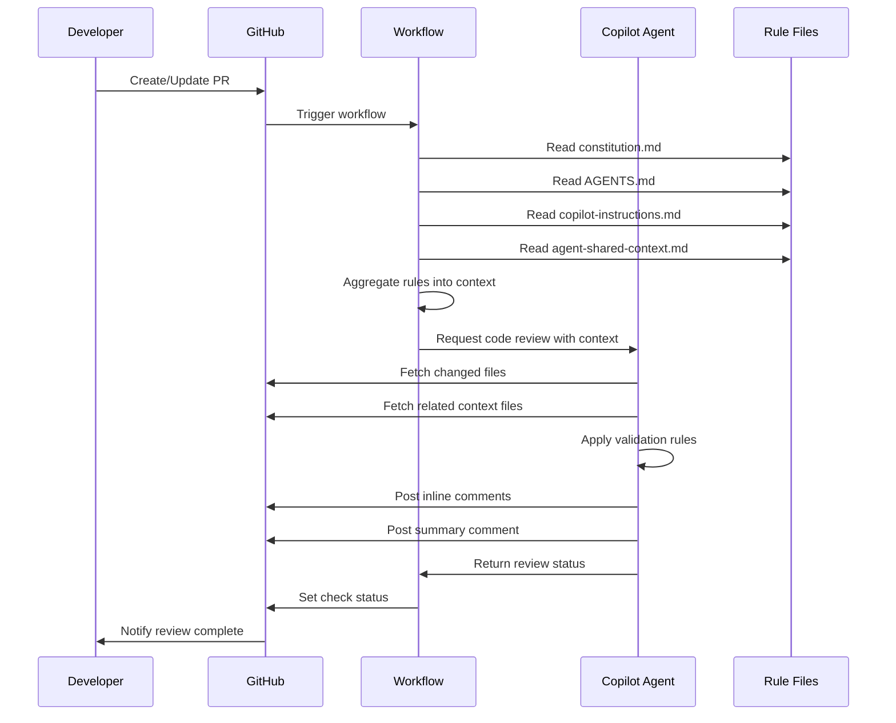

# GitHub Copilot PR Review Architecture

## Document Information

| Field | Value |
|-------|-------|
| **Version** | 1.0.0 |
| **Created** | 2025-12-09 |
| **Status** | Draft |
| **Author** | Architecture Mode |

## Executive Summary

This document defines the architecture for integrating GitHub Copilot cloud-based agents to automatically review Pull Requests against rules defined in this context repository. The system leverages GitHub's native Copilot Code Review feature with custom instructions, ensuring that any updates to the rules are automatically reflected in reviews.

### Design Decisions

- **Integration Approach**: GitHub's native Copilot Code Review with custom instructions
- **Review Scope**: Changed files plus their related context files
- **Violation Handling**: Tiered approach - Critical violations block, warnings are advisory

---

## System Overview

```
┌─────────────────────────────────────────────────────────────────────────────┐
│                        GitHub Repository                                     │
│  ┌─────────────────────────────────────────────────────────────────────┐   │
│  │                    Pull Request Created/Updated                       │   │
│  └─────────────────────────────────────────────────────────────────────┘   │
│                                    │                                         │
│                                    ▼                                         │
│  ┌─────────────────────────────────────────────────────────────────────┐   │
│  │              GitHub Actions Workflow Triggered                        │   │
│  │                  .github/workflows/pr-review.yml                      │   │
│  └─────────────────────────────────────────────────────────────────────┘   │
│                                    │                                         │
│                    ┌───────────────┴───────────────┐                        │
│                    ▼                               ▼                        │
│  ┌──────────────────────────┐    ┌──────────────────────────────────────┐  │
│  │   Rule Aggregation Job   │    │   Copilot Code Review Trigger        │  │
│  │   - Read constitution    │    │   - Request review from Copilot      │  │
│  │   - Read AGENTS.md       │    │   - Pass custom instructions         │  │
│  │   - Read shared context  │    └──────────────────────────────────────┘  │
│  └──────────────────────────┘                      │                        │
│                    │                               ▼                        │
│                    │             ┌──────────────────────────────────────┐  │
│                    └────────────▶│   GitHub Copilot Cloud Agent        │  │
│                                  │   - Reads aggregated rules           │  │
│                                  │   - Analyzes changed files           │  │
│                                  │   - Fetches context files            │  │
│                                  │   - Applies validation rules         │  │
│                                  └──────────────────────────────────────┘  │
│                                                    │                        │
│                                                    ▼                        │
│  ┌─────────────────────────────────────────────────────────────────────┐   │
│  │                    Review Results Posted                              │   │
│  │   - Inline comments on violations                                     │   │
│  │   - Summary comment with findings                                     │   │
│  │   - Status check: pass/fail based on severity                        │   │
│  └─────────────────────────────────────────────────────────────────────┘   │
└─────────────────────────────────────────────────────────────────────────────┘
```

---

## Component Architecture

### 1. PR Review Agent

**File**: `.github/agents/speckit.pr-review.agent.md`

The PR review agent is a specialized GitHub Copilot agent that performs automated code review against project standards.

#### Agent Structure

```markdown
---
description: Automated PR review agent that validates code changes against project constitution and coding standards
---

## Purpose
Review pull request changes for compliance with project standards defined in:
- .specify/memory/constitution.md (primary authority)
- AGENTS.md (agent-specific rules)
- .github/agents/copilot-instructions.md (development guidelines)
- .specify/memory/agent-shared-context.md (shared patterns)

## Validation Categories
1. TypeScript Compliance
2. Testing Requirements
3. AWS Best Practices
4. Security Standards
5. Code Organization
6. Performance Optimization

## Review Process
[Detailed instructions for the agent]
```

#### Validation Categories

| Category | Source | Severity | Examples |
|----------|--------|----------|----------|
| **TypeScript Compliance** | Constitution §I | CRITICAL | No implicit `any`, strict mode, explicit types |
| **Testing Requirements** | Constitution §III | CRITICAL | Test-first, 80% coverage, Jest/RTL usage |
| **AWS Best Practices** | Constitution §IV | HIGH | SDK v3 modular imports, no DynamoDB scans |
| **Security Standards** | Constitution §V | CRITICAL | No secrets in code, input validation, CORS |
| **Code Organization** | Constitution §VII | MEDIUM | App Router structure, colocation, separation |
| **Performance** | Constitution §VI | HIGH | Image optimization, code splitting, caching |

### 2. GitHub Actions Workflow

**File**: `.github/workflows/pr-review.yml`

```yaml
name: Copilot PR Review

on:
  pull_request:
    types: [opened, synchronize, reopened]

permissions:
  contents: read
  pull-requests: write
  checks: write

jobs:
  copilot-review:
    runs-on: ubuntu-latest
    steps:
      - name: Checkout repository
        uses: actions/checkout@v4
        with:
          fetch-depth: 0

      - name: Aggregate review rules
        id: rules
        run: |
          # Aggregate all rule sources into a single context
          echo "Aggregating rules from constitution and agent files..."
          
      - name: Request Copilot Code Review
        uses: github/copilot-code-review-action@v1
        with:
          custom-instructions-file: .github/agents/speckit.pr-review.agent.md
          
      - name: Evaluate review results
        id: evaluate
        run: |
          # Parse review comments and determine pass/fail
          
      - name: Update PR status
        uses: actions/github-script@v7
        with:
          script: |
            // Set check status based on findings
```

### 3. Rule Sources Hierarchy

```
┌─────────────────────────────────────────────────────────────────┐
│                    RULE SOURCES HIERARCHY                        │
├─────────────────────────────────────────────────────────────────┤
│                                                                  │
│  ┌─────────────────────────────────────────────────────────┐    │
│  │  PRIMARY: .specify/memory/constitution.md               │    │
│  │  - NON-NEGOTIABLE principles                            │    │
│  │  - Version: 1.1.0                                       │    │
│  │  - Authority: Supersedes all other guidelines           │    │
│  └─────────────────────────────────────────────────────────┘    │
│                           │                                      │
│                           ▼                                      │
│  ┌─────────────────────────────────────────────────────────┐    │
│  │  SECONDARY: AGENTS.md                                   │    │
│  │  - Repository-specific agent rules                      │    │
│  │  - Technology stack definitions                         │    │
│  │  - SpecKit workflow guidance                            │    │
│  └─────────────────────────────────────────────────────────┘    │
│                           │                                      │
│                           ▼                                      │
│  ┌─────────────────────────────────────────────────────────┐    │
│  │  TERTIARY: .github/agents/copilot-instructions.md       │    │
│  │  - Development guidelines                               │    │
│  │  - Common patterns                                      │    │
│  │  - Project-specific conventions                         │    │
│  └─────────────────────────────────────────────────────────┘    │
│                           │                                      │
│                           ▼                                      │
│  ┌─────────────────────────────────────────────────────────┐    │
│  │  CONTEXT: .specify/memory/agent-shared-context.md       │    │
│  │  - Shared patterns across all agents                    │    │
│  │  - Build tool and deployment info                       │    │
│  │  - Common error handling patterns                       │    │
│  └─────────────────────────────────────────────────────────┘    │
│                                                                  │
└─────────────────────────────────────────────────────────────────┘
```

---

## Data Flow



---

## Dynamic Rule Reading Strategy

### Rule Aggregation Process

The workflow aggregates rules at runtime to ensure the latest versions are always used:

```bash
#!/bin/bash
# .github/scripts/aggregate-rules.sh

# Extract constitution version
CONSTITUTION_VERSION=$(grep -E "^\*\*Version\*\*:" .specify/memory/constitution.md | head -1)

# Build aggregated context
cat << EOF > /tmp/review-context.md
# PR Review Context
Generated: $(date -u +"%Y-%m-%dT%H:%M:%SZ")
Constitution Version: ${CONSTITUTION_VERSION}

## Constitution Principles
$(cat .specify/memory/constitution.md)

## Agent Rules
$(cat AGENTS.md)

## Development Guidelines
$(cat .github/agents/copilot-instructions.md)

## Shared Context
$(cat .specify/memory/agent-shared-context.md)
EOF
```

### Version Tracking

The system tracks constitution versions to detect rule changes:

| Mechanism | Purpose |
|-----------|---------|
| **Version Header** | Constitution includes semantic version in header |
| **Git History** | Track changes to rule files via git log |
| **Review Comments** | Include constitution version in review summary |
| **Audit Trail** | Log which version was used for each review |

### Caching Strategy

Since GitHub Copilot Code Review reads files directly from the repository, no explicit caching is needed. The rules are always read fresh from the current commit being reviewed.

---

## Integration Points

### 1. PR Comments

**Inline Comments**: Posted directly on the lines with violations

```markdown
<!-- Copilot Review: TypeScript Compliance -->
⚠️ **HIGH**: Implicit `any` type detected

**Rule**: Constitution §I - TypeScript Type Safety
**Requirement**: All function parameters and return types MUST be explicitly typed

**Suggestion**:
\`\`\`typescript
// Before
function processData(data) { ... }

// After  
function processData(data: ProcessedData): Result { ... }
\`\`\`
```

**Summary Comment**: Posted as a PR comment with overall findings

```markdown
## 🤖 Copilot Code Review Summary

**Constitution Version**: 1.1.0
**Files Reviewed**: 12
**Review Date**: 2025-12-09T02:30:00Z

### Findings

| Severity | Count | Category |
|----------|-------|----------|
| 🔴 CRITICAL | 2 | TypeScript Compliance |
| 🟠 HIGH | 3 | AWS Best Practices |
| 🟡 MEDIUM | 5 | Code Organization |
| 🟢 LOW | 1 | Performance |

### Critical Issues (Blocking)

1. **Line 45 in `src/api/handler.ts`**: Implicit `any` type
2. **Line 23 in `src/utils/db.ts`**: DynamoDB scan operation detected

### Recommendations

- [ ] Fix critical TypeScript issues before merge
- [ ] Consider refactoring DynamoDB query to use GSI
- [ ] Add missing test coverage for new endpoints

---
*Review powered by GitHub Copilot with project constitution v1.1.0*
```

### 2. Status Checks

The workflow sets a GitHub check status based on findings:

| Condition | Status | Merge Allowed |
|-----------|--------|---------------|
| No CRITICAL findings | ✅ Success | Yes |
| Only MEDIUM/LOW findings | ⚠️ Neutral | Yes (with warnings) |
| Any CRITICAL findings | ❌ Failure | No (blocking) |

### 3. Actionable Feedback

Each finding includes:
- **Rule Reference**: Link to specific constitution section
- **Code Suggestion**: Concrete fix when possible
- **Severity Level**: Clear indication of blocking vs advisory
- **Context**: Why this rule exists (rationale from constitution)

---

## File Structure

### New Files to Create

```
.github/
├── workflows/
│   └── pr-review.yml              # GitHub Actions workflow
├── agents/
│   └── speckit.pr-review.agent.md # PR review agent definition
├── prompts/
│   └── speckit.pr-review.prompt.md # Prompt file linking to agent
└── scripts/
    └── aggregate-rules.sh          # Rule aggregation script
```

### File Purposes

| File | Purpose |
|------|---------|
| `pr-review.yml` | Orchestrates the PR review workflow, triggers on PR events |
| `speckit.pr-review.agent.md` | Defines the Copilot agent behavior and validation rules |
| `speckit.pr-review.prompt.md` | Links prompt to agent (follows existing pattern) |
| `aggregate-rules.sh` | Combines all rule sources into review context |

---

## Configuration Requirements

### Repository Settings

1. **Enable GitHub Copilot Code Review**
   - Navigate to Repository Settings → Copilot
   - Enable "Copilot code review"
   - Configure custom instructions path

2. **Branch Protection Rules**
   - Require status checks to pass before merging
   - Add "Copilot PR Review" as required check
   - Configure for `main` and `develop` branches

3. **Permissions**
   - Workflow needs `pull-requests: write` for comments
   - Workflow needs `checks: write` for status updates
   - Workflow needs `contents: read` for file access

### Environment Variables

| Variable | Purpose | Required |
|----------|---------|----------|
| `GITHUB_TOKEN` | Automatic, for API access | Auto-provided |
| `COPILOT_REVIEW_ENABLED` | Feature flag for review | Optional |

---

## Security Considerations

### 1. Secret Protection

- **No secrets in rule files**: All rule files are public in the repository
- **Token handling**: Only use automatic `GITHUB_TOKEN`, no custom tokens needed
- **Audit logging**: All review actions are logged in GitHub Actions

### 2. Access Control

- **Read-only analysis**: Agent only reads files, never modifies
- **PR scope**: Reviews only files changed in the PR
- **Context boundaries**: Related files fetched are limited to repository

### 3. Rule Integrity

- **Version control**: All rules are version-controlled in git
- **Change tracking**: Constitution changes require explicit version bump
- **Audit trail**: Review comments include constitution version used

### 4. Denial of Service Prevention

- **Rate limiting**: GitHub's built-in rate limits apply
- **Timeout handling**: Workflow has configurable timeout
- **Graceful degradation**: If Copilot unavailable, workflow continues

---

## Implementation Checklist

### Phase 1: Core Setup
- [ ] Create `.github/workflows/pr-review.yml`
- [ ] Create `.github/agents/speckit.pr-review.agent.md`
- [ ] Create `.github/prompts/speckit.pr-review.prompt.md`
- [ ] Create `.github/scripts/aggregate-rules.sh`

### Phase 2: Agent Configuration
- [ ] Define validation rules for each category
- [ ] Map constitution sections to validation checks
- [ ] Configure severity levels and blocking behavior
- [ ] Add code suggestion templates

### Phase 3: Integration Testing
- [ ] Test with sample PR containing violations
- [ ] Verify inline comments are posted correctly
- [ ] Verify summary comment format
- [ ] Verify status check behavior

### Phase 4: Documentation
- [ ] Update AGENTS.md with new agent reference
- [ ] Add usage instructions to README
- [ ] Document how to update rules

---

## Appendix A: Agent File Template

```markdown
---
description: Automated PR review agent that validates code changes against project constitution and coding standards
---

## User Input

\`\`\`text
$ARGUMENTS
\`\`\`

You **MUST** consider the user input before proceeding (if not empty).

## Goal

Review pull request code changes for compliance with the project constitution and coding standards. Identify violations, categorize by severity, and provide actionable feedback.

## Operating Constraints

**READ-ONLY ANALYSIS**: Do not modify any files. Output review comments only.

**Constitution Authority**: The project constitution at \`.specify/memory/constitution.md\` is **NON-NEGOTIABLE**. Constitution violations are automatically CRITICAL severity.

## Rule Sources

Load and parse the following files in order of authority:

1. **PRIMARY**: \`.specify/memory/constitution.md\` - Core principles and standards
2. **SECONDARY**: \`AGENTS.md\` - Repository-specific agent rules  
3. **TERTIARY**: \`.github/agents/copilot-instructions.md\` - Development guidelines
4. **CONTEXT**: \`.specify/memory/agent-shared-context.md\` - Shared patterns

## Validation Categories

### 1. TypeScript Compliance (Constitution §I)
- [ ] No implicit \`any\` types
- [ ] All function parameters explicitly typed
- [ ] All return types explicitly typed
- [ ] Type assertions have justification comments
- [ ] Shared types in dedicated type files

### 2. Testing Requirements (Constitution §III)
- [ ] Unit tests exist for business logic
- [ ] Integration tests for API handlers
- [ ] Jest and React Testing Library used
- [ ] Mocks for external dependencies
- [ ] Test files colocated with source

### 3. AWS Best Practices (Constitution §IV)
- [ ] AWS SDK v3 with modular imports
- [ ] DynamoDB Document Client used
- [ ] No DynamoDB scan operations
- [ ] Proper error handling for AWS calls
- [ ] IAM least-privilege patterns

### 4. Security Standards (Constitution §V)
- [ ] No secrets or API keys in code
- [ ] Input validation present
- [ ] Proper error messages (no stack traces)
- [ ] Environment variables for config
- [ ] CORS headers configured

### 5. Code Organization (Constitution §VII)
- [ ] App Router directory structure
- [ ] Business logic separated from UI
- [ ] Related files colocated
- [ ] Utilities in lib/ or utils/
- [ ] Types in types/ or colocated

### 6. Performance (Constitution §VI)
- [ ] Next.js Image component for images
- [ ] Code splitting where beneficial
- [ ] Proper caching strategies
- [ ] Minimal bundle size considerations

## Severity Levels

| Level | Criteria | Merge Impact |
|-------|----------|--------------|
| CRITICAL | Constitution MUST violation | Blocks merge |
| HIGH | Best practice violation | Advisory, recommend fix |
| MEDIUM | Style or organization issue | Advisory |
| LOW | Minor improvement suggestion | Informational |

## Output Format

For each finding, output:

\`\`\`markdown
**[SEVERITY]**: Brief description

**Rule**: Constitution §X - Section Name
**File**: path/to/file.ts:line
**Requirement**: Exact requirement text from constitution

**Current Code**:
\\\`\\\`\\\`typescript
// problematic code
\\\`\\\`\\\`

**Suggested Fix**:
\\\`\\\`\\\`typescript
// corrected code
\\\`\\\`\\\`
\`\`\`

## Summary Format

After all findings, output a summary:

\`\`\`markdown
## Review Summary

| Severity | Count |
|----------|-------|
| CRITICAL | X |
| HIGH | X |
| MEDIUM | X |
| LOW | X |

**Verdict**: [PASS/FAIL]
**Constitution Version**: X.X.X
\`\`\`
```

---

## Appendix B: Workflow File Template

```yaml
name: Copilot PR Review

on:
  pull_request:
    types: [opened, synchronize, reopened]
    branches:
      - main
      - develop

permissions:
  contents: read
  pull-requests: write
  checks: write

concurrency:
  group: pr-review-${{ github.event.pull_request.number }}
  cancel-in-progress: true

jobs:
  copilot-review:
    name: Copilot Code Review
    runs-on: ubuntu-latest
    timeout-minutes: 10
    
    steps:
      - name: Checkout repository
        uses: actions/checkout@v4
        with:
          fetch-depth: 0
          
      - name: Get constitution version
        id: constitution
        run: |
          VERSION=$(grep -oP '\*\*Version\*\*: \K[0-9]+\.[0-9]+\.[0-9]+' .specify/memory/constitution.md || echo "unknown")
          echo "version=$VERSION" >> $GITHUB_OUTPUT
          
      - name: Request Copilot Code Review
        id: review
        uses: github/copilot-code-review-action@v1
        with:
          custom-instructions-file: .github/agents/speckit.pr-review.agent.md
          
      - name: Post review summary
        uses: actions/github-script@v7
        with:
          script: |
            const constitutionVersion = '${{ steps.constitution.outputs.version }}';
            
            await github.rest.issues.createComment({
              owner: context.repo.owner,
              repo: context.repo.repo,
              issue_number: context.issue.number,
              body: `## 🤖 Copilot Code Review Complete\n\n` +
                    `**Constitution Version**: ${constitutionVersion}\n` +
                    `**Review Date**: ${new Date().toISOString()}\n\n` +
                    `See inline comments for detailed findings.`
            });
```

---

## Revision History

| Version | Date | Author | Changes |
|---------|------|--------|---------|
| 1.0.0 | 2025-12-09 | Architecture Mode | Initial architecture document |