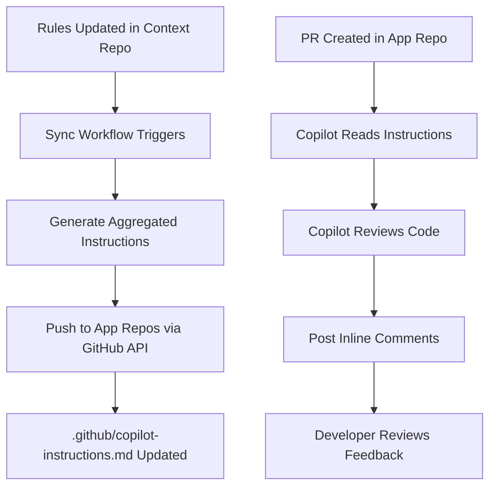
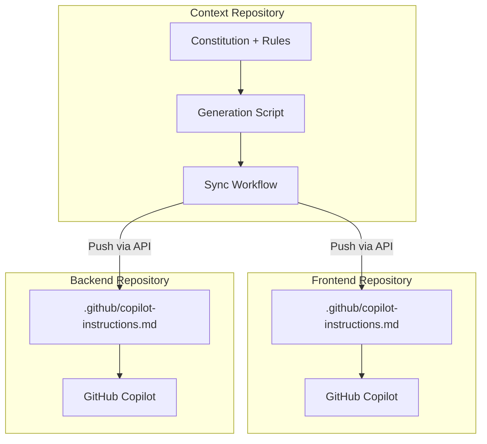

# GitHub Copilot PR Review System

## Overview

This repository includes an automated Pull Request review system powered by GitHub Copilot's native code review feature. The system validates code changes against the project's constitution and coding standards, providing inline comments and actionable feedback directly on your PRs.

### Multi-Repository Support

The PR review system is designed to work across **three repositories** in the project:

- **📋 Context Repository** (this repo) - Central hub for rules, constitution, and instruction generation
- **🔧 Backend Repository** - Application backend code reviewed using synced rules
- **🎨 Frontend Repository** - Application frontend code reviewed using synced rules

**Key Benefit**: Rules are automatically synced from the Context repository to each application repository's `.github/copilot-instructions.md` file. This ensures all repositories use the same standards without manual duplication.

See [Multi-Repository Setup](#multi-repository-setup) for details on setting up other repositories.

### What It Does

- **Automated Code Review**: GitHub Copilot analyzes all code changes in pull requests
- **Constitution Compliance**: Validates against NON-NEGOTIABLE principles defined in [`.specify/memory/constitution.md`](.specify/memory/constitution.md:1)
- **Inline Feedback**: Posts comments directly on problematic lines with suggested fixes
- **Severity-Based Blocking**: Critical violations block merge, while warnings are advisory
- **Automatic Rule Sync**: Rules are automatically synced to application repositories when updated

### Key Benefits

- ✅ **Consistent Standards**: Every PR is reviewed against the same criteria
- ✅ **Fast Feedback**: Automated reviews complete in minutes
- ✅ **Actionable Suggestions**: Concrete code fixes, not vague recommendations
- ✅ **Learning Tool**: Helps developers understand project standards
- ✅ **Version Tracked**: Reviews reference specific constitution versions
- ✅ **Automatic Updates**: Rule changes propagate automatically to all repositories

---

## Prerequisites

### GitHub Copilot License

This feature requires:
- **GitHub Copilot Business** or **GitHub Copilot Enterprise** subscription
- Copilot code review feature enabled for your organization/repository

> **Note**: GitHub Copilot Individual does not include code review capabilities.

### Repository Settings

1. **Enable GitHub Actions** (Context Repository)
   - Navigate to **Settings** → **Actions** → **General**
   - Ensure "Allow all actions and reusable workflows" is selected

2. **Configure Workflow Permissions** (Context Repository)
   - Navigate to **Settings** → **Actions** → **General** → **Workflow permissions**
   - Select "Read and write permissions"

3. **Enable Copilot Code Review** (Application Repositories)
   - Navigate to **Settings** → **Copilot**
   - Enable "Copilot code review"
   - Copilot will automatically read `.github/copilot-instructions.md` synced from the Context repository

### Required Secrets

The sync workflow requires a Personal Access Token (PAT) with repository access:

| Secret | Scope | Purpose |
|--------|-------|---------|
| `CROSS_REPO_TOKEN` | Context repo | PAT with `repo` scope to push files to application repositories |

---

## How It Works

### Sync Workflow

The sync workflow automatically triggers when:
- Changes are pushed to `main` branch affecting:
  - [`.specify/memory/constitution.md`](.specify/memory/constitution.md:1)
  - [`AGENTS.md`](AGENTS.md:1)
  - [`.specify/memory/agent-shared-context.md`](.specify/memory/agent-shared-context.md:1)
  - [`.github/copilot-instructions.md`](.github/copilot-instructions.md:1)
  - [`.github/scripts/generate-copilot-instructions.sh`](.github/scripts/generate-copilot-instructions.sh:1)
- Manually triggered via workflow dispatch

### Review Process



### Rule Aggregation

The generation script ([`.github/scripts/generate-copilot-instructions.sh`](.github/scripts/generate-copilot-instructions.sh:1)) aggregates rules from multiple sources:

1. **PRIMARY**: [`.specify/memory/constitution.md`](.specify/memory/constitution.md:1) - NON-NEGOTIABLE principles
2. **SECONDARY**: [`AGENTS.md`](AGENTS.md:1) - Repository-specific agent rules
3. **TERTIARY**: [`.specify/memory/agent-shared-context.md`](.specify/memory/agent-shared-context.md:1) - Shared patterns

The aggregated file is then synced to each application repository's `.github/copilot-instructions.md`.

### Validation Categories

| Category | Source | Severity | Examples |
|----------|--------|----------|----------|
| **TypeScript Compliance** | Constitution §I | 🔴 CRITICAL | No implicit `any`, strict mode, explicit types |
| **Testing Requirements** | Constitution §III | 🔴 CRITICAL | Test-first, 80% coverage, Jest/RTL usage |
| **AWS Best Practices** | Constitution §IV | 🟠 HIGH | SDK v3 modular imports, no DynamoDB scans |
| **Security Standards** | Constitution §V | 🔴 CRITICAL | No secrets in code, input validation, CORS |
| **Code Organization** | Constitution §VII | 🟡 MEDIUM | App Router structure, colocation, separation |
| **Performance** | Constitution §VI | 🟠 HIGH | Image optimization, code splitting, caching |

### Severity Levels

| Level | Icon | Criteria | Merge Impact |
|-------|------|----------|--------------|
| **CRITICAL** | 🔴 | Constitution MUST violation | **Blocks merge** |
| **HIGH** | 🟠 | Best practice violation | Advisory, strongly recommend fix |
| **MEDIUM** | 🟡 | Style or organization issue | Advisory |
| **LOW** | 🟢 | Minor improvement suggestion | Informational |

---

## Configuration

### Enabling Copilot Code Review

To enable Copilot code review in an application repository:

1. **Navigate to Repository Settings** → **Copilot**
2. **Enable "Copilot code review"**
3. Copilot will automatically read `.github/copilot-instructions.md` (synced from Context repo)

See [COPILOT-PR-REVIEW-SETUP.md](COPILOT-PR-REVIEW-SETUP.md) for detailed setup instructions.

### Modifying Validation Rules

To update validation rules:

1. **Edit the Constitution**: Update [`.specify/memory/constitution.md`](.specify/memory/constitution.md:1)
   - Increment the version number in the header
   - Add or modify NON-NEGOTIABLE principles
   - Document the changes in the revision history

2. **Edit Agent Rules**: Update [`AGENTS.md`](AGENTS.md:1)
   - Add repository-specific rules
   - Update technology stack requirements

3. **Edit Shared Context**: Update [`.specify/memory/agent-shared-context.md`](.specify/memory/agent-shared-context.md:1)
   - Add coding patterns and conventions
   - Update best practices

4. **Commit and Push**: Changes to `main` branch automatically trigger the sync workflow

The sync workflow will automatically generate updated instructions and push them to all configured application repositories.

---

## File Reference

### Core Files

| File | Purpose | Link |
|------|---------|------|
| **Sync Workflow** | Syncs instructions to app repos | [`.github/workflows/sync-copilot-instructions.yml`](.github/workflows/sync-copilot-instructions.yml:1) |
| **Generation Script** | Aggregates rules into instructions | [`.github/scripts/generate-copilot-instructions.sh`](.github/scripts/generate-copilot-instructions.sh:1) |
| **Source Instructions** | Base Copilot instructions | [`.github/copilot-instructions.md`](.github/copilot-instructions.md:1) |

### Rule Sources

| File | Authority | Purpose | Link |
|------|-----------|---------|------|
| **Constitution** | PRIMARY | NON-NEGOTIABLE principles | [`.specify/memory/constitution.md`](.specify/memory/constitution.md:1) |
| **AGENTS.md** | SECONDARY | Repository-specific rules | [`AGENTS.md`](AGENTS.md:1) |
| **Shared Context** | SUPPLEMENTARY | Common patterns | [`.specify/memory/agent-shared-context.md`](.specify/memory/agent-shared-context.md:1) |

### Documentation

| File | Purpose | Link |
|------|---------|------|
| **Architecture Document** | System design and approach | [`docs/architecture/copilot-code-review-centralized-rules.md`](docs/architecture/copilot-code-review-centralized-rules.md:1) |
| **Setup Guide** | Detailed setup instructions | [`docs/COPILOT-PR-REVIEW-SETUP.md`](docs/COPILOT-PR-REVIEW-SETUP.md:1) |
| **This Document** | User guide and reference | [`docs/COPILOT-PR-REVIEW.md`](docs/COPILOT-PR-REVIEW.md:1) |

---

## Multi-Repository Setup

### Architecture Overview

The multi-repository PR review system uses a sync workflow to automatically push aggregated rules to application repositories:



### How It Works

1. **Rules are updated** in the Context repository (constitution, AGENTS.md, etc.)
2. **Sync workflow triggers** automatically on push to `main`
3. **Generation script** aggregates rules into a comprehensive instructions file
4. **GitHub API** pushes the file to each application repository's `.github/copilot-instructions.md`
5. **Copilot reads** the synced instructions when reviewing PRs in application repositories

### Benefits

| Benefit | Description |
|---------|-------------|
| ✅ **Single Source of Truth** | All rules maintained in Context repository |
| ✅ **Automatic Sync** | Changes propagate automatically on push |
| ✅ **Native Integration** | Copilot reads instructions natively |
| ✅ **Version Tracking** | Each sync includes constitution version |
| ✅ **No Manual Updates** | Application repos receive updates automatically |

### Setting Up a New Application Repository

To enable automatic rule sync for a new repository:

1. **Add repository to sync workflow**:
   - Edit [`.github/workflows/sync-copilot-instructions.yml`](.github/workflows/sync-copilot-instructions.yml:26)
   - Add repository name to `TARGET_REPOS` environment variable

2. **Enable Copilot code review** in the application repository:
   - Navigate to **Settings** → **Copilot**
   - Enable "Copilot code review"

3. **Manually trigger initial sync** (optional):
   - Go to Actions tab in Context repository
   - Run "Sync Copilot Instructions" workflow
   - Select the new repository

See [COPILOT-PR-REVIEW-SETUP.md](COPILOT-PR-REVIEW-SETUP.md) for detailed setup instructions.

---

## Troubleshooting

### Sync Workflow Fails

**Problem**: Sync workflow fails to push to application repositories

**Solutions**:
1. Verify `CROSS_REPO_TOKEN` secret is set in Context repository
2. Check that the PAT has `repo` scope for target repositories
3. Ensure target repositories exist and are accessible
4. Review workflow logs for specific API errors

### Instructions Not Updating

**Problem**: Changes to rules don't appear in application repositories

**Solutions**:
1. Verify the sync workflow ran successfully (check Actions tab)
2. Check that changed files are in the workflow's `paths` trigger
3. Manually trigger the sync workflow via workflow dispatch
4. Verify the generation script is executable:
   ```bash
   chmod +x .github/scripts/generate-copilot-instructions.sh
   ```

### Copilot Not Using Instructions

**Problem**: Copilot reviews don't reflect the synced rules

**Solutions**:
1. Verify `.github/copilot-instructions.md` exists in the application repository
2. Check that Copilot code review is enabled in repository settings
3. Ensure the file was synced recently (check git history)
4. Try creating a new PR to trigger a fresh review

### Permission Denied Errors

**Problem**: Sync workflow fails with permission errors

**Solutions**:
1. Verify the PAT has not expired
2. Check that the PAT has `repo` scope (or `public_repo` for public repos)
3. Ensure the service account has write access to target repositories
4. Review GitHub security logs for token usage issues

---

## Updating Rules

### Adding New Rules to Constitution

1. **Edit the Constitution**:
   ```bash
   # Open the constitution file
   vim .specify/memory/constitution.md
   ```

2. **Increment Version**:
   ```markdown
   **Version**: 1.2.0  # Increment from 1.1.0
   ```

3. **Add New Rule**:
   ```markdown
   ## §VIII - New Category

   ### MUST Requirements
   - New requirement 1
   - New requirement 2
   ```

4. **Update Revision History**:
   ```markdown
   | Version | Date | Changes |
   |---------|------|---------|
   | 1.2.0 | 2025-12-09 | Added §VIII - New Category |
   ```

5. **Commit and Push**:
   ```bash
   git add .specify/memory/constitution.md
   git commit -m "feat: add new validation rules to constitution v1.2.0"
   git push
   ```

### How Changes Propagate


**Key Points**:
- ✅ Changes sync **automatically** when pushed to `main`
- ✅ All application repositories updated simultaneously
- ✅ Version tracking in synced file
- ✅ Can manually trigger sync via workflow dispatch

### Version Tracking

Each synced instructions file includes metadata:

```markdown
> **Auto-synced from inventory-management-context repository**
> 
> | Field | Value |
> |-------|-------|
> | Constitution Version | 1.2.0 |
> | Generated | 2025-12-09T17:00:00Z |
```

This ensures:
- **Audit Trail**: Know which rules version is active
- **Consistency**: All repos use same version
- **Change Management**: Track when rules changed

---

## Additional Resources

- **Architecture Documentation**: [`docs/architecture/copilot-code-review-centralized-rules.md`](docs/architecture/copilot-code-review-centralized-rules.md:1)
- **Setup Guide**: [`docs/COPILOT-PR-REVIEW-SETUP.md`](docs/COPILOT-PR-REVIEW-SETUP.md:1)
- **GitHub Copilot Docs**: https://docs.github.com/en/copilot
- **GitHub Actions Docs**: https://docs.github.com/en/actions
- **Project Constitution**: [`.specify/memory/constitution.md`](.specify/memory/constitution.md:1)

---

## Support

For issues or questions:

1. **Check Troubleshooting**: Review the [Troubleshooting](#troubleshooting) section above
2. **Review Workflow Logs**: Check the Actions tab for detailed error messages
3. **Verify Configuration**: Ensure all files are present and properly formatted
4. **Update Rules**: Make sure constitution and agent files are up to date

---

*Last Updated: 2025-12-09*
*Constitution Version: 1.1.0*