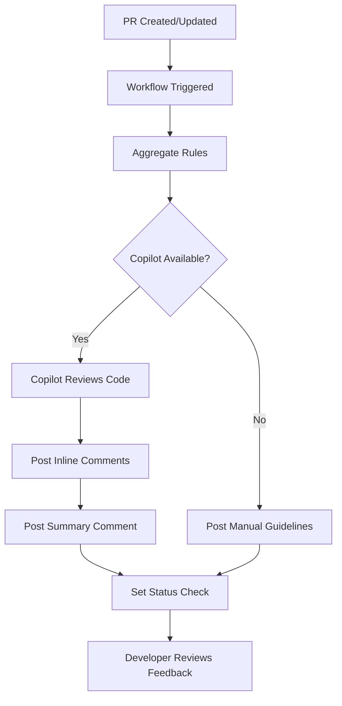
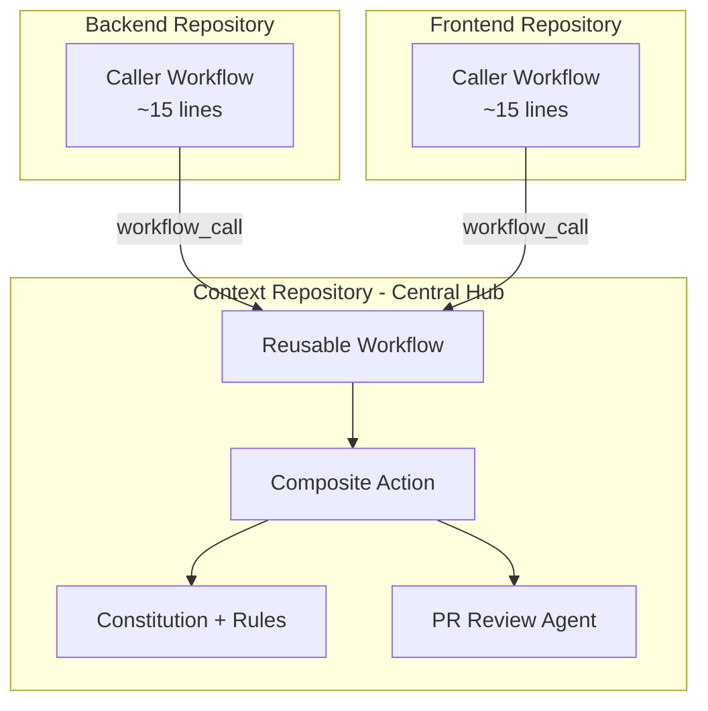
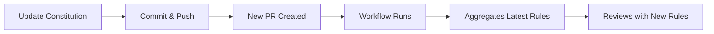

# GitHub Copilot PR Review System

## Overview

This repository includes an automated Pull Request review system powered by GitHub Copilot. The system validates code changes against the project's constitution and coding standards, providing inline comments and actionable feedback directly on your PRs.

### Multi-Repository Support

The PR review system is designed to work across **three repositories** in the project:

- **📋 Context Repository** (this repo) - Central hub for rules, constitution, and review configuration
- **🔧 Backend Repository** - Application backend code reviewed using Context rules
- **🎨 Frontend Repository** - Application frontend code reviewed using Context rules

**Key Benefit**: Backend and Frontend repositories only need **ONE small file** (~15 lines) to enable PR reviews. All rules, constitution, and review logic are centralized in the Context repository, eliminating file duplication and ensuring consistency.

See [Multi-Repository Setup](#multi-repository-setup) for details on setting up other repositories.

### What It Does

- **Automated Code Review**: Analyzes all code changes in pull requests
- **Constitution Compliance**: Validates against NON-NEGOTIABLE principles defined in [`.specify/memory/constitution.md`](.specify/memory/constitution.md:1)
- **Inline Feedback**: Posts comments directly on problematic lines with suggested fixes
- **Severity-Based Blocking**: Critical violations block merge, while warnings are advisory
- **Dynamic Rule Updates**: Automatically uses the latest version of project rules

### Key Benefits

- ✅ **Consistent Standards**: Every PR is reviewed against the same criteria
- ✅ **Fast Feedback**: Automated reviews complete in minutes
- ✅ **Actionable Suggestions**: Concrete code fixes, not vague recommendations
- ✅ **Learning Tool**: Helps developers understand project standards
- ✅ **Version Tracked**: Reviews reference specific constitution versions

---

## Prerequisites

### GitHub Copilot License

This feature requires:
- **GitHub Copilot Business** or **GitHub Copilot Enterprise** subscription
- Copilot code review feature enabled for your organization/repository

> **Note**: GitHub Copilot Individual does not include code review capabilities.

### Repository Settings

1. **Enable GitHub Actions**
   - Navigate to **Settings** → **Actions** → **General**
   - Ensure "Allow all actions and reusable workflows" is selected

2. **Configure Workflow Permissions**
   - Navigate to **Settings** → **Actions** → **General** → **Workflow permissions**
   - Select "Read and write permissions"
   - Check "Allow GitHub Actions to create and approve pull requests"

3. **Enable Copilot Code Review** (when available)
   - Navigate to **Settings** → **Copilot**
   - Enable "Copilot code review"
   - The custom instructions file is automatically configured via [`.github/copilot-review-config.yml`](.github/copilot-review-config.yml:1)

### Required Permissions

The workflow requires these permissions (already configured in [`.github/workflows/pr-review.yml`](.github/workflows/pr-review.yml:20)):

| Permission | Access | Purpose |
|------------|--------|---------|
| `contents` | read | Access repository files and constitution |
| `pull-requests` | write | Post review comments on PRs |
| `checks` | write | Update PR status checks |

---

## How It Works

### Workflow Trigger

The PR review workflow automatically triggers when:
- A pull request is **opened**
- A pull request is **synchronized** (new commits pushed)
- A pull request is **reopened**

Target branches: `main` and `develop`

### Review Process



### Rule Aggregation

The system aggregates rules from multiple sources in order of authority:

1. **PRIMARY**: [`.specify/memory/constitution.md`](.specify/memory/constitution.md:1) - NON-NEGOTIABLE principles
2. **SECONDARY**: [`AGENTS.md`](AGENTS.md:1) - Repository-specific agent rules
3. **TERTIARY**: [`.github/agents/copilot-instructions.md`](.github/agents/copilot-instructions.md:1) - Development guidelines
4. **CONTEXT**: [`.specify/memory/agent-shared-context.md`](.specify/memory/agent-shared-context.md:1) - Shared patterns

The aggregation script ([`.github/scripts/aggregate-rules.sh`](.github/scripts/aggregate-rules.sh:1)) combines these files into a single context that Copilot uses for review.

### Validation Categories

| Category | Source | Severity | Examples |
|----------|--------|----------|----------|
| **TypeScript Compliance** | Constitution §I | 🔴 CRITICAL | No implicit `any`, strict mode, explicit types |
| **Testing Requirements** | Constitution §III | 🔴 CRITICAL | Test-first, 80% coverage, Jest/RTL usage |
| **AWS Best Practices** | Constitution §IV | 🟠 HIGH | SDK v3 modular imports, no DynamoDB scans |
| **Security Standards** | Constitution §V | 🔴 CRITICAL | No secrets in code, input validation, CORS |
| **Code Organization** | Constitution §VII | 🟡 MEDIUM | App Router structure, colocation, separation |
| **Performance** | Constitution §VI | 🟠 HIGH | Image optimization, code splitting, caching |

### Severity Levels

| Level | Icon | Criteria | Merge Impact |
|-------|------|----------|--------------|
| **CRITICAL** | 🔴 | Constitution MUST violation | **Blocks merge** |
| **HIGH** | 🟠 | Best practice violation | Advisory, strongly recommend fix |
| **MEDIUM** | 🟡 | Style or organization issue | Advisory |
| **LOW** | 🟢 | Minor improvement suggestion | Informational |

---

## Configuration

### Current Status

The system is currently in **fallback mode** because the `github/copilot-code-review-action@v1` is not yet publicly available. The workflow posts manual review guidelines instead of automated Copilot reviews.

### Enabling Copilot Action (When Available)

When GitHub releases the Copilot code review action, enable it by:

1. Edit [`.github/workflows/pr-review.yml`](.github/workflows/pr-review.yml:35)
2. Change `COPILOT_ACTION_ENABLED` from `'false'` to `'true'`:

```yaml
env:
  COPILOT_ACTION_ENABLED: 'true'  # Changed from 'false'
```

3. Commit and push the change
4. Future PRs will use automated Copilot reviews

### Modifying Validation Rules

To update validation rules:

1. **Edit the Constitution**: Update [`.specify/memory/constitution.md`](.specify/memory/constitution.md:1)
   - Increment the version number in the header
   - Add or modify NON-NEGOTIABLE principles
   - Document the changes in the revision history

2. **Edit Agent Rules**: Update [`AGENTS.md`](AGENTS.md:1)
   - Add repository-specific rules
   - Update technology stack requirements

3. **Edit Development Guidelines**: Update [`.github/agents/copilot-instructions.md`](.github/agents/copilot-instructions.md:1)
   - Add coding patterns and conventions
   - Update best practices

Changes take effect immediately on the next PR review - no workflow updates needed!

### Customizing Review Behavior

Edit [`.github/copilot-review-config.yml`](.github/copilot-review-config.yml:1) to customize:

```yaml
# File patterns to review
review:
  include:
    - "**/*.ts"
    - "**/*.tsx"
  exclude:
    - "**/node_modules/**"

# Severity mappings
severity:
  critical:
    - typescript_implicit_any
    - secrets_in_code
  high:
    - aws_sdk_v2_usage
    - dynamodb_scan_operation

# Comment settings
comments:
  inline: true
  summary: true
  suggestions: true
```

---

## File Reference

### Core Files

| File | Purpose | Link |
|------|---------|------|
| **PR Review Workflow** | Orchestrates the review process | [`.github/workflows/pr-review.yml`](.github/workflows/pr-review.yml:1) |
| **PR Review Agent** | Defines validation rules and behavior | [`.github/agents/speckit.pr-review.agent.md`](.github/agents/speckit.pr-review.agent.md:1) |
| **PR Review Prompt** | Links prompt to agent | [`.github/prompts/speckit.pr-review.prompt.md`](.github/prompts/speckit.pr-review.prompt.md:1) |
| **Rule Aggregation Script** | Combines all rule sources | [`.github/scripts/aggregate-rules.sh`](.github/scripts/aggregate-rules.sh:1) |
| **Copilot Config** | Configures review behavior | [`.github/copilot-review-config.yml`](.github/copilot-review-config.yml:1) |

### Rule Sources

| File | Authority | Purpose | Link |
|------|-----------|---------|------|
| **Constitution** | PRIMARY | NON-NEGOTIABLE principles | [`.specify/memory/constitution.md`](.specify/memory/constitution.md:1) |
| **AGENTS.md** | SECONDARY | Repository-specific rules | [`AGENTS.md`](AGENTS.md:1) |
| **Copilot Instructions** | TERTIARY | Development guidelines | [`.github/agents/copilot-instructions.md`](.github/agents/copilot-instructions.md:1) |
| **Shared Context** | SUPPLEMENTARY | Common patterns | [`.specify/memory/agent-shared-context.md`](.specify/memory/agent-shared-context.md:1) |

### Documentation

| File | Purpose | Link |
|------|---------|------|
| **Architecture Document** | System design and data flow | [`.specify/memory/pr-review-architecture.md`](.specify/memory/pr-review-architecture.md:1) |
| **This Document** | User guide and reference | [`docs/COPILOT-PR-REVIEW.md`](docs/COPILOT-PR-REVIEW.md:1) |

---

## Multi-Repository Setup

### Architecture Overview

The multi-repository PR review system uses GitHub's reusable workflows and composite actions to share rules across repositories:



### How It Works

1. **Backend/Frontend** repositories have a minimal caller workflow (~15 lines)
2. Caller workflow invokes the **reusable workflow** in Context repository
3. Reusable workflow uses a **composite action** to fetch all rules from Context
4. Rules are placed in the correct locations for Copilot to use
5. Review runs with the latest centralized rules
6. Results are posted back to the calling repository's PR

### Benefits

| Benefit | Description |
|---------|-------------|
| ✅ **Minimal Duplication** | Only ~15 lines needed in Backend/Frontend repos |
| ✅ **Centralized Rules** | All rules maintained in one place (Context repo) |
| ✅ **Automatic Updates** | Rule changes automatically apply to all repos |
| ✅ **Consistent Reviews** | Same standards across all repositories |
| ✅ **Version Tracking** | Each review shows which constitution version was used |

### Setting Up Backend or Frontend Repository

To enable PR reviews in the Backend or Frontend repository:

1. **Copy the template workflow**:
   - Template location: [`.github/workflows/templates/caller-workflow.yml`](.github/workflows/templates/caller-workflow.yml:1)
   - Destination: `.github/workflows/pr-review.yml` in your Backend/Frontend repo

2. **Replace the organization name**:
   - Find `ORG_NAME` in the template
   - Replace with your actual GitHub organization name

3. **Set the repository type**:
   - Change `repository-type: backend` to match your repo (backend or frontend)

4. **Commit and push**:
   ```bash
   git add .github/workflows/pr-review.yml
   git commit -m "feat: add Copilot PR review workflow"
   git push
   ```

5. **Configure branch protection** (optional but recommended):
   - Add "Copilot PR Review" as a required status check
   - See [detailed setup guide](COPILOT-PR-REVIEW-SETUP.md#part-2-add-required-status-check)

**That's it!** Your repository will now use the centralized rules from the Context repository for all PR reviews.

### Template File

The complete template is available at [`.github/workflows/templates/caller-workflow.yml`](.github/workflows/templates/caller-workflow.yml:1). Here's what it looks like:

```yaml
name: PR Review

on:
  pull_request:
    types: [opened, synchronize, reopened]
    branches:
      - main
      - develop

jobs:
  review:
    # Replace ORG_NAME with your GitHub organization name
    uses: ORG_NAME/inventory-management-context/.github/workflows/copilot-pr-review.yml@main
    with:
      repository-type: backend  # or 'frontend'
      copilot-enabled: false
    permissions:
      contents: read
      pull-requests: write
      checks: write
```

### Architecture Documentation

For complete technical details about the multi-repository architecture, see:
- [Multi-Repository PR Review Architecture](.specify/memory/multi-repo-pr-review-architecture.md:1)

---

## Troubleshooting

### Workflow Not Running

**Problem**: PR review workflow doesn't trigger on new PRs

**Solutions**:
1. Check that GitHub Actions are enabled in repository settings
2. Verify the PR targets `main` or `develop` branch
3. Check workflow permissions in Settings → Actions → General
4. Review the Actions tab for any error messages

### Rule Aggregation Fails

**Problem**: Workflow fails at "Aggregate review rules" step

**Solutions**:
1. Verify all rule source files exist:
   ```bash
   ls -la .specify/memory/constitution.md
   ls -la AGENTS.md
   ls -la .github/agents/copilot-instructions.md
   ls -la .specify/memory/agent-shared-context.md
   ```

2. Check script permissions:
   ```bash
   chmod +x .github/scripts/aggregate-rules.sh
   ```

3. Review workflow logs in the Actions tab for specific errors

### Copilot Action Not Available

**Problem**: Workflow shows "Copilot action is disabled" message

**Expected Behavior**: This is normal! The `github/copilot-code-review-action@v1` is not yet publicly available.

**Current Behavior**: The workflow posts manual review guidelines as a fallback.

**When Available**: Update `COPILOT_ACTION_ENABLED` to `'true'` in the workflow file.

### No Comments Posted

**Problem**: Workflow completes but no review comments appear

**Solutions**:
1. Check workflow permissions include `pull-requests: write`
2. Verify the PR has actual code changes (not just documentation)
3. Review the workflow logs for API errors
4. Ensure the repository has Copilot enabled (when action is available)

### Constitution Version Not Detected

**Problem**: Review summary shows "unknown" for constitution version

**Solutions**:
1. Verify constitution file has version header:
   ```markdown
   **Version**: 1.1.0
   ```

2. Check the version format matches `X.X.X` (semantic versioning)
3. Ensure the version line is near the top of the file

---

## Updating Rules

### Adding New Rules to Constitution

1. **Edit the Constitution**:
   ```bash
   # Open the constitution file
   vim .specify/memory/constitution.md
   ```

2. **Increment Version**:
   ```markdown
   **Version**: 1.2.0  # Increment from 1.1.0
   ```

3. **Add New Rule**:
   ```markdown
   ## §VIII - New Category

   ### MUST Requirements
   - New requirement 1
   - New requirement 2
   ```

4. **Update Revision History**:
   ```markdown
   | Version | Date | Changes |
   |---------|------|---------|
   | 1.2.0 | 2025-12-09 | Added §VIII - New Category |
   ```

5. **Commit and Push**:
   ```bash
   git add .specify/memory/constitution.md
   git commit -m "feat: add new validation rules to constitution v1.2.0"
   git push
   ```

### How Changes Propagate



**Key Points**:
- ✅ Changes take effect **immediately** on next PR
- ✅ No workflow updates needed
- ✅ Version tracking ensures audit trail
- ✅ Old PRs reviewed with old rules (based on commit)

### Version Tracking

Each review includes the constitution version used:

```markdown
## 🤖 Copilot Code Review Summary

**Constitution Version**: 1.2.0
**Review Date**: 2025-12-09T02:30:00Z
```

This ensures:
- **Audit Trail**: Know which rules were applied
- **Consistency**: Same PR always reviewed with same rules
- **Change Management**: Track when rules changed

---

## Example Review Output

### Inline Comment Example

```markdown
<!-- Copilot Review: TypeScript Compliance -->
🔴 **CRITICAL**: Implicit `any` type detected

**Rule**: Constitution §I - TypeScript Type Safety
**Requirement**: All function parameters and return types MUST be explicitly typed

**Current Code**:
```typescript
function processData(data) {
  return data.map(item => item.value);
}
```

**Suggested Fix**:
```typescript
function processData(data: DataItem[]): number[] {
  return data.map((item: DataItem) => item.value);
}
```
```

### Summary Comment Example

```markdown
## 🤖 Copilot Code Review Summary

**Constitution Version**: 1.1.0
**Files Reviewed**: 12
**Review Date**: 2025-12-09T02:30:00Z

### Findings

| Severity | Count | Category |
|----------|-------|----------|
| 🔴 CRITICAL | 2 | TypeScript Compliance |
| 🟠 HIGH | 3 | AWS Best Practices |
| 🟡 MEDIUM | 5 | Code Organization |
| 🟢 LOW | 1 | Performance |

### Critical Issues (Blocking)

1. **Line 45 in `src/api/handler.ts`**: Implicit `any` type
2. **Line 23 in `src/utils/db.ts`**: DynamoDB scan operation detected

### Recommendations

- [ ] Fix critical TypeScript issues before merge
- [ ] Consider refactoring DynamoDB query to use GSI
- [ ] Add missing test coverage for new endpoints

### Verdict

**Status**: FAIL ❌

This PR has CRITICAL violations that must be resolved before merge.

---
*Review powered by GitHub Copilot with project constitution v1.1.0*
```

---

## Future Enhancements

### When `github/copilot-code-review-action@v1` Becomes Available

GitHub is developing a native Copilot code review action. When released:

1. **Enable the Action**:
   - Set `COPILOT_ACTION_ENABLED: 'true'` in [`.github/workflows/pr-review.yml`](.github/workflows/pr-review.yml:35)

2. **Benefits**:
   - ✅ Fully automated reviews (no manual fallback)
   - ✅ Faster review completion
   - ✅ Better integration with GitHub UI
   - ✅ More sophisticated code analysis

3. **Migration Path**:
   - No changes needed to rule files
   - No changes needed to agent configuration
   - Simply enable the feature flag

### Planned Improvements

- **Custom Severity Thresholds**: Configure which severities block merge
- **File-Specific Rules**: Different rules for different file types
- **Review Templates**: Customizable comment formats
- **Metrics Dashboard**: Track review statistics over time
- **Auto-Fix Suggestions**: Automated PR updates for simple fixes

---

## Additional Resources

- **Architecture Documentation**: [`.specify/memory/pr-review-architecture.md`](.specify/memory/pr-review-architecture.md:1)
- **GitHub Copilot Docs**: https://docs.github.com/en/copilot
- **GitHub Actions Docs**: https://docs.github.com/en/actions
- **Project Constitution**: [`.specify/memory/constitution.md`](.specify/memory/constitution.md:1)

---

## Support

For issues or questions:

1. **Check Troubleshooting**: Review the [Troubleshooting](#troubleshooting) section above
2. **Review Workflow Logs**: Check the Actions tab for detailed error messages
3. **Verify Configuration**: Ensure all files are present and properly formatted
4. **Update Rules**: Make sure constitution and agent files are up to date

---

*Last Updated: 2025-12-09*
*Constitution Version: 1.1.0*