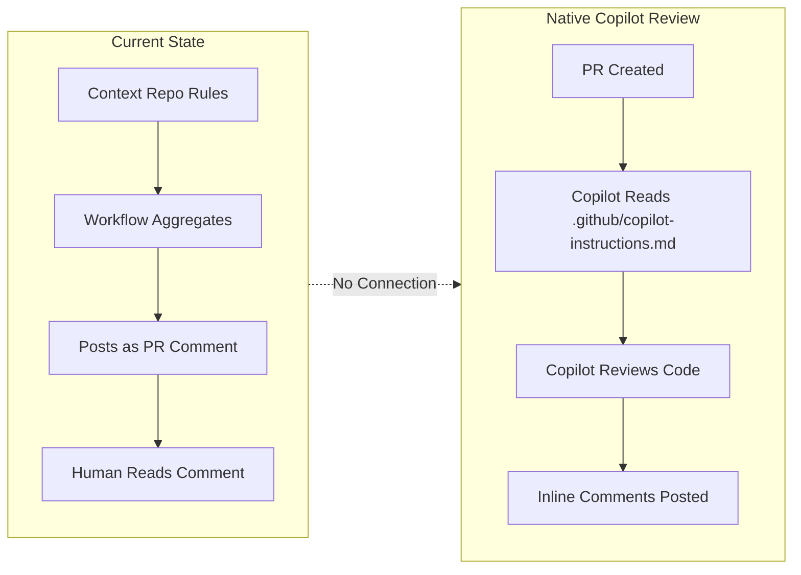
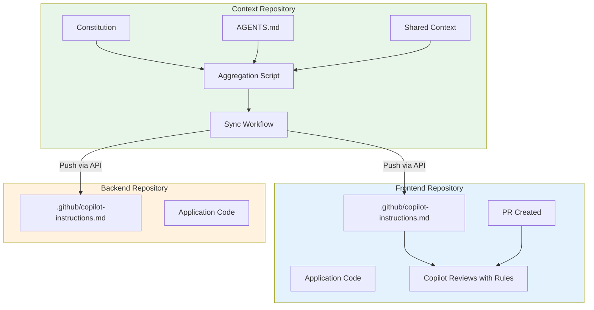
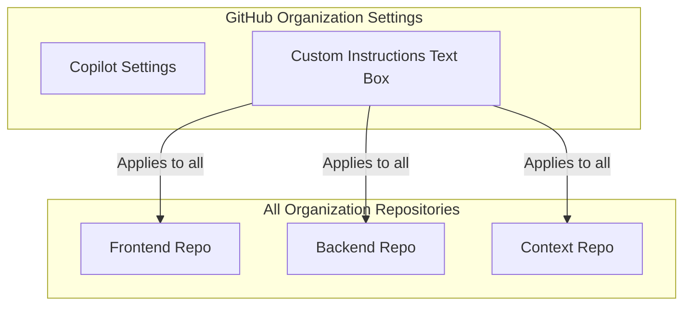
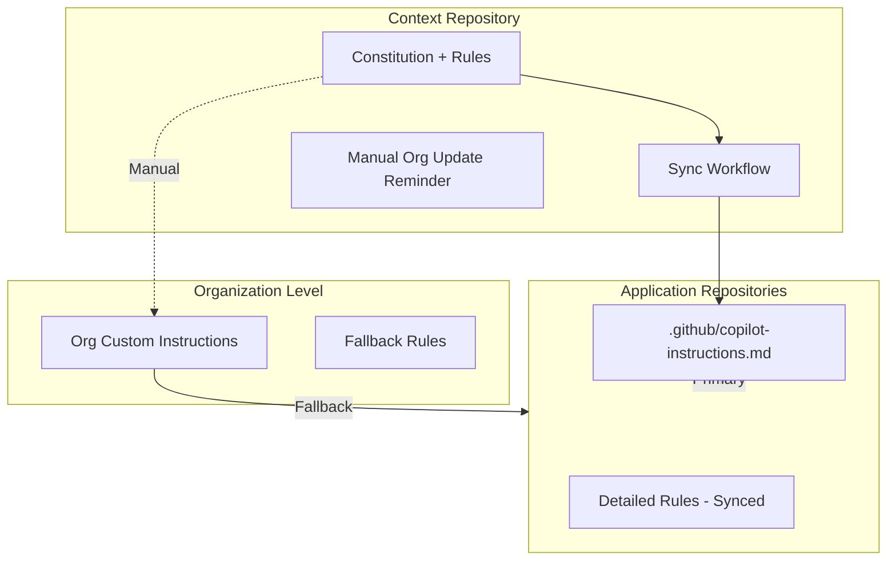
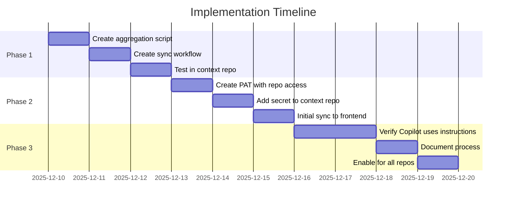
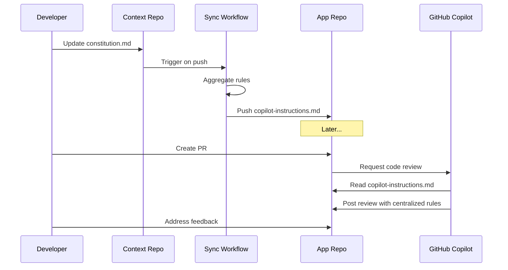

# Centralized Rules for GitHub Copilot Code Review

## Architecture Design Document

| Field | Value |
|-------|-------|
| **Version** | 1.0.0 |
| **Created** | 2025-12-09 |
| **Status** | Implemented |
| **Implemented** | 2025-12-09 |
| **Author** | Architecture Mode |
| **Approach** | Approach 1 - Sync via GitHub Actions |

---

## Executive Summary

This document presents a comprehensive architecture for ensuring centralized rules from the `inventory-management-context` repository are applied to GitHub Copilot's native code review feature across all application repositories.

### Key Discovery

**GitHub Copilot Code Review is a native GitHub feature**, not a GitHub Action. It:
- Is enabled at the repository level via Settings → Code review → Copilot
- Consumes custom instructions from `.github/copilot-instructions.md` in each repository
- Supports organization-level instructions via GitHub organization settings UI
- Does NOT support cross-repository file references

### The Core Challenge

The `.github/copilot-instructions.md` file must exist **within each repository** for Copilot to use it during code reviews. There is no native mechanism to reference instructions from another repository.

---

## Current State Analysis

### What We Have

```
inventory-management-context/           # Central rules repository
├── .specify/memory/constitution.md     # NON-NEGOTIABLE principles
├── AGENTS.md                           # Repository-specific rules
├── .github/copilot-instructions.md     # Basic Copilot instructions
└── .github/workflows/copilot-pr-review.yml  # Current workflow

inventory-management-frontend/          # Application repository
└── (no copilot-instructions.md)        # Missing centralized rules
```

### Current Workflow Behavior

The existing workflow:
1. ✅ Checks out the context repository
2. ✅ Aggregates rules into a single file
3. ⚠️ Posts review guidelines as a PR comment (fallback mode)
4. ⚠️ Creates a status check
5. ❌ Does NOT feed rules to Copilot's native code review

### The Gap



---

## Proposed Solutions

### Approach 1: Sync Instructions File via GitHub Actions (RECOMMENDED)

**Strategy**: Use a GitHub Action workflow to automatically sync the aggregated rules from the context repository to each application repository's `.github/copilot-instructions.md` file.



#### Implementation Details

**Context Repository - Sync Workflow**

File: `.github/workflows/sync-copilot-instructions.yml`

```yaml
name: Sync Copilot Instructions to Application Repos

on:
  push:
    branches: [main]
    paths:
      - '.specify/memory/constitution.md'
      - 'AGENTS.md'
      - '.specify/memory/agent-shared-context.md'
      - '.github/copilot-instructions.md'
      - '.github/scripts/aggregate-rules.sh'
  workflow_dispatch:
    inputs:
      target_repos:
        description: 'Comma-separated list of repos to sync'
        required: false
        default: 'all'

env:
  TARGET_REPOS: |
    inventory-management-frontend
    inventory-management-backend

jobs:
  aggregate-and-sync:
    runs-on: ubuntu-latest
    permissions:
      contents: read
    
    steps:
      - name: Checkout context repository
        uses: actions/checkout@v4
        
      - name: Aggregate rules into copilot-instructions.md
        run: |
          # Generate aggregated instructions
          .github/scripts/generate-copilot-instructions.sh
          
      - name: Sync to application repositories
        env:
          GH_TOKEN: ${{ secrets.CROSS_REPO_TOKEN }}
        run: |
          for repo in $TARGET_REPOS; do
            echo "Syncing to $repo..."
            
            # Create or update the file via GitHub API
            gh api repos/${{ github.repository_owner }}/$repo/contents/.github/copilot-instructions.md \
              --method PUT \
              -f message="chore: sync copilot instructions from context repo" \
              -f content="$(base64 -w0 .github/copilot-instructions-aggregated.md)" \
              -f branch="main" \
              --jq '.commit.sha' || echo "Failed to sync to $repo"
          done
```

**New Aggregation Script**

File: `.github/scripts/generate-copilot-instructions.sh`

```bash
#!/bin/bash
# Generates a comprehensive copilot-instructions.md for code review

set -euo pipefail

OUTPUT_FILE=".github/copilot-instructions-aggregated.md"
CONSTITUTION_FILE=".specify/memory/constitution.md"
AGENTS_FILE="AGENTS.md"
SHARED_CONTEXT_FILE=".specify/memory/agent-shared-context.md"

# Extract version
VERSION=$(grep -oP '\*\*Version\*\*: \K[0-9]+\.[0-9]+\.[0-9]+' "$CONSTITUTION_FILE" 2>/dev/null || echo "unknown")
GENERATED_AT=$(date -u +"%Y-%m-%dT%H:%M:%SZ")

cat << 'EOF' > "$OUTPUT_FILE"
# GitHub Copilot Code Review Instructions

> **Auto-generated from inventory-management-context repository**
> Constitution Version: ${VERSION} | Generated: ${GENERATED_AT}

## Code Review Guidelines

When reviewing code in this repository, apply the following standards:

### Critical Violations (MUST Block Merge)

1. **TypeScript Type Safety**
   - No implicit `any` types allowed
   - All function parameters and return types MUST be explicitly typed
   - Type assertions must be justified with comments

2. **Testing Requirements**
   - All business logic MUST have unit tests
   - Minimum 80% code coverage for critical paths
   - Tests MUST use Jest and React Testing Library

3. **Security Standards**
   - No secrets or API keys in code
   - All user inputs MUST be validated
   - CORS and security headers properly configured

4. **AWS Best Practices**
   - AWS SDK v3 with modular imports only
   - No DynamoDB scan operations (use queries with indexes)
   - Lambda functions must be stateless and idempotent

### High Priority (Strongly Recommend Fix)

- Missing error handling for AWS calls
- CORS/security header issues
- Performance optimization opportunities

### Medium Priority (Advisory)

- Code organization issues
- Missing type definitions
- Documentation improvements

## Technology Stack

- **Framework**: Next.js 16 with App Router
- **Language**: TypeScript 5 strict mode
- **Runtime**: Node.js 24.x LTS
- **Build Tool**: Vite
- **Backend**: AWS SAM (Lambda + DynamoDB)
- **Testing**: Jest + React Testing Library

## Review Format

When providing feedback:
1. Cite the specific rule being violated
2. Explain why it matters
3. Provide a concrete fix suggestion
4. Use severity labels: 🔴 CRITICAL, 🟠 HIGH, 🟡 MEDIUM, 🟢 LOW

---

*These instructions are automatically synced from the central context repository.*
*Do not edit this file directly - changes will be overwritten.*
EOF

echo "Generated $OUTPUT_FILE with constitution version $VERSION"
```

#### Pros

| Benefit | Description |
|---------|-------------|
| ✅ **Native Integration** | Rules are consumed by Copilot's native code review |
| ✅ **Automatic Sync** | Changes propagate automatically on push |
| ✅ **Single Source of Truth** | Rules maintained only in context repo |
| ✅ **Version Tracking** | Each sync includes constitution version |
| ✅ **Audit Trail** | Git history shows when rules changed |

#### Cons

| Limitation | Description |
|------------|-------------|
| ❌ **Requires PAT** | Need Personal Access Token with repo write access |
| ❌ **Eventual Consistency** | Brief delay between rule change and sync |
| ❌ **File in App Repos** | Creates a file that shouldn't be manually edited |
| ❌ **API Rate Limits** | GitHub API has rate limits for many repos |

---

### Approach 2: Organization-Level Custom Instructions

**Strategy**: Use GitHub's organization-level Copilot settings to define instructions that apply to all repositories.



#### Implementation

1. Navigate to: **Organization Settings → Copilot → Custom Instructions**
2. Paste the aggregated rules into the text box
3. Save changes

#### Pros

| Benefit | Description |
|---------|-------------|
| ✅ **No Files Needed** | No `.github/copilot-instructions.md` in app repos |
| ✅ **Immediate Effect** | Changes apply instantly |
| ✅ **Centralized UI** | Single place to manage |

#### Cons

| Limitation | Description |
|------------|-------------|
| ❌ **Manual Process** | Must manually update via UI |
| ❌ **No Version Control** | Changes not tracked in git |
| ❌ **No Automation** | Cannot be updated via API/workflow |
| ❌ **Character Limits** | May have text length restrictions |
| ❌ **Lowest Priority** | Org instructions have lowest priority (personal > repo > org) |

---

### Approach 3: Hybrid - Sync + Organization Fallback

**Strategy**: Combine both approaches for maximum coverage.



#### Implementation

1. **Primary**: Sync detailed rules to `.github/copilot-instructions.md` in each app repo
2. **Fallback**: Add summary rules to organization settings for repos without synced files
3. **Reminder**: Workflow posts reminder when org settings need updating

---

## Recommended Approach

### Primary Recommendation: Approach 1 (Sync via GitHub Actions)

This approach provides the best balance of:
- ✅ Native Copilot integration
- ✅ Automation and version control
- ✅ Single source of truth
- ✅ Audit trail

### Implementation Plan



---

## File Changes Required

### Context Repository

| File | Action | Purpose |
|------|--------|---------|
| `.github/scripts/generate-copilot-instructions.sh` | CREATE | Aggregates rules into Copilot format |
| `.github/workflows/sync-copilot-instructions.yml` | CREATE | Syncs to application repos |
| `.github/copilot-instructions.md` | UPDATE | Add header noting it's the source |

### Frontend Repository

| File | Action | Purpose |
|------|--------|---------|
| `.github/copilot-instructions.md` | AUTO-CREATED | Synced from context repo |

### Backend Repository

| File | Action | Purpose |
|------|--------|---------|
| `.github/copilot-instructions.md` | AUTO-CREATED | Synced from context repo |

---

## Security Considerations

### Required Secrets

| Secret | Scope | Purpose |
|--------|-------|---------|
| `CROSS_REPO_TOKEN` | Context repo | PAT with `repo` scope for target repos |

### Token Permissions

The PAT needs:
- `repo` - Full control of private repositories (to push files)
- OR `public_repo` - If repos are public

### Best Practices

1. Use a dedicated service account for the PAT
2. Set token expiration and rotate regularly
3. Limit token scope to only required repositories
4. Audit token usage via GitHub security logs

---

## Workflow Diagram



---

## Alternative Approaches Considered

### Git Submodules

**Rejected** because:
- Copilot doesn't follow submodule references
- Adds developer friction
- Requires manual updates

### Symlinks

**Rejected** because:
- GitHub doesn't resolve symlinks in web UI
- Copilot reads files from GitHub, not local filesystem

### GitHub App

**Rejected** because:
- Overkill for this use case
- Requires app development and hosting
- More complex than workflow-based sync

### Manual Copy

**Rejected** because:
- Prone to drift
- No automation
- Violates DRY principle

---

## Success Metrics

| Metric | Target | Measurement |
|--------|--------|-------------|
| Sync Success Rate | 100% | Workflow run success |
| Rule Freshness | < 5 min | Time from push to sync |
| Copilot Adoption | 100% PRs | PRs with Copilot review |
| Rule Violations Caught | Increase | Compare before/after |

---

## Rollback Plan

If issues arise:

1. **Disable Sync Workflow**: Comment out trigger in workflow file
2. **Revert Instructions**: Push previous version of copilot-instructions.md
3. **Fallback to Comments**: Re-enable PR comment workflow

---

## Next Steps

1. [ ] Review and approve this architecture
2. [ ] Create `CROSS_REPO_TOKEN` PAT
3. [ ] Implement aggregation script
4. [ ] Implement sync workflow
5. [ ] Test with frontend repository
6. [ ] Document for team
7. [ ] Enable for all repositories

---

## Appendix: Sample Aggregated Instructions

```markdown
# GitHub Copilot Code Review Instructions

> Auto-synced from inventory-management-context
> Constitution v1.1.0 | Synced: 2025-12-09T17:00:00Z

## CRITICAL Rules (Block Merge)

### TypeScript
- No implicit `any` - all types must be explicit
- Strict mode required
- No type assertions without justification comments

### Testing
- 80% coverage for critical paths
- Jest + React Testing Library only
- Test-first development required

### Security
- No secrets in code
- Validate all inputs
- CORS properly configured

### AWS
- SDK v3 modular imports only
- No DynamoDB scans
- Lambda must be stateless

## Review Format

Use severity labels:
- 🔴 CRITICAL - Must fix before merge
- 🟠 HIGH - Strongly recommend fix
- 🟡 MEDIUM - Consider fixing
- 🟢 LOW - Optional improvement

---
*Do not edit - auto-synced from context repository*
```

---

## Revision History

| Version | Date | Author | Changes |
|---------|------|--------|---------|
| 1.0.0 | 2025-12-09 | Architecture Mode | Initial design document |