# Multi-Repository Workspace Architecture

## Executive Summary

This document describes a **multi-repository workspace architecture** designed to demonstrate spec-driven development with SpecKit. The architecture separates concerns across three repositories while maintaining consistency through synchronized AI agent configurations and a centralized constitution.

**Key Innovation:** A dedicated context repository serves as the single source of truth for development workflows, agent configurations, and project governance, enabling multiple AI coding assistants (Cursor, Roo Code, GitHub Copilot) to work consistently across application repositories.

**Core Benefits:**
- **Separation of Concerns**: SpecKit tooling isolated from application code
- **Multi-Agent Support**: Consistent behavior across different AI assistants
- **Constitution-Driven**: Non-negotiable principles enforced via automated PR reviews
- **Spec-First Development**: Requirements validated before implementation

---

## Workspace Architecture

The workspace consists of three repositories organized under the `ATL-Inventory/` namespace:

```mermaid
graph TB
    subgraph "ATL-Inventory Workspace"
        CTX["📋 inventory-management-context<br/>(Context Repository)<br/>SpecKit Commands, Templates, Constitution"]
        BE["🔧 inventory-management-backend<br/>(Backend Repository)<br/>AWS Lambda + DynamoDB"]
        FE["🎨 inventory-management-frontend<br/>(Frontend Repository)<br/>Next.js 16 App Router"]
    end
    
    CTX -->|"Syncs Rules & Constitution"| BE
    CTX -->|"Syncs Rules & Constitution"| FE
    
    style CTX fill:#e1f5ff
    style BE fill:#fff4e1
    style FE fill:#ffe1f5
```



### Repository Roles

| Repository | Type | Purpose | Contains |
|------------|------|---------|----------|
| **inventory-management-context** | Meta/Context | AI-assisted development tooling | SpecKit commands, templates, scripts, constitution, agent configurations |
| **inventory-management-backend** | Application | Server-side logic | AWS Lambda functions, DynamoDB schemas, API definitions |
| **inventory-management-frontend** | Application | User interface | Next.js 16 app, React components, client-side logic |

---

## What Belongs Where

### Context Repository (`inventory-management-context`)

**Purpose:** Meta-repository for AI-assisted development workflows

**Contains:**
- `.specify/` - SpecKit templates, scripts, and memory
  - `memory/constitution.md` - **NON-NEGOTIABLE** project authority
  - `memory/agent-shared-context.md` - Single source of truth for agent sync
  - `templates/` - Specification, plan, and task templates
  - `scripts/bash/` - Automation scripts including sync utilities
- `.cursor/` - Cursor IDE configuration
  - `commands/` - 9 SpecKit commands
  - `rules/specify-rules.mdc` - Cursor-specific rules (auto-synced)
- `.roo/` - Roo Code configuration
  - `commands/` - 9 SpecKit commands
  - `rules-*/` - Mode-specific rules
- `.github/` - GitHub Copilot configuration
  - `agents/` - 11 specialized agents
  - `prompts/` - 10 prompt templates
  - `workflows/sync-copilot-instructions.yml` - Cross-repo sync automation
- `docs/` - Architecture and workflow documentation
- `specs/` - Feature specifications organized by feature number
- `AGENTS.md` - Agent guidance (auto-synced from shared context)

**Does NOT Contain:**
- Application source code
- Deployment configurations for apps
- Application-specific tests

### Backend Repository (`inventory-management-backend`)

**Purpose:** AWS serverless backend implementation

**Contains:**
- Lambda function handlers (TypeScript 5 strict mode)
- DynamoDB single-table design schemas
- AWS SAM templates for deployment
- API Gateway configurations
- Backend-specific tests (Jest)
- `.github/copilot-instructions.md` (synced from context repo)

**Technology Stack:**
- Node.js 20.x LTS
- TypeScript 5 with strict mode
- AWS Lambda + API Gateway
- DynamoDB (single-table design)
- AWS SAM for IaC

### Frontend Repository (`inventory-management-frontend`)

**Purpose:** Next.js web application

**Contains:**
- Next.js 16 App Router application
- React components (TypeScript 5 strict mode)
- Client-side state management
- UI/UX assets and styles
- Frontend-specific tests (Jest + React Testing Library)
- `.github/copilot-instructions.md` (synced from context repo)

**Technology Stack:**
- Next.js 16 with App Router
- TypeScript 5 with strict mode
- React 18+
- Jest + React Testing Library

---

## Multi-Agent Support

The architecture supports three AI coding assistants with **identical SpecKit commands** but **agent-specific configurations**.

### SpecKit Commands (Available to All Agents)


### Agent Configuration Matrix

| Agent | Configuration Location | Key Files | Command Count |
|-------|----------------------|-----------|---------------|
| **Cursor** | `.cursor/` | `.cursorrules`<br/>`rules/specify-rules.mdc`<br/>`commands/*.md` | 9 SpecKit commands |
| **GitHub Copilot** | `.github/` | `copilot-instructions.md`<br/>`copilot-review-config.yml`<br/>`agents/*.md`<br/>`prompts/*.md` | 10 SpecKit commands* |
| **Roo Code** | `.roo/` | `commands/*.md`<br/>`rules-architect/*.md`<br/>`rules-code/*.md`<br/>`rules-ask/*.md`<br/>`rules-debug/*.md` | 9 SpecKit commands<br/>4 mode rule sets |

*GitHub Copilot includes an additional `speckit.pr-review` command not available in other agents, and uses a dual-file approach with both `.prompt.md` and `.agent.md` files for each command.


**Command Descriptions:**

| Command | Purpose | Output |
|---------|---------|--------|
| `speckit.constitution` | Create/update project constitution | `.specify/memory/constitution.md` |
| `speckit.specify` | Create feature specification | `specs/###-feature-name/spec.md` |
| `speckit.clarify` | Resolve specification ambiguities | Updated spec with clarifications |
| `speckit.plan` | Generate implementation plan | `specs/###-feature-name/plan.md` |
| `speckit.tasks` | Generate task breakdown | `specs/###-feature-name/tasks.md` |
| `speckit.checklist` | Generate quality checklists | `specs/###-feature-name/checklists/requirements.md` |
| `speckit.analyze` | Cross-artifact consistency analysis | Analysis report |
| `speckit.implement` | Execute implementation tasks | Code changes in app repos |
| `speckit.taskstoissues` | Convert tasks to GitHub issues | GitHub issues created |

---

## Synchronization Strategy

### Single Source of Truth

**File:** `.specify/memory/agent-shared-context.md`

This file contains shared context that should apply to **all AI agents**. It is the authoritative source for:
- Repository type and purpose
- Non-negotiable principles
- Technology stack decisions
- Feature branch conventions
- SpecKit workflow guidance
- Critical gotchas and best practices

### Local Synchronization (Within Context Repo)

**Script:** `.specify/scripts/bash/sync-agent-contexts.sh`

**Process:**
1. Reads content from `.specify/memory/agent-shared-context.md`
2. Syncs to three target files:
   - `AGENTS.md` (Roo Code)
   - `.cursor/rules/specify-rules.mdc` (Cursor IDE)
   - `.github/agents/copilot-instructions.md` (GitHub Copilot)

**Trigger:** Manual execution after editing shared context

```bash
# Run from context repository root
.specify/scripts/bash/sync-agent-contexts.sh
```

### Cross-Repository Synchronization

**Workflow:** `.github/workflows/sync-copilot-instructions.yml`

**Process:**


**Trigger Conditions:**
- Push to `main` branch
- Changes to:
  - `.specify/memory/constitution.md`
  - `AGENTS.md`
  - `.specify/memory/agent-shared-context.md`

**Target Files:**
- `inventory-management-backend/.github/copilot-instructions.md`
- `inventory-management-frontend/.github/copilot-instructions.md`

**Benefits:**
- GitHub Copilot works natively in app repos with latest rules
- Constitution changes automatically propagate
- No manual sync required across repositories

### Synchronization Quick Reference

| Scope | Source | Targets | Trigger | Tool |
|-------|--------|---------|---------|------|
| **Local** | `.specify/memory/agent-shared-context.md` | `AGENTS.md`<br/>`.cursor/rules/specify-rules.mdc`<br/>`.github/agents/copilot-instructions.md` | Manual | `sync-agent-contexts.sh` |
| **Cross-Repo** | Constitution + AGENTS.md + Shared Context | `backend/.github/copilot-instructions.md`<br/>`frontend/.github/copilot-instructions.md` | Push to main | GitHub Actions |

---

## SpecKit Workflow

### Constitution as Authority

**File:** `.specify/memory/constitution.md`

The constitution is the **NON-NEGOTIABLE** authority for all development decisions. It defines:

1. **Non-Negotiable Principles**
   - TypeScript 5 with strict mode (no implicit `any`)
   - Test-first development (80% coverage for critical paths)
   - Jest and React Testing Library as mandatory frameworks

2. **Technology Stack**
   - Next.js 16 with App Router
   - Node.js 20.x LTS
   - AWS SAM for deployment
   - DynamoDB single-table design

3. **Development Standards**
   - Feature branch convention: `###-feature-name`
   - Code review requirements
   - Testing requirements
   - Documentation standards

### Spec-Driven Development Process


### Workflow Steps

#### 1. Constitution (Foundation)
- **Command:** `speckit.constitution`
- **Output:** `.specify/memory/constitution.md`
- **Purpose:** Establish non-negotiable principles and technology decisions
- **Frequency:** Once per project, updated rarely

#### 2. Specification (Requirements)
- **Command:** `speckit.specify`
- **Output:** `specs/###-feature-name/spec.md`
- **Purpose:** Capture user stories, acceptance criteria, and functional requirements
- **Includes:** User personas, use cases, success metrics

#### 3. Clarification (Ambiguity Resolution)
- **Command:** `speckit.clarify`
- **Output:** Updated specification
- **Purpose:** Resolve ambiguities before planning
- **Trigger:** When requirements are unclear or conflicting

#### 4. Plan (Technical Design)
- **Command:** `speckit.plan`
- **Output:** `specs/###-feature-name/plan.md`
- **Purpose:** Define technical approach, validate against constitution
- **Includes:** Architecture decisions, API contracts, data models

#### 5. Tasks (Implementation Breakdown)
- **Command:** `speckit.tasks`
- **Output:** `specs/###-feature-name/tasks.md`
- **Purpose:** Break down plan into trackable implementation units
- **Format:** `- [ ] [TaskID] [P?] [Story?] Description with file path`

#### 6. Checklist (Validation)
- **Command:** `speckit.checklist`
- **Output:** `specs/###-feature-name/checklists/requirements.md`
- **Purpose:** Validate **requirements** completion (NOT implementation details)
- **Critical:** Checklists validate against spec, not against code

#### 7. Implementation (Execution)
- **Command:** `speckit.implement`
- **Output:** Code changes in application repositories
- **Purpose:** Execute tasks with AI assistance
- **Validation:** Against constitution and plan

#### 8. Analysis (Consistency Check)
- **Command:** `speckit.analyze`
- **Output:** Analysis report
- **Purpose:** Ensure cross-artifact consistency
- **Checks:** Spec ↔ Plan ↔ Tasks ↔ Checklist alignment

### PR Review System

**Configuration:** `.github/copilot-review-config.yml`

**Process:**
1. PR opened in backend or frontend repository
2. GitHub Copilot reviews code against constitution rules
3. Severity-based blocking:
   - **CRITICAL**: Blocks merge
   - **WARNING**: Allows merge with review
   - **INFO**: Informational only
4. Inline comments with suggested fixes
5. Constitution compliance report

**Example Rules:**
- No implicit `any` types (CRITICAL)
- Test coverage ≥80% for critical paths (CRITICAL)
- Feature branch naming convention (WARNING)

---

## Getting Started

### For New Team Members

#### 1. Clone All Repositories

```bash
# Create workspace directory
mkdir ATL-Inventory
cd ATL-Inventory

# Clone repositories
git clone https://github.com/your-org/inventory-management-context.git
git clone https://github.com/your-org/inventory-management-backend.git
git clone https://github.com/your-org/inventory-management-frontend.git
```

#### 2. Review the Constitution

```bash
cd inventory-management-context
cat .specify/memory/constitution.md
```

**Key Question:** Do you agree with the non-negotiable principles?

#### 3. Set Up Your AI Assistant

**For Cursor:**
- Open `inventory-management-context` in Cursor
- Commands available in Command Palette (Cmd/Ctrl+Shift+P)
- Type "SpecKit" to see available commands

**For Roo Code:**
- Open `inventory-management-context` in VS Code with Roo Code extension
- Commands available via Roo Code interface
- Access via `.roo/commands/`

**For GitHub Copilot:**
- Ensure GitHub Copilot is enabled
- Agents available via `@` mentions in chat
- Prompts available in `.github/prompts/`

#### 4. Understand the Feature Branch Convention

```bash
# Feature branches MUST follow this pattern
git checkout -b 001-user-authentication
git checkout -b 002-inventory-crud
git checkout -b 003-search-functionality
```

**Format:** `###-feature-name` (3-digit number, kebab-case name)

#### 5. Start a New Feature

```bash
# 1. Create specification
# Use: speckit.specify command in your AI assistant

# 2. Generate plan
# Use: speckit.plan command

# 3. Break down into tasks
# Use: speckit.tasks command

# 4. Create checklist
# Use: speckit.checklist command

# 5. Implement
# Use: speckit.implement command or manual coding

# 6. Validate
# Check off items in checklist as requirements are met
```

### Quick Reference Card

| Task | Command | Output Location |
|------|---------|-----------------|
| Define project principles | `speckit.constitution` | `.specify/memory/constitution.md` |
| Specify new feature | `speckit.specify` | `specs/###-feature-name/spec.md` |
| Plan implementation | `speckit.plan` | `specs/###-feature-name/plan.md` |
| Break down tasks | `speckit.tasks` | `specs/###-feature-name/tasks.md` |
| Create validation checklist | `speckit.checklist` | `specs/###-feature-name/checklists/requirements.md` |
| Sync agent contexts | Run script | `.specify/scripts/bash/sync-agent-contexts.sh` |
| Convert tasks to issues | `speckit.taskstoissues` | GitHub Issues |

### Critical Gotchas

1. **Feature Context:** Set `SPECIFY_FEATURE` env var when not using git for feature context
2. **Checklist Purpose:** Checklists validate **requirements**, NOT implementation details
3. **Task Format:** Must follow `- [ ] [TaskID] [P?] [Story?] Description with file path`
4. **Template Location:** All templates are in `.specify/templates/`
5. **Script Location:** All scripts are in `.specify/scripts/bash/`
6. **Agent Sync:** After editing `.specify/memory/agent-shared-context.md`, run sync script
7. **Constitution Authority:** All development decisions must align with constitution

---

## Related Documentation

- [Agent Context Synchronization](../.specify/docs/agent-context-sync.md) - Detailed sync documentation
- [Agent Sync Quick Reference](../.specify/AGENT-SYNC-QUICK-REFERENCE.md) - Quick sync guide
- [Copilot PR Review Setup](../COPILOT-PR-REVIEW-SETUP.md) - PR review configuration
- [Copilot PR Review](../COPILOT-PR-REVIEW.md) - PR review usage guide
- [Centralized Rules Architecture](./copilot-code-review-centralized-rules.md) - Rules architecture

---

## Appendix: File Structure Reference

### Context Repository Structure

```
inventory-management-context/
├── .cursor/                          # Cursor IDE configuration
│   ├── .cursorrules                  # Cursor rules
│   ├── commands/                     # 9 SpecKit commands
│   └── rules/
│       └── specify-rules.mdc         # Auto-synced rules
├── .github/                          # GitHub Copilot configuration
│   ├── agents/                       # 11 specialized agents
│   │   └── copilot-instructions.md   # Auto-synced instructions
│   ├── prompts/                      # 10 prompt templates
│   ├── workflows/
│   │   └── sync-copilot-instructions.yml  # Cross-repo sync
│   └── copilot-review-config.yml     # PR review config
├── .roo/                             # Roo Code configuration
│   ├── commands/                     # 9 SpecKit commands
│   ├── rules-architect/              # Architect mode rules
│   ├── rules-code/                   # Code mode rules
│   ├── rules-ask/                    # Ask mode rules
│   └── rules-debug/                  # Debug mode rules
├── .specify/                         # SpecKit core
│   ├── memory/
│   │   ├── constitution.md           # NON-NEGOTIABLE authority
│   │   └── agent-shared-context.md   # Single source of truth
│   ├── templates/                    # Spec, plan, task templates
│   ├── scripts/
│   │   └── bash/
│   │       └── sync-agent-contexts.sh  # Local sync script
│   └── docs/
│       └── agent-context-sync.md     # Sync documentation
├── docs/                             # Project documentation
│   ├── architecture/                 # Architecture docs
│   ├── COPILOT-PR-REVIEW.md
│   └── COPILOT-PR-REVIEW-SETUP.md
├── specs/                            # Feature specifications
│   └── ###-feature-name/
│       ├── spec.md                   # Requirements
│       ├── plan.md                   # Technical design
│       ├── tasks.md                  # Implementation tasks
│       └── checklists/
│           └── requirements.md       # Validation checklist
├── AGENTS.md                         # Auto-synced agent guidance
└── README.md                         # Repository overview
```

---

## 8. Scaling to Enterprise Governance

### Overview

As organizations adopt the multi-repository workspace pattern across multiple projects, a need emerges for **enterprise-level governance** that enforces organization-wide standards while allowing project-level customization. This section explores potential approaches to extend the current two-tier hierarchy (Context Repo → App Repos) to a three-tier model with an Enterprise Governance layer.

### Current vs. Proposed Hierarchy


### Governance Categories

Enterprise governance typically spans four key domains:

| Category | Examples | Enforcement Level |
|----------|----------|-------------------|
| **Security** | OWASP compliance, secret management, authentication standards | Mandatory - No override |
| **Architecture** | Approved cloud services, API standards, data patterns | Mandatory with exceptions |
| **Coding Standards** | Language versions, linting rules, testing frameworks | Recommended - Project customizable |
| **Compliance** | Regulatory requirements, audit trails, data retention | Mandatory - No override |

---

### Approach 1: Centralized Enterprise Repository

**Model:** Single enterprise governance repository that syncs to all project context repositories.


**Structure:**
```
enterprise-governance/
├── .github/
│   └── workflows/
│       └── sync-to-projects.yml      # Syncs to all project contexts
├── constitution/
│   ├── enterprise-constitution.md    # Organization-wide principles
│   └── amendment-log.md              # Change history
├── security/
│   ├── owasp-rules.md               # OWASP compliance requirements
│   ├── secrets-policy.md            # Secret management standards
│   └── auth-standards.md            # Authentication requirements
├── architecture/
│   ├── approved-services.md         # Approved cloud services list
│   ├── api-standards.md             # API design guidelines
│   └── data-patterns.md             # Data architecture patterns
├── coding/
│   ├── typescript-standards.md      # TypeScript conventions
│   ├── testing-requirements.md      # Testing framework standards
│   └── linting-config/              # Shared linting configurations
└── compliance/
    ├── audit-requirements.md        # Audit trail requirements
    └── data-retention.md            # Data retention policies
```

**Pros:**
- Single source of truth for enterprise standards
- Simplified governance - one place to update rules
- Clear audit trail for compliance
- Consistent enforcement across all projects

**Cons:**
- Single point of failure
- May become bloated with project-specific exceptions
- Requires careful access control management
- All projects must wait for enterprise repo updates

---

### Approach 2: Federated Domain Repositories

**Model:** Multiple domain-specific governance repositories, each owning a specific governance area.


**Structure:**
```
Organization/
├── security-governance/
│   ├── rules/
│   │   ├── owasp-compliance.md
│   │   ├── secrets-management.md
│   │   └── authentication.md
│   └── .github/workflows/sync.yml
│
├── architecture-governance/
│   ├── patterns/
│   │   ├── approved-services.md
│   │   ├── api-standards.md
│   │   └── data-patterns.md
│   └── .github/workflows/sync.yml
│
├── coding-standards/
│   ├── languages/
│   │   ├── typescript.md
│   │   └── python.md
│   ├── configs/
│   │   ├── eslint-base.json
│   │   └── prettier-base.json
│   └── .github/workflows/sync.yml
│
└── compliance-governance/
    ├── requirements/
    │   ├── audit-trails.md
    │   └── data-retention.md
    └── .github/workflows/sync.yml
```

**Pros:**
- Domain experts own their respective areas
- Independent versioning and release cycles
- Smaller, focused repositories
- Teams can subscribe to relevant domains only

**Cons:**
- Coordination overhead between domains
- Potential for conflicting rules across domains
- More complex synchronization logic
- Harder to see complete governance picture

---

### Approach 3: Package-Based Distribution

**Model:** Enterprise rules distributed as versioned packages that project contexts consume as dependencies.


**Package Structure:**
```json
// project-context/package.json
{
  "name": "@org/project-a-context",
  "dependencies": {
    "@org/security-rules": "^2.1.0",
    "@org/architecture-patterns": "^1.5.0",
    "@org/coding-standards": "^3.0.0"
  },
  "scripts": {
    "sync-governance": "speckit-sync-governance",
    "validate-compliance": "speckit-validate-compliance"
  }
}
```

**Pros:**
- Semantic versioning for governance rules
- Projects control when to upgrade
- Familiar npm/package ecosystem
- Easy rollback to previous versions
- Dependency resolution handles conflicts

**Cons:**
- Requires package registry infrastructure
- Projects can lag behind on critical updates
- More complex initial setup
- May not work well for non-code artifacts

---

### Rule Inheritance and Conflict Resolution

Regardless of approach, a clear inheritance model is essential:

#### Inheritance Hierarchy


#### Rule Classification

| Classification | Description | Override Allowed? | Example |
|---------------|-------------|-------------------|---------|
| **MANDATORY** | Enterprise-critical, no exceptions | No | Secrets never in version control |
| **REQUIRED** | Standard requirement with exception process | With approval | Minimum test coverage 80% |
| **RECOMMENDED** | Best practice, project discretion | Yes | Specific linting rules |
| **OPTIONAL** | Guidance only | Yes | Code formatting preferences |

#### Conflict Resolution Matrix

| Scenario | Resolution | Mechanism |
|----------|------------|-----------|
| Enterprise MANDATORY vs Project rule | Enterprise wins | Validation fails on sync |
| Enterprise REQUIRED vs Project override | Project wins with documented exception | Exception registry |
| Project rule vs App-specific need | Project wins unless documented | Local override file |
| Multiple enterprise domains conflict | Domain priority order | Priority configuration |

#### Exception Registry Pattern

```yaml
# project-context/.specify/governance/exceptions.yml
exceptions:
  - rule_id: "SEC-001"
    rule_name: "Minimum password length"
    enterprise_value: 12
    project_value: 8
    justification: "Legacy system integration requires 8-char max"
    approved_by: "security-team"
    approved_date: "2025-01-15"
    review_date: "2025-07-15"
    status: "active"
```

---

### Synchronization Mechanisms

#### Option A: GitHub Actions Cascade


#### Option B: Git Submodules

```bash
# Project context includes enterprise governance as submodule
project-context/
├── .governance/           # Git submodule → enterprise-governance
│   ├── security/
│   ├── architecture/
│   └── compliance/
├── .specify/
│   └── memory/
│       └── constitution.md  # Extends enterprise constitution
└── project-overrides.yml    # Local customizations
```

#### Option C: Scheduled Polling

```yaml
# project-context/.github/workflows/governance-sync.yml
name: Sync Enterprise Governance
on:
  schedule:
    - cron: '0 6 * * *'  # Daily at 6 AM
  workflow_dispatch:

jobs:
  sync:
    runs-on: ubuntu-latest
    steps:
      - name: Fetch latest enterprise rules
        run: |
          curl -H "Authorization: token ${{ secrets.GITHUB_TOKEN }}" \
            https://api.github.com/repos/org/enterprise-governance/contents/rules \
            -o enterprise-rules.json
      
      - name: Merge with project constitution
        run: ./scripts/merge-governance.sh
      
      - name: Validate compliance
        run: ./scripts/validate-compliance.sh
```

---

### Implementation Considerations

#### Phase 1: Foundation
1. Define governance categories and rule classifications
2. Create enterprise governance repository structure
3. Establish exception registry format
4. Document conflict resolution procedures

#### Phase 2: Synchronization
1. Extend existing sync scripts for enterprise layer
2. Implement validation checks for mandatory rules
3. Create merge logic for rule inheritance
4. Set up GitHub Actions for cascade sync

#### Phase 3: Enforcement
1. Integrate with PR review workflows
2. Add CI/CD pipeline checks for compliance
3. Implement agent instruction injection
4. Create compliance dashboards

#### Phase 4: Rollout
1. Pilot with single project
2. Gather feedback and iterate
3. Gradual rollout to additional projects
4. Establish governance review cadence

### Recommendation

For organizations starting this journey, **Approach 1 (Centralized Enterprise Repository)** is recommended as the initial implementation due to:

1. **Simplicity**: Single source of truth reduces coordination overhead
2. **Alignment**: Mirrors the existing Context Repo → App Repos pattern
3. **Auditability**: Clear governance trail for compliance requirements
4. **Extensibility**: Can evolve to federated model as organization matures

The package-based approach (Approach 3) becomes attractive at scale when:
- Multiple teams need independent release cycles
- Semantic versioning of rules is critical
- Projects need fine-grained control over upgrade timing

---

**Document Version:** 1.1
**Last Updated:** 2025-12-09
**Maintained By:** Architecture Team