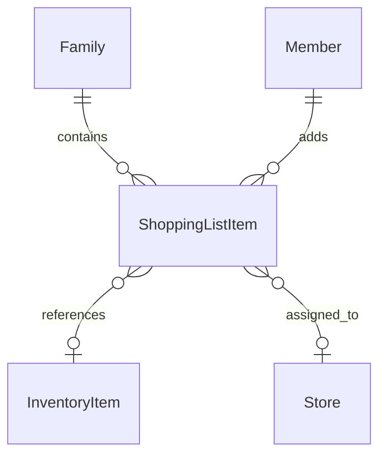
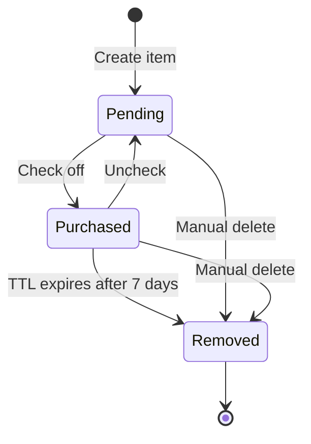

# Data Model: Shopping List Management

**Feature**: 002-shopping-lists  
**Date**: 2025-12-10  
**Database**: Amazon DynamoDB (Single-Table Design)  
**Parent Feature**: 001-family-inventory-mvp

## Overview

This document defines the extended data model for the Shopping List Management feature. It builds upon the ShoppingListItem entity defined in the parent feature ([`001-family-inventory-mvp/data-model.md`](../001-family-inventory-mvp/data-model.md#6-shoppinglistitem), lines 318-387) with additional attributes for optimistic locking and automatic cleanup.

## Table Structure

**Table Name**: `InventoryManagement` (shared with parent feature)

This feature uses the existing single-table design. No new tables or GSIs are required.

---

## ShoppingListItem Entity (Extended)

An item that needs to be purchased. Can be linked to an inventory item or be a standalone free-text entry.

### Access Patterns

| Access Pattern | Query Type | Keys Used |
|----------------|-----------|-----------|
| Get shopping item by ID | GetItem | PK = `FAMILY#{familyId}`, SK = `SHOPPING#{shoppingItemId}` |
| List all shopping items | Query | PK = `FAMILY#{familyId}`, SK begins_with `SHOPPING#` |
| List by store | Query | GSI2: PK = `FAMILY#{familyId}#SHOPPING`, SK begins_with `STORE#{storeId}` |
| List unassigned items | Query | GSI2: PK = `FAMILY#{familyId}#SHOPPING`, SK begins_with `STORE#UNASSIGNED` |
| List by status | Query | GSI2: PK = `FAMILY#{familyId}#SHOPPING`, SK contains `STATUS#{status}` |
| List pending by store | Query | GSI2: PK = `FAMILY#{familyId}#SHOPPING`, SK = `STORE#{storeId}#STATUS#pending` |

### Key Structure

- **PK**: `FAMILY#{familyId}`
- **SK**: `SHOPPING#{shoppingItemId}`
- **GSI2PK**: `FAMILY#{familyId}#SHOPPING`
- **GSI2SK**: `STORE#{storeId}#STATUS#{status}` (use `STORE#UNASSIGNED` when storeId is null)

### Attributes

```typescript
{
  // Primary identifiers
  shoppingItemId: string;     // UUID v4
  familyId: string;           // UUID v4
  
  // Item details
  itemId: string | null;      // UUID of InventoryItem (null for free-text items)
  name: string;               // Item name (1-100 characters)
  storeId: string | null;     // UUID of Store (null for unassigned)
  status: 'pending' | 'purchased'; // Purchase status
  quantity: number | null;    // Optional quantity to purchase (integer > 0)
  notes: string | null;       // Optional notes (0-500 characters)
  
  // Concurrency control (NEW)
  version: number;            // Optimistic locking version (starts at 1)
  
  // Automatic cleanup (NEW)
  ttl: number | null;         // Unix timestamp for DynamoDB TTL (null when pending)
  
  // Audit fields
  addedBy: string;            // memberId who added the item
  entityType: 'ShoppingListItem';
  createdAt: string;          // ISO 8601 timestamp
  updatedAt: string;          // ISO 8601 timestamp
}
```

### New Attributes Detail

#### `version` (Optimistic Locking)

- **Type**: `number`
- **Default**: `1` (on creation)
- **Purpose**: Prevents concurrent update conflicts when multiple family members modify the same item
- **Behavior**:
  - Incremented on every successful update
  - Update operations include `ConditionExpression: version = :expectedVersion`
  - On conflict (ConditionCheckFailedException), return HTTP 409 with current item state
  - Client should refresh and retry or merge changes

#### `ttl` (Time-To-Live)

- **Type**: `number | null` (Unix timestamp in seconds)
- **Default**: `null` (on creation)
- **Purpose**: Automatic cleanup of purchased items after 7 days
- **Behavior**:
  - Set to `updatedAt + 7 days` when status changes to `'purchased'`
  - Set to `null` when status changes back to `'pending'`
  - DynamoDB TTL automatically deletes items after the timestamp
  - Requires TTL to be enabled on the table for the `ttl` attribute

### Validation Rules

| Field | Rule | Error Message |
|-------|------|---------------|
| `shoppingItemId` | UUID v4 format | "Invalid shopping item ID format" |
| `familyId` | UUID v4 format | "Invalid family ID format" |
| `itemId` | UUID v4 format or null | "Invalid inventory item ID format" |
| `name` | 1-100 characters, required | "Name must be 1-100 characters" |
| `storeId` | UUID v4 format or null | "Invalid store ID format" |
| `status` | 'pending' or 'purchased' | "Status must be 'pending' or 'purchased'" |
| `quantity` | Integer > 0 or null | "Quantity must be a positive integer" |
| `notes` | 0-500 characters or null | "Notes must be 500 characters or less" |
| `version` | Integer >= 1 | "Version must be a positive integer" |
| `addedBy` | UUID v4 format | "Invalid member ID format" |

### Relationships



- **Belongs to**: One Family (via `familyId`)
- **Optionally references**: One InventoryItem (via `itemId`)
- **Optionally assigned to**: One Store (via `storeId`)
- **Created by**: One Member (via `addedBy`)

### State Transitions



| Transition | Trigger | Side Effects |
|------------|---------|--------------|
| Create → Pending | POST /shopping-list | `status = 'pending'`, `version = 1`, `ttl = null` |
| Pending → Purchased | PATCH status | `status = 'purchased'`, `version++`, `ttl = now + 7 days` |
| Purchased → Pending | PATCH status | `status = 'pending'`, `version++`, `ttl = null` |
| Any → Removed | DELETE or TTL | Item deleted from table |

### Orphaned Item Handling

When a linked InventoryItem is deleted:

1. Query for ShoppingListItems with matching `itemId`
2. Update each item: set `itemId = null` (convert to free-text)
3. Preserve `name`, `storeId`, and all other attributes
4. Use transactional write for consistency

```typescript
// Pseudocode for orphan handling
async function handleInventoryItemDeleted(familyId: string, deletedItemId: string) {
  const shoppingItems = await queryShoppingItemsByInventoryId(familyId, deletedItemId);
  
  const updates = shoppingItems.map(item => ({
    Update: {
      TableName: TABLE_NAME,
      Key: { PK: `FAMILY#${familyId}`, SK: `SHOPPING#${item.shoppingItemId}` },
      UpdateExpression: 'SET itemId = :null, version = version + :one, updatedAt = :now',
      ExpressionAttributeValues: {
        ':null': null,
        ':one': 1,
        ':now': new Date().toISOString(),
      },
    },
  }));
  
  await docClient.send(new TransactWriteCommand({ TransactItems: updates }));
}
```

### Duplicate Prevention

Before adding an inventory-linked item:

1. Query for existing ShoppingListItem with same `itemId` and `status = 'pending'`
2. If found, return HTTP 409 Conflict with existing item details
3. Client can prompt user for confirmation to add duplicate
4. If user confirms, proceed with add (no special flag needed)

```typescript
// Pseudocode for duplicate check
async function checkForDuplicate(familyId: string, itemId: string): Promise<ShoppingListItem | null> {
  const result = await docClient.send(new QueryCommand({
    TableName: TABLE_NAME,
    KeyConditionExpression: 'PK = :pk AND begins_with(SK, :sk)',
    FilterExpression: 'itemId = :itemId AND #status = :pending',
    ExpressionAttributeNames: { '#status': 'status' },
    ExpressionAttributeValues: {
      ':pk': `FAMILY#${familyId}`,
      ':sk': 'SHOPPING#',
      ':itemId': itemId,
      ':pending': 'pending',
    },
  }));
  
  return result.Items?.[0] as ShoppingListItem | null;
}
```

---

## DynamoDB Example Items

### Pending Item (Linked to Inventory)

```json
{
  "PK": "FAMILY#f47ac10b-58cc-4372-a567-0e02b2c3d479",
  "SK": "SHOPPING#8f14e45f-ceea-467a-9b36-34f6c3b3e7d1",
  "GSI2PK": "FAMILY#f47ac10b-58cc-4372-a567-0e02b2c3d479#SHOPPING",
  "GSI2SK": "STORE#123e4567-e89b-12d3-a456-426614174000#STATUS#pending",
  "shoppingItemId": "8f14e45f-ceea-467a-9b36-34f6c3b3e7d1",
  "familyId": "f47ac10b-58cc-4372-a567-0e02b2c3d479",
  "itemId": "6ba7b810-9dad-11d1-80b4-00c04fd430c8",
  "name": "Paper Towels",
  "storeId": "123e4567-e89b-12d3-a456-426614174000",
  "status": "pending",
  "quantity": 2,
  "notes": "Prefer double-roll",
  "version": 1,
  "ttl": null,
  "addedBy": "550e8400-e29b-41d4-a716-446655440000",
  "entityType": "ShoppingListItem",
  "createdAt": "2025-12-10T12:00:00Z",
  "updatedAt": "2025-12-10T12:00:00Z"
}
```

### Purchased Item (With TTL)

```json
{
  "PK": "FAMILY#f47ac10b-58cc-4372-a567-0e02b2c3d479",
  "SK": "SHOPPING#9f14e45f-ceea-467a-9b36-34f6c3b3e7d2",
  "GSI2PK": "FAMILY#f47ac10b-58cc-4372-a567-0e02b2c3d479#SHOPPING",
  "GSI2SK": "STORE#123e4567-e89b-12d3-a456-426614174000#STATUS#purchased",
  "shoppingItemId": "9f14e45f-ceea-467a-9b36-34f6c3b3e7d2",
  "familyId": "f47ac10b-58cc-4372-a567-0e02b2c3d479",
  "itemId": "7ba7b810-9dad-11d1-80b4-00c04fd430c9",
  "name": "Milk",
  "storeId": "123e4567-e89b-12d3-a456-426614174000",
  "status": "purchased",
  "quantity": 1,
  "notes": null,
  "version": 2,
  "ttl": 1734451200,
  "addedBy": "550e8400-e29b-41d4-a716-446655440000",
  "entityType": "ShoppingListItem",
  "createdAt": "2025-12-10T10:00:00Z",
  "updatedAt": "2025-12-10T14:00:00Z"
}
```

### Free-Text Item (Unassigned Store)

```json
{
  "PK": "FAMILY#f47ac10b-58cc-4372-a567-0e02b2c3d479",
  "SK": "SHOPPING#af14e45f-ceea-467a-9b36-34f6c3b3e7d3",
  "GSI2PK": "FAMILY#f47ac10b-58cc-4372-a567-0e02b2c3d479#SHOPPING",
  "GSI2SK": "STORE#UNASSIGNED#STATUS#pending",
  "shoppingItemId": "af14e45f-ceea-467a-9b36-34f6c3b3e7d3",
  "familyId": "f47ac10b-58cc-4372-a567-0e02b2c3d479",
  "itemId": null,
  "name": "Birthday cake",
  "storeId": null,
  "status": "pending",
  "quantity": 1,
  "notes": "For Sarah's party on Saturday",
  "version": 1,
  "ttl": null,
  "addedBy": "550e8400-e29b-41d4-a716-446655440000",
  "entityType": "ShoppingListItem",
  "createdAt": "2025-12-10T15:00:00Z",
  "updatedAt": "2025-12-10T15:00:00Z"
}
```

---

## TypeScript Type Definitions

```typescript
import { z } from 'zod';

// Zod Schema
export const ShoppingListItemSchema = z.object({
  shoppingItemId: z.string().uuid(),
  familyId: z.string().uuid(),
  itemId: z.string().uuid().nullable(),
  name: z.string().min(1).max(100),
  storeId: z.string().uuid().nullable(),
  status: z.enum(['pending', 'purchased']),
  quantity: z.number().int().positive().nullable(),
  notes: z.string().max(500).nullable(),
  version: z.number().int().min(1),
  ttl: z.number().int().nullable(),
  addedBy: z.string().uuid(),
  entityType: z.literal('ShoppingListItem'),
  createdAt: z.string().datetime(),
  updatedAt: z.string().datetime(),
});

export type ShoppingListItem = z.infer<typeof ShoppingListItemSchema>;

// Create Request Schema
export const CreateShoppingListItemSchema = z.object({
  itemId: z.string().uuid().nullable().optional(),
  name: z.string().min(1).max(100),
  storeId: z.string().uuid().nullable().optional(),
  quantity: z.number().int().positive().nullable().optional(),
  notes: z.string().max(500).nullable().optional(),
});

export type CreateShoppingListItemRequest = z.infer<typeof CreateShoppingListItemSchema>;

// Update Request Schema
export const UpdateShoppingListItemSchema = z.object({
  name: z.string().min(1).max(100).optional(),
  storeId: z.string().uuid().nullable().optional(),
  quantity: z.number().int().positive().nullable().optional(),
  notes: z.string().max(500).nullable().optional(),
  version: z.number().int().min(1), // Required for optimistic locking
});

export type UpdateShoppingListItemRequest = z.infer<typeof UpdateShoppingListItemSchema>;

// Status Update Schema
export const UpdateStatusSchema = z.object({
  status: z.enum(['pending', 'purchased']),
  version: z.number().int().min(1), // Required for optimistic locking
});

export type UpdateStatusRequest = z.infer<typeof UpdateStatusSchema>;
```

---

## Infrastructure Requirements

### DynamoDB TTL Configuration

Enable TTL on the `InventoryManagement` table for the `ttl` attribute:

```bash
aws dynamodb update-time-to-live \
  --table-name InventoryManagement \
  --time-to-live-specification "Enabled=true, AttributeName=ttl"
```

**SAM Template Addition** (if not already configured):

```yaml
Resources:
  InventoryTable:
    Type: AWS::DynamoDB::Table
    Properties:
      TableName: InventoryManagement
      TimeToLiveSpecification:
        AttributeName: ttl
        Enabled: true
      # ... other properties
```

---

## Data Integrity Rules

### Family Isolation
- All queries MUST filter by `familyId` to ensure data isolation
- Lambda authorizer MUST inject `familyId` from JWT claims
- Cross-family access MUST be prevented at the application layer

### Optimistic Locking
- All update operations MUST include version check
- On conflict, return HTTP 409 with current item state
- Client MUST handle conflicts gracefully (refresh and retry)

### TTL Behavior
- TTL is set only when status changes to 'purchased'
- TTL is cleared when status changes back to 'pending'
- Items are automatically deleted 7 days after being marked purchased
- DynamoDB TTL deletion is eventually consistent (may take up to 48 hours)

### Orphan Handling
- When InventoryItem is deleted, linked ShoppingListItems become free-text
- Item name is preserved for shopping continuity
- Store assignment is preserved

---

**Data Model Complete**: 2025-12-10  
**Status**: Ready for API contract generation