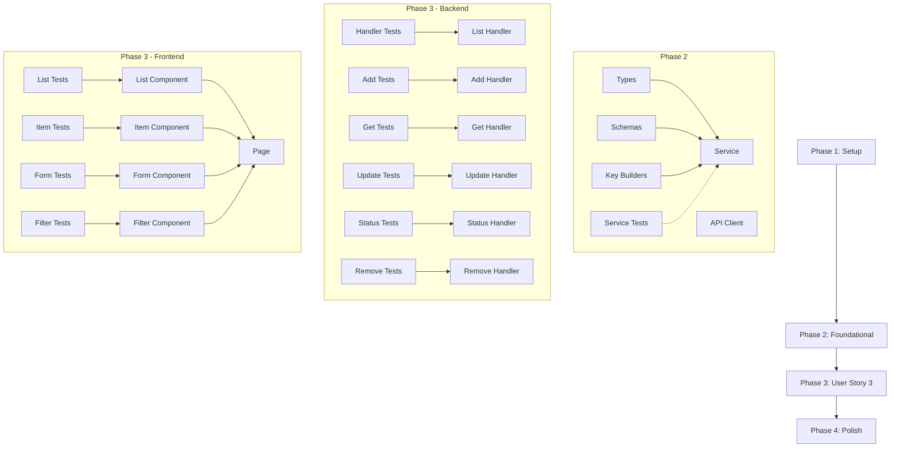

# Tasks: Shopping List Management

**Feature**: 002-shopping-lists  
**Date**: 2025-12-10  
**Input**: Design documents from `/specs/002-shopping-lists/`  
**Prerequisites**: plan.md ✅, spec.md ✅, research.md ✅, data-model.md ✅, contracts/api-spec.yaml ✅, quickstart.md ✅

## User Story Summary

### User Story 3 - Adult Creates and Manages Shopping Lists (Priority: P1) 🎯 MVP

Adults add items to a family shopping list (either from tracked inventory or as free-text items), organize items by preferred store, view the list filtered by store or as a combined master list, and check off items as purchased.

**Acceptance Criteria**:
1. Add inventory items to shopping list with preferred store auto-assignment
2. Add free-text items not in inventory
3. View items grouped by store
4. View master list with all items
5. Check off items as purchased (does NOT update inventory)
6. View which items were purchased

**Independent Test**: Can be tested by adding inventory items and free-text items to the shopping list, viewing by store and combined views, and checking off items to verify they're marked as purchased.

---

## Format: `[ID] [P?] [Story] Description`

- **[P]**: Can run in parallel (different files, no dependencies)
- **[US3]**: User Story 3 - Shopping List Management (P1)
- Include exact file paths in descriptions

---

## Phase 1: Setup (Shared Infrastructure)

**Purpose**: Project initialization and DynamoDB TTL configuration

- [X] T001 Enable DynamoDB TTL on `InventoryManagement` table for `ttl` attribute via AWS CLI or SAM template update
- [X] T002 [P] Create feature branch `002-shopping-lists` in backend repository
- [X] T003 [P] Create feature branch `002-shopping-lists` in frontend repository
- [X] T004 [P] Verify parent feature (001-family-inventory-mvp) dependencies are available

**Checkpoint**: Infrastructure ready for feature development

---

## Phase 2: Foundational (Blocking Prerequisites)

**Purpose**: Core types, schemas, and shared utilities that MUST be complete before handlers/components

**⚠️ CRITICAL**: No handler or component work can begin until this phase is complete

### Backend Types and Schemas

- [X] T005 [P] Create ShoppingListItem TypeScript types in `src/types/shoppingList.ts`
- [X] T006 [P] Create Zod validation schemas (ShoppingListItemSchema, CreateShoppingListItemSchema, UpdateShoppingListItemSchema, UpdateStatusSchema) in `src/types/shoppingList.ts`
- [X] T007 [P] Create DynamoDB key builders for shopping list items in `src/lib/dynamodb.ts` or `src/lib/keys.ts`

### Backend Service Layer

- [X] T008 Create shoppingListService with core CRUD operations in `src/services/shoppingListService.ts`
- [X] T009 [P] Write unit tests for shoppingListService in `src/services/__tests__/shoppingListService.test.ts`

### Frontend API Client

- [X] T010 [P] Create shopping list API client in `lib/api/shoppingList.ts`

**Checkpoint**: Foundation ready - handler and component implementation can now begin

---

## Phase 3: User Story 3 - Shopping List Management (Priority: P1) 🎯 MVP

**Goal**: Enable adults to create, view, update, and manage shopping list items with store organization and purchase status tracking.

**Independent Test**: 
1. Add an inventory item to shopping list → verify it appears with preferred store
2. Add a free-text item → verify it appears in "Unassigned" group
3. Filter by store → verify correct grouping
4. Check off item → verify status changes to "purchased" and TTL is set
5. Uncheck item → verify status returns to "pending" and TTL is cleared

### Tests for User Story 3 (Test-First Development) ⚠️

> **NOTE: Write these tests FIRST, ensure they FAIL before implementation**

#### Handler Tests

- [X] T011 [P] [US3] Write tests for listShoppingListItems handler in `src/handlers/__tests__/shopping-list/listShoppingListItems.test.ts`
- [X] T012 [P] [US3] Write tests for addToShoppingList handler in `src/handlers/__tests__/shopping-list/addToShoppingList.test.ts`
- [ ] T013 [P] [US3] Write tests for getShoppingListItem handler in `src/handlers/__tests__/shopping-list/getShoppingListItem.test.ts`
- [ ] T014 [P] [US3] Write tests for updateShoppingListItem handler in `src/handlers/__tests__/shopping-list/updateShoppingListItem.test.ts`
- [X] T015 [P] [US3] Write tests for updateShoppingListItemStatus handler in `src/handlers/__tests__/shopping-list/updateShoppingListItemStatus.test.ts`
- [ ] T016 [P] [US3] Write tests for removeFromShoppingList handler in `src/handlers/__tests__/shopping-list/removeFromShoppingList.test.ts`

#### Frontend Component Tests

- [X] T017 [P] [US3] Write tests for ShoppingList component in `components/shopping-list/__tests__/ShoppingList.test.tsx`
- [X] T018 [P] [US3] Write tests for ShoppingListItem component in `components/shopping-list/__tests__/ShoppingListItem.test.tsx`
- [X] T019 [P] [US3] Write tests for AddItemForm component in `components/shopping-list/__tests__/AddItemForm.test.tsx`
- [ ] T020 [P] [US3] Write tests for StoreFilter component in `components/shopping-list/__tests__/StoreFilter.test.tsx`

### Backend Handler Implementation

- [X] T021 [US3] Implement listShoppingListItems handler in `src/handlers/shopping-list/listShoppingListItems.ts` (depends on T011)
- [X] T022 [US3] Implement addToShoppingList handler with duplicate detection in `src/handlers/shopping-list/addToShoppingList.ts` (depends on T012)
- [X] T023 [US3] Implement getShoppingListItem handler in `src/handlers/shopping-list/getShoppingListItem.ts` (depends on T013)
- [X] T024 [US3] Implement updateShoppingListItem handler with optimistic locking in `src/handlers/shopping-list/updateShoppingListItem.ts` (depends on T014)
- [X] T025 [US3] Implement updateShoppingListItemStatus handler with TTL management in `src/handlers/shopping-list/updateShoppingListItemStatus.ts` (depends on T015)
- [X] T026 [US3] Implement removeFromShoppingList handler in `src/handlers/shopping-list/removeFromShoppingList.ts` (depends on T016)

### Infrastructure (SAM Template)

- [X] T027 [US3] Add ListShoppingListItemsFunction to `template.yaml` with DynamoDBCrudPolicy
- [X] T028 [P] [US3] Add AddToShoppingListFunction to `template.yaml` with DynamoDBCrudPolicy
- [X] T029 [P] [US3] Add GetShoppingListItemFunction to `template.yaml` with DynamoDBReadPolicy
- [X] T030 [P] [US3] Add UpdateShoppingListItemFunction to `template.yaml` with DynamoDBCrudPolicy
- [X] T031 [P] [US3] Add UpdateShoppingListItemStatusFunction to `template.yaml` with DynamoDBCrudPolicy
- [X] T032 [P] [US3] Add RemoveFromShoppingListFunction to `template.yaml` with DynamoDBCrudPolicy

### Frontend Component Implementation

- [X] T033 [US3] Implement ShoppingList container component in `components/shopping-list/ShoppingList.tsx` (depends on T017)
- [X] T034 [US3] Implement ShoppingListItem component with checkbox toggle in `components/shopping-list/ShoppingListItem.tsx` (depends on T018)
- [X] T035 [US3] Implement AddItemForm component with inventory/free-text support in `components/shopping-list/AddItemForm.tsx` (depends on T019)
- [X] T036 [US3] Implement StoreFilter component for store-based grouping in `components/shopping-list/StoreFilter.tsx` (depends on T020)

### Frontend Page Implementation

- [X] T037 [US3] Create shopping list page in `app/dashboard/shopping-list/page.tsx`
- [ ] T038 [P] [US3] Create shopping list item detail page in `app/dashboard/shopping-list/[shoppingItemId]/page.tsx`

**Checkpoint**: User Story 3 should be fully functional and testable independently

---

## Phase 4: Polish & Cross-Cutting Concerns

**Purpose**: Improvements that affect the entire feature

- [X] T039 [P] Add error handling and user-friendly error messages across all handlers
- [X] T040 [P] Add structured logging (CloudWatch) to all Lambda handlers
- [ ] T041 [P] Verify 80% test coverage for critical paths (handlers and services)
- [X] T042 [P] Update quickstart.md with any implementation-specific notes
- [X] T043 Run full test suite and fix any failing tests
- [ ] T044 Perform local end-to-end testing with SAM local
- [ ] T045 [P] Update API documentation if any deviations from api-spec.yaml

---

## Dependencies & Execution Order

### Phase Dependencies

### Parallel Opportunities

**Phase 1** (all can run in parallel):
- T002, T003, T004 can run simultaneously

**Phase 2** (types/schemas in parallel, then service):
- T005, T006, T007, T010 can run in parallel
- T008 depends on T005, T006, T007
- T009 can run in parallel with T008 (test-first)

**Phase 3 - Tests** (all can run in parallel):
- T011-T016 (handler tests) can all run in parallel
- T017-T020 (component tests) can all run in parallel

**Phase 3 - Implementation**:
- Backend handlers (T021-T026) can run in parallel after their respective tests
- SAM template additions (T027-T032) can run in parallel
- Frontend components (T033-T036) can run in parallel after their respective tests
- Pages (T037-T038) depend on components

**Phase 4** (most can run in parallel):
- T039, T040, T041, T042, T045 can run in parallel
- T043, T044 should run after other Phase 4 tasks

---

## Implementation Strategy

### MVP First (User Story 3 Only)

1. Complete Phase 1: Setup (DynamoDB TTL, branches)
2. Complete Phase 2: Foundational (types, schemas, service)
3. Complete Phase 3: User Story 3 (handlers, components, pages)
4. **STOP and VALIDATE**: Test User Story 3 independently
5. Complete Phase 4: Polish
6. Deploy/demo if ready

### Test-First Workflow

For each handler/component:
1. Write test file with expected behavior
2. Run test → verify it FAILS
3. Implement handler/component
4. Run test → verify it PASSES
5. Refactor if needed
6. Commit

### Optimistic Locking Implementation

All update operations must:
1. Accept `version` in request body
2. Use `ConditionExpression: version = :expectedVersion`
3. Increment version on success
4. Return 409 with current item on `ConditionalCheckFailedException`

### TTL Management

When status changes:
- To `purchased`: Set `ttl = Math.floor(Date.now() / 1000) + (7 * 24 * 60 * 60)`
- To `pending`: Set `ttl = null`

---

## Task Summary

| Phase | Task Count | Parallel Tasks |
|-------|------------|----------------|
| Phase 1: Setup | 4 | 3 |
| Phase 2: Foundational | 6 | 5 |
| Phase 3: User Story 3 | 28 | 22 |
| Phase 4: Polish | 7 | 5 |
| **Total** | **45** | **35** |

---

## Notes

- [P] tasks = different files, no dependencies
- [US3] label maps task to User Story 3 for traceability
- Tests MUST be written and FAIL before implementation (constitution requirement)
- Commit after each task or logical group
- Stop at any checkpoint to validate story independently
- All handlers require admin role for write operations, any member for read
- Use `STORE#UNASSIGNED` sentinel value for items without store assignment