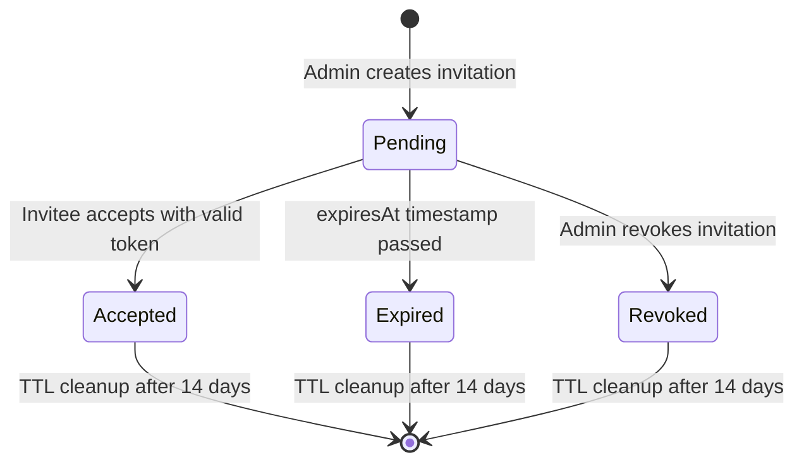
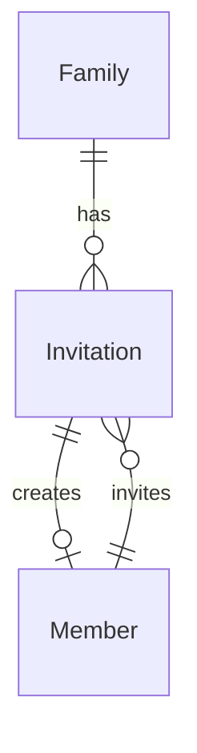

# Data Model: Family Member Management

**Feature**: 003-member-management  
**Date**: 2025-12-10  
**Database**: Amazon DynamoDB (Single-Table Design)  
**Parent Feature**: 001-family-inventory-mvp

## Overview

This document defines the data model extensions for the Family Member Management feature. It introduces the **Invitation** entity for managing member invitations and extends the existing **Member** entity with optimistic locking support.

### Entities in This Feature

| Entity | Purpose | New/Extended |
|--------|---------|--------------|
| Invitation | Tracks pending, accepted, expired, and revoked member invitations | **New** |
| Member | Family member with role-based permissions | **Extended** (adds `version` attribute) |

---

## Invitation Entity

An invitation sent by an admin to add a new member to the family. Invitations are time-limited and single-use.

### Access Patterns

| Access Pattern | Query Type | Keys Used |
|----------------|-----------|-----------|
| List invitations by family | Query | PK = `FAMILY#{familyId}`, SK begins_with `INVITATION#` |
| Get invitation by ID | GetItem | PK = `FAMILY#{familyId}`, SK = `INVITATION#{invitationId}` |
| Get invitation by token | Query | GSI1: PK = `INVITATION_TOKEN#{token}` |
| List pending invitations | Query | PK = `FAMILY#{familyId}`, SK begins_with `INVITATION#`, filter by status |
| Check duplicate email | Query | PK = `FAMILY#{familyId}`, SK begins_with `INVITATION#`, filter by email |

### Key Structure

- **PK**: `FAMILY#{familyId}`
- **SK**: `INVITATION#{invitationId}`
- **GSI1PK**: `INVITATION_TOKEN#{token}`
- **GSI1SK**: `INVITATION#{invitationId}`

### Attributes

```typescript
{
  // Primary identifiers
  invitationId: string;           // UUID v4
  familyId: string;               // UUID v4
  
  // Invitation details
  email: string;                  // Invitee email address
  role: 'admin' | 'suggester';    // Assigned role upon acceptance
  token: string;                  // Secure invitation token (UUID.HMAC format)
  tokenSignature: string;         // HMAC-SHA256 signature for verification
  status: 'pending' | 'accepted' | 'expired' | 'revoked';
  
  // Expiration
  expiresAt: string;              // ISO 8601 timestamp (7 days from creation)
  ttl: number;                    // Unix timestamp for DynamoDB TTL (14 days from creation)
  
  // Audit fields
  invitedBy: string;              // memberId of admin who sent invitation
  acceptedBy: string | null;      // memberId of user who accepted (after acceptance)
  acceptedAt: string | null;      // ISO 8601 timestamp when accepted
  revokedBy: string | null;       // memberId of admin who revoked (if revoked)
  revokedAt: string | null;       // ISO 8601 timestamp when revoked
  
  // Standard fields
  entityType: 'Invitation';
  createdAt: string;              // ISO 8601 timestamp
  updatedAt: string;              // ISO 8601 timestamp
}
```

### Token Format

The invitation token uses a secure format combining UUID v4 with HMAC-SHA256 signature:

```
{uuid}.{hmac_signature}
```

**Example**: `f47ac10b-58cc-4372-a567-0e02b2c3d479.a1b2c3d4e5f6789...`

- **UUID v4**: 36 characters, provides 122 bits of cryptographic randomness
- **Separator**: `.` (dot)
- **HMAC-SHA256**: 64 hex characters, prevents token tampering
- **Total length**: ~101 characters

### Validation Rules

| Field | Rule | Error Message |
|-------|------|---------------|
| `invitationId` | UUID v4 format | "Invalid invitation ID format" |
| `familyId` | UUID v4 format | "Invalid family ID format" |
| `email` | Valid email format, max 254 characters | "Invalid email address format" |
| `role` | 'admin' or 'suggester' | "Role must be 'admin' or 'suggester'" |
| `token` | UUID.HMAC format (~101 chars) | "Invalid token format" |
| `tokenSignature` | 64 hex characters | "Invalid token signature" |
| `status` | One of: pending, accepted, expired, revoked | "Invalid invitation status" |
| `expiresAt` | ISO 8601 datetime, future date | "Expiration must be a future date" |
| `ttl` | Unix timestamp, > expiresAt | "TTL must be after expiration" |
| `invitedBy` | UUID v4 format, must be admin | "Invalid inviter ID or not an admin" |

### State Transitions



| Transition | Trigger | Side Effects |
|------------|---------|--------------|
| Create → Pending | POST /members/invite | Send invitation email, set expiresAt = now + 7 days, ttl = now + 14 days |
| Pending → Accepted | POST /invitations/{token}/accept | Create Cognito user, create Member record, set acceptedBy/acceptedAt |
| Pending → Expired | Application check on token validation | No side effects (status updated on read) |
| Pending → Revoked | DELETE /invitations/{id} | Set revokedBy/revokedAt, token becomes invalid |
| Any → Deleted | DynamoDB TTL | Automatic cleanup after 14 days |

### Relationships



- **Belongs to**: One Family (via `familyId`)
- **Created by**: One Member with admin role (via `invitedBy`)
- **Results in**: One Member (via `acceptedBy`, after acceptance)

### DynamoDB Example Items

#### Pending Invitation

```json
{
  "PK": "FAMILY#f47ac10b-58cc-4372-a567-0e02b2c3d479",
  "SK": "INVITATION#8f14e45f-ceea-467a-9b36-34f6c3b3e7d1",
  "GSI1PK": "INVITATION_TOKEN#a1b2c3d4-e5f6-7890-abcd-ef1234567890.abc123def456...",
  "GSI1SK": "INVITATION#8f14e45f-ceea-467a-9b36-34f6c3b3e7d1",
  "invitationId": "8f14e45f-ceea-467a-9b36-34f6c3b3e7d1",
  "familyId": "f47ac10b-58cc-4372-a567-0e02b2c3d479",
  "email": "jane@example.com",
  "role": "suggester",
  "token": "a1b2c3d4-e5f6-7890-abcd-ef1234567890.abc123def456789012345678901234567890123456789012345678901234",
  "tokenSignature": "abc123def456789012345678901234567890123456789012345678901234",
  "status": "pending",
  "expiresAt": "2025-12-17T01:00:00Z",
  "ttl": 1735084800,
  "invitedBy": "550e8400-e29b-41d4-a716-446655440000",
  "acceptedBy": null,
  "acceptedAt": null,
  "revokedBy": null,
  "revokedAt": null,
  "entityType": "Invitation",
  "createdAt": "2025-12-10T01:00:00Z",
  "updatedAt": "2025-12-10T01:00:00Z"
}
```

#### Accepted Invitation

```json
{
  "PK": "FAMILY#f47ac10b-58cc-4372-a567-0e02b2c3d479",
  "SK": "INVITATION#9f14e45f-ceea-467a-9b36-34f6c3b3e7d2",
  "GSI1PK": "INVITATION_TOKEN#b2c3d4e5-f6a7-8901-bcde-f12345678901.def456abc789...",
  "GSI1SK": "INVITATION#9f14e45f-ceea-467a-9b36-34f6c3b3e7d2",
  "invitationId": "9f14e45f-ceea-467a-9b36-34f6c3b3e7d2",
  "familyId": "f47ac10b-58cc-4372-a567-0e02b2c3d479",
  "email": "bob@example.com",
  "role": "admin",
  "token": "b2c3d4e5-f6a7-8901-bcde-f12345678901.def456abc789012345678901234567890123456789012345678901234",
  "tokenSignature": "def456abc789012345678901234567890123456789012345678901234",
  "status": "accepted",
  "expiresAt": "2025-12-17T01:00:00Z",
  "ttl": 1735084800,
  "invitedBy": "550e8400-e29b-41d4-a716-446655440000",
  "acceptedBy": "660e8400-e29b-41d4-a716-446655440001",
  "acceptedAt": "2025-12-11T10:30:00Z",
  "revokedBy": null,
  "revokedAt": null,
  "entityType": "Invitation",
  "createdAt": "2025-12-10T01:00:00Z",
  "updatedAt": "2025-12-11T10:30:00Z"
}
```

#### Revoked Invitation

```json
{
  "PK": "FAMILY#f47ac10b-58cc-4372-a567-0e02b2c3d479",
  "SK": "INVITATION#af14e45f-ceea-467a-9b36-34f6c3b3e7d3",
  "GSI1PK": "INVITATION_TOKEN#c3d4e5f6-a7b8-9012-cdef-123456789012.ghi789jkl012...",
  "GSI1SK": "INVITATION#af14e45f-ceea-467a-9b36-34f6c3b3e7d3",
  "invitationId": "af14e45f-ceea-467a-9b36-34f6c3b3e7d3",
  "familyId": "f47ac10b-58cc-4372-a567-0e02b2c3d479",
  "email": "cancelled@example.com",
  "role": "suggester",
  "token": "c3d4e5f6-a7b8-9012-cdef-123456789012.ghi789jkl012345678901234567890123456789012345678901234",
  "tokenSignature": "ghi789jkl012345678901234567890123456789012345678901234",
  "status": "revoked",
  "expiresAt": "2025-12-17T01:00:00Z",
  "ttl": 1735084800,
  "invitedBy": "550e8400-e29b-41d4-a716-446655440000",
  "acceptedBy": null,
  "acceptedAt": null,
  "revokedBy": "550e8400-e29b-41d4-a716-446655440000",
  "revokedAt": "2025-12-10T15:00:00Z",
  "entityType": "Invitation",
  "createdAt": "2025-12-10T01:00:00Z",
  "updatedAt": "2025-12-10T15:00:00Z"
}
```

---

## Member Entity Updates

The Member entity is extended from the parent feature ([`001-family-inventory-mvp/data-model.md`](../001-family-inventory-mvp/data-model.md#2-member), lines 74-136) with a new `version` attribute for optimistic locking.

### New Attribute: `version`

| Attribute | Type | Default | Purpose |
|-----------|------|---------|---------|
| `version` | `number` | `1` | Optimistic locking to prevent concurrent update conflicts |

### Extended Attributes

```typescript
{
  // Existing attributes (from parent feature)
  memberId: string;               // UUID (Cognito user sub)
  familyId: string;               // UUID
  email: string;                  // User email
  name: string;                   // Display name
  role: 'admin' | 'suggester';    // Role within family
  status: 'active' | 'removed';   // Member status
  entityType: 'Member';
  createdAt: string;              // ISO 8601
  updatedAt: string;              // ISO 8601
  
  // NEW: Optimistic locking
  version: number;                // Starting at 1, incremented on each update
}
```

### Optimistic Locking Behavior

1. **On creation**: `version = 1`
2. **On update**: Include `ConditionExpression: version = :expectedVersion`
3. **On success**: Increment version (`version = version + 1`)
4. **On conflict**: Return HTTP 409 with current member state

### Conditional Update Example

```typescript
await dynamodb.send(new UpdateCommand({
  TableName: 'InventoryManagement',
  Key: { 
    PK: `FAMILY#${familyId}`, 
    SK: `MEMBER#${memberId}` 
  },
  UpdateExpression: 'SET #status = :newStatus, #version = #version + :one, #updatedAt = :now',
  ConditionExpression: '#version = :expectedVersion',
  ExpressionAttributeNames: {
    '#status': 'status',
    '#version': 'version',
    '#updatedAt': 'updatedAt'
  },
  ExpressionAttributeValues: {
    ':newStatus': 'removed',
    ':one': 1,
    ':expectedVersion': currentVersion,
    ':now': new Date().toISOString()
  }
}));
```

### Conflict Handling

```typescript
try {
  await updateMember(familyId, memberId, updates, expectedVersion);
} catch (error) {
  if (error.name === 'ConditionalCheckFailedException') {
    const currentMember = await getMember(familyId, memberId);
    return {
      statusCode: 409,
      body: JSON.stringify({
        error: 'Conflict',
        message: 'Member was modified by another user',
        currentState: currentMember
      })
    };
  }
  throw error;
}
```

### Updated DynamoDB Example

```json
{
  "PK": "FAMILY#f47ac10b-58cc-4372-a567-0e02b2c3d479",
  "SK": "MEMBER#550e8400-e29b-41d4-a716-446655440000",
  "GSI1PK": "MEMBER#550e8400-e29b-41d4-a716-446655440000",
  "GSI1SK": "FAMILY#f47ac10b-58cc-4372-a567-0e02b2c3d479",
  "memberId": "550e8400-e29b-41d4-a716-446655440000",
  "familyId": "f47ac10b-58cc-4372-a567-0e02b2c3d479",
  "email": "john@example.com",
  "name": "John Smith",
  "role": "admin",
  "status": "active",
  "version": 3,
  "entityType": "Member",
  "createdAt": "2025-12-08T10:00:00Z",
  "updatedAt": "2025-12-10T14:30:00Z"
}
```

### Migration Notes

For existing Member records without a `version` attribute:

1. **Read-time migration**: If `version` is undefined, treat as `version = 1`
2. **Write-time migration**: On first update, set `version = 1` then increment
3. **Batch migration** (optional): Run a one-time script to add `version = 1` to all existing members

```typescript
// Read-time migration example
function getMemberVersion(member: Member): number {
  return member.version ?? 1;
}
```

---

## Access Patterns Summary

### Invitation Access Patterns

| Access Pattern | Query Type | Keys Used |
|----------------|-----------|-----------|
| List invitations by family | Query | PK = `FAMILY#{familyId}`, SK begins_with `INVITATION#` |
| Get invitation by ID | GetItem | PK = `FAMILY#{familyId}`, SK = `INVITATION#{invitationId}` |
| Get invitation by token | Query | GSI1: PK = `INVITATION_TOKEN#{token}` |
| List pending invitations | Query + Filter | PK = `FAMILY#{familyId}`, SK begins_with `INVITATION#`, filter status = 'pending' |

### Member Access Patterns (from parent feature)

| Access Pattern | Query Type | Keys Used |
|----------------|-----------|-----------|
| Get member by ID | GetItem | PK = `FAMILY#{familyId}`, SK = `MEMBER#{memberId}` |
| Get member's family | Query | GSI1: PK = `MEMBER#{memberId}` |
| List family members | Query | PK = `FAMILY#{familyId}`, SK begins_with `MEMBER#` |
| List active members | Query + Filter | PK = `FAMILY#{familyId}`, SK begins_with `MEMBER#`, filter status = 'active' |
| Count admin members | Query + Filter | PK = `FAMILY#{familyId}`, SK begins_with `MEMBER#`, filter role = 'admin' AND status = 'active' |

---

## Global Secondary Indexes

### GSI1: Token Lookup Index

**Purpose**: Enable O(1) lookup of invitations by token for the acceptance flow.

| Attribute | Value |
|-----------|-------|
| **GSI1PK** | `INVITATION_TOKEN#{token}` |
| **GSI1SK** | `INVITATION#{invitationId}` |
| **Projection** | ALL (all attributes projected) |

**Use Cases**:
- Validate invitation token during acceptance
- Check if token exists and is still valid
- Retrieve invitation details for acceptance flow

**Query Example**:
```typescript
const result = await docClient.send(new QueryCommand({
  TableName: 'InventoryManagement',
  IndexName: 'GSI1',
  KeyConditionExpression: 'GSI1PK = :tokenKey',
  ExpressionAttributeValues: {
    ':tokenKey': `INVITATION_TOKEN#${token}`
  }
}));
```

**Note**: GSI1 is already defined in the parent feature for Member-to-Family lookup. This feature adds a new key pattern (`INVITATION_TOKEN#`) to the same index.

---

## TypeScript Type Definitions

```typescript
import { z } from 'zod';

// ============================================
// Invitation Entity
// ============================================

export const InvitationStatusSchema = z.enum(['pending', 'accepted', 'expired', 'revoked']);
export type InvitationStatus = z.infer<typeof InvitationStatusSchema>;

export const MemberRoleSchema = z.enum(['admin', 'suggester']);
export type MemberRole = z.infer<typeof MemberRoleSchema>;

export const InvitationSchema = z.object({
  // Primary identifiers
  invitationId: z.string().uuid(),
  familyId: z.string().uuid(),
  
  // Invitation details
  email: z.string().email().max(254),
  role: MemberRoleSchema,
  token: z.string().min(90).max(110), // UUID.HMAC format
  tokenSignature: z.string().length(64), // HMAC-SHA256 hex
  status: InvitationStatusSchema,
  
  // Expiration
  expiresAt: z.string().datetime(),
  ttl: z.number().int().positive(),
  
  // Audit fields
  invitedBy: z.string().uuid(),
  acceptedBy: z.string().uuid().nullable(),
  acceptedAt: z.string().datetime().nullable(),
  revokedBy: z.string().uuid().nullable(),
  revokedAt: z.string().datetime().nullable(),
  
  // Standard fields
  entityType: z.literal('Invitation'),
  createdAt: z.string().datetime(),
  updatedAt: z.string().datetime(),
});

export type Invitation = z.infer<typeof InvitationSchema>;

// Create Invitation Request
export const CreateInvitationRequestSchema = z.object({
  email: z.string().email().max(254),
  role: MemberRoleSchema,
});

export type CreateInvitationRequest = z.infer<typeof CreateInvitationRequestSchema>;

// Accept Invitation Request
export const AcceptInvitationRequestSchema = z.object({
  name: z.string().min(1).max(100),
});

export type AcceptInvitationRequest = z.infer<typeof AcceptInvitationRequestSchema>;

// ============================================
// Member Entity (Extended)
// ============================================

export const MemberStatusSchema = z.enum(['active', 'removed']);
export type MemberStatus = z.infer<typeof MemberStatusSchema>;

export const MemberSchema = z.object({
  // Primary identifiers
  memberId: z.string().uuid(),
  familyId: z.string().uuid(),
  
  // Member details
  email: z.string().email().max(254),
  name: z.string().min(1).max(100),
  role: MemberRoleSchema,
  status: MemberStatusSchema,
  
  // Optimistic locking (NEW)
  version: z.number().int().min(1),
  
  // Standard fields
  entityType: z.literal('Member'),
  createdAt: z.string().datetime(),
  updatedAt: z.string().datetime(),
});

export type Member = z.infer<typeof MemberSchema>;

// Update Member Request
export const UpdateMemberRequestSchema = z.object({
  name: z.string().min(1).max(100).optional(),
  role: MemberRoleSchema.optional(),
  version: z.number().int().min(1), // Required for optimistic locking
});

export type UpdateMemberRequest = z.infer<typeof UpdateMemberRequestSchema>;

// Remove Member Request
export const RemoveMemberRequestSchema = z.object({
  version: z.number().int().min(1), // Required for optimistic locking
});

export type RemoveMemberRequest = z.infer<typeof RemoveMemberRequestSchema>;

// ============================================
// DynamoDB Key Schemas
// ============================================

export const InvitationKeysSchema = z.object({
  PK: z.string().regex(/^FAMILY#[0-9a-f-]{36}$/),
  SK: z.string().regex(/^INVITATION#[0-9a-f-]{36}$/),
  GSI1PK: z.string().regex(/^INVITATION_TOKEN#.+$/),
  GSI1SK: z.string().regex(/^INVITATION#[0-9a-f-]{36}$/),
});

export type InvitationKeys = z.infer<typeof InvitationKeysSchema>;

export const MemberKeysSchema = z.object({
  PK: z.string().regex(/^FAMILY#[0-9a-f-]{36}$/),
  SK: z.string().regex(/^MEMBER#[0-9a-f-]{36}$/),
  GSI1PK: z.string().regex(/^MEMBER#[0-9a-f-]{36}$/),
  GSI1SK: z.string().regex(/^FAMILY#[0-9a-f-]{36}$/),
});

export type MemberKeys = z.infer<typeof MemberKeysSchema>;
```

---

## Data Integrity Rules

### Family Isolation
- All queries MUST filter by `familyId` to ensure data isolation
- Lambda authorizer MUST inject `familyId` from JWT claims
- Cross-family access MUST be prevented at the application layer

### Invitation Constraints
- Email MUST be unique per family (no duplicate pending invitations)
- Token MUST be validated with HMAC signature before database lookup
- Expired invitations MUST be rejected at application level (before TTL cleanup)
- Only admins can create, view, or revoke invitations

### Member Constraints
- At least one admin MUST exist per family at all times
- Last admin removal MUST be prevented
- Role changes for last admin to suggester MUST be prevented
- All updates MUST use optimistic locking with version check

### TTL Behavior
- Invitation TTL is set to 14 days from creation (7 days after expiration)
- DynamoDB TTL deletion is eventually consistent (may take up to 48 hours)
- Application-level expiration check provides immediate enforcement

---

## Infrastructure Requirements

### DynamoDB TTL Configuration

TTL should already be enabled on the `InventoryManagement` table from the shopping-lists feature. Verify with:

```bash
aws dynamodb describe-time-to-live --table-name InventoryManagement
```

If not enabled:

```bash
aws dynamodb update-time-to-live \
  --table-name InventoryManagement \
  --time-to-live-specification "Enabled=true, AttributeName=ttl"
```

### Secrets Manager

Store the HMAC secret for token signing:

```bash
aws secretsmanager create-secret \
  --name /inventory-mgmt/prod/invitation-hmac-secret \
  --secret-string "$(openssl rand -hex 32)"
```

### Parameter Store

Store configurable values:

```bash
# Invitation expiration (7 days in seconds)
aws ssm put-parameter \
  --name /inventory-mgmt/prod/invitation-expiration-seconds \
  --value "604800" \
  --type String

# TTL grace period (7 days in seconds)
aws ssm put-parameter \
  --name /inventory-mgmt/prod/invitation-ttl-grace-seconds \
  --value "604800" \
  --type String
```

---

**Data Model Complete**: 2025-12-10  
**Status**: Ready for API contract generation