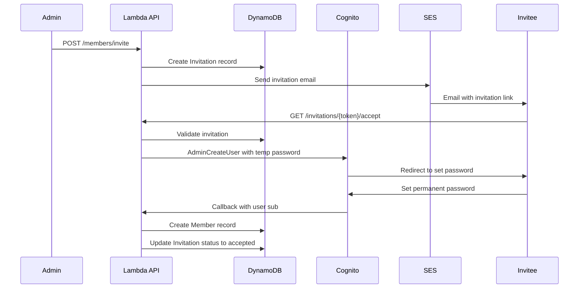

# Research: Family Member Management

**Feature**: 003-member-management  
**Date**: 2025-12-10  
**Status**: Phase 0 Complete

## Overview

This document captures research decisions made during the planning phase for the Family Member Management feature. Each decision includes rationale, alternatives considered, and implementation notes.

---

## 1. Invitation Entity Data Model

**Decision**: Use a dual-key structure with primary access by family and secondary access by token via GSI1.

**Key Structure**:
- PK: `FAMILY#{familyId}`
- SK: `INVITATION#{invitationId}`
- GSI1PK: `INVITATION_TOKEN#{token}`
- GSI1SK: `INVITATION#{invitationId}`

**Attributes**:
```typescript
{
  invitationId: string;           // UUID
  familyId: string;               // UUID
  email: string;                  // Invitee email address
  role: 'admin' | 'suggester';    // Assigned role
  token: string;                  // Secure invitation token
  status: 'pending' | 'accepted' | 'expired' | 'revoked';
  invitedBy: string;              // memberId of admin who sent invitation
  expiresAt: string;              // ISO 8601 timestamp
  ttl: number;                    // Unix timestamp for DynamoDB TTL
  entityType: 'Invitation';
  createdAt: string;              // ISO 8601
  updatedAt: string;              // ISO 8601
}
```

**Rationale**:
- Primary key (PK/SK) enables listing all pending invitations for a family with a single query
- GSI1 enables O(1) lookup by token when accepting invitations (critical for invitation acceptance flow)
- Follows the single-table design pattern established in 001-family-inventory-mvp
- Consistent with Member entity key structure (PK: `FAMILY#{familyId}`, SK: `MEMBER#{memberId}`)

**Alternatives Considered**:
- **PK=`INVITATION#{token}`, SK=`INVITATION#{token}`**: Rejected because it makes listing family invitations require a scan or separate GSI
- **Store token in Member entity**: Rejected because invitations are a separate lifecycle from members (pending vs active)
- **Separate table for invitations**: Rejected per constitution mandate for single-table design

**Access Patterns**:
| Pattern | Query |
|---------|-------|
| List pending invitations for family | PK = `FAMILY#{familyId}`, SK begins_with `INVITATION#` |
| Get invitation by token | GSI1: PK = `INVITATION_TOKEN#{token}` |
| Check duplicate email in family | PK = `FAMILY#{familyId}`, SK begins_with `INVITATION#`, filter by email |

---

## 2. Invitation Token Generation and Storage

**Decision**: Use UUID v4 tokens stored in DynamoDB with TTL, combined with HMAC signature for tamper detection.

**Token Format**: `{uuid}.{hmac_signature}`
- UUID v4 provides 122 bits of randomness (cryptographically secure)
- HMAC-SHA256 signature prevents token tampering
- Total token length: ~77 characters (36 UUID + 1 dot + 40 hex signature)

**Example**: `f47ac10b-58cc-4372-a567-0e02b2c3d479.a1b2c3d4e5f6...`

**Rationale**:
- UUID v4 is cryptographically random and collision-resistant
- HMAC signature ensures token integrity without database lookup
- Stateful storage in DynamoDB enables:
  - Single-use enforcement (mark as accepted)
  - Revocation capability (admin can cancel invitation)
  - Audit trail (who invited whom, when)
- Simpler than JWT for this use case (no need for embedded claims)

**Alternatives Considered**:
- **JWT with expiration claim**: Rejected because:
  - Cannot revoke individual tokens without a blocklist
  - Larger token size (300+ characters)
  - Overkill for simple invitation use case
- **Plain UUID v4 only**: Rejected because no tamper detection; attacker could guess UUIDs
- **Cryptographically signed token with embedded data**: Rejected due to complexity; DynamoDB lookup is fast enough

**Implementation Notes**:
- Generate UUID v4 using `crypto.randomUUID()` (Node.js 20+)
- HMAC secret stored in AWS Secrets Manager
- Validate token by:
  1. Split on `.` to get UUID and signature
  2. Verify HMAC signature matches
  3. Query GSI1 to get invitation record
  4. Check status is 'pending' and not expired

**Security Considerations**:
- Tokens transmitted only via HTTPS
- Tokens included in email links, not exposed in URLs after acceptance
- Single-use: status changes to 'accepted' after use
- Rate limiting on token validation endpoint to prevent brute force

---

## 3. Invitation Expiration Mechanism

**Decision**: Use both DynamoDB TTL for automatic cleanup AND application-level expiration checks for immediate enforcement.

**Dual Approach**:
1. **Application-level check**: Validate `expiresAt` timestamp on every token lookup
2. **DynamoDB TTL**: Automatically delete expired invitations after a grace period

**TTL Strategy**:
- `expiresAt`: 7 days from creation (configurable via Parameter Store)
- `ttl`: `expiresAt` + 7 days (14 days total from creation)
- Grace period allows audit trail review before deletion

**Rationale**:
- Application-level check provides immediate expiration enforcement (spec FR-008)
- DynamoDB TTL provides automatic cleanup without Lambda invocations
- Grace period preserves audit trail for recently expired invitations
- Consistent with shopping list TTL pattern from 002-shopping-lists

**Alternatives Considered**:
- **DynamoDB TTL only**: Rejected because TTL deletion is eventually consistent (up to 48 hours delay); users could accept expired invitations
- **Application-level only**: Rejected because expired records accumulate indefinitely, requiring manual cleanup
- **Scheduled Lambda for cleanup**: Rejected because DynamoDB TTL is simpler and cost-free

**Implementation Notes**:
- On invitation creation:
  ```typescript
  const expiresAt = new Date(Date.now() + 7 * 24 * 60 * 60 * 1000).toISOString();
  const ttl = Math.floor(Date.now() / 1000) + 14 * 24 * 60 * 60; // 14 days
  ```
- On token validation:
  ```typescript
  if (new Date(invitation.expiresAt) < new Date()) {
    throw new InvitationExpiredError();
  }
  ```
- Enable TTL on DynamoDB table for the `ttl` attribute

---

## 4. Cognito User Creation Flow

**Decision**: Admin creates user with temporary password; user sets permanent password on first login via Cognito hosted UI.

**Flow**:


**Rationale**:
- `AdminCreateUser` API allows programmatic user creation with known email
- Temporary password flow is Cognito's recommended pattern for admin-initiated accounts
- User sets their own password (security best practice)
- Cognito handles password policies, validation, and secure storage
- No need for custom password handling in our application

**Alternatives Considered**:
- **User self-registers, then links to invitation**: Rejected because:
  - Race condition: user could register before accepting invitation
  - Complexity: need to match email addresses and handle edge cases
  - Poor UX: two separate flows (register + accept)
- **Admin sets permanent password**: Rejected because:
  - Security risk: password transmitted via email
  - Violates security best practices
  - User doesn't choose their own password

**Implementation Notes**:
- Use `@aws-sdk/client-cognito-identity-provider` with `AdminCreateUserCommand`
- Set `MessageAction: 'SUPPRESS'` to prevent Cognito's default email (we send our own)
- Set `TemporaryPassword` to a random string (user will change it)
- Configure Cognito User Pool with:
  - `FORCE_CHANGE_PASSWORD` as initial user status
  - Hosted UI for password change flow
  - Callback URL to our application
- After password set, Cognito redirects to callback with authorization code
- Exchange code for tokens, extract `sub` as `memberId`

**Cognito Configuration**:
```yaml
# In template.yaml
UserPool:
  Type: AWS::Cognito::UserPool
  Properties:
    UserPoolName: InventoryManagement
    AutoVerifiedAttributes:
      - email
    UsernameAttributes:
      - email
    Policies:
      PasswordPolicy:
        MinimumLength: 8
        RequireUppercase: true
        RequireLowercase: true
        RequireNumbers: true
        RequireSymbols: false
```

---

## 5. Email Service Configuration

**Decision**: Use AWS SES with verified domain, HTML email templates stored in Parameter Store, and a dedicated sender address.

**Configuration**:
- **Sender Address**: `noreply@{domain}` (e.g., `noreply@inventory.example.com`)
- **Domain Verification**: Full domain verification via DNS (DKIM, SPF, DMARC)
- **Template Storage**: AWS Systems Manager Parameter Store
- **Template Format**: HTML with Handlebars-style placeholders

**Email Template Structure**:
```html
<!-- Stored in Parameter Store: /inventory-mgmt/{env}/email-templates/invitation -->
<!DOCTYPE html>
<html>
<head>
  <style>
    .button { background-color: #007bff; color: white; padding: 12px 24px; text-decoration: none; border-radius: 4px; }
  </style>
</head>
<body>
  <h1>You're Invited to Join {{familyName}}</h1>
  <p>{{inviterName}} has invited you to join their family on Inventory Management.</p>
  <p>You'll be added as a <strong>{{role}}</strong>.</p>
  <p><a href="{{invitationLink}}" class="button">Accept Invitation</a></p>
  <p>This invitation expires on {{expirationDate}}.</p>
  <p>If you didn't expect this invitation, you can safely ignore this email.</p>
</body>
</html>
```

**Rationale**:
- SES is AWS-native, cost-effective ($0.10/1000 emails), and integrates with Lambda
- Domain verification improves deliverability and prevents spoofing
- Parameter Store for templates allows updates without code deployment
- HTML templates provide professional appearance and branding consistency
- Consistent with email approach from 001-family-inventory-mvp research

**Alternatives Considered**:
- **SES Email Templates**: Rejected because Parameter Store is simpler and doesn't require SES template management
- **Plain text emails**: Rejected because HTML provides better UX and branding
- **Third-party email service (SendGrid, Mailgun)**: Rejected to maintain AWS-native architecture
- **Hardcoded templates in code**: Rejected because updates require deployment

**Implementation Notes**:
- Use `@aws-sdk/client-ses` with `SendEmailCommand`
- Fetch template from Parameter Store, cache in Lambda global scope
- Replace placeholders using simple string replacement or Handlebars
- Include both HTML and plain text versions for email clients
- Track delivery via SES configuration sets and CloudWatch

**SES Setup Checklist**:
1. Verify domain in SES console
2. Add DNS records (DKIM, SPF, DMARC)
3. Request production access (move out of sandbox)
4. Create configuration set for tracking
5. Store sender address in Parameter Store

---

## 6. Self-Removal Policy

**Decision**: Admins CAN remove themselves from the family, but only if at least one other admin remains.

**Policy Rules**:
1. An admin can remove themselves if `count(admins) > 1`
2. The last admin cannot remove themselves (same as FR-016)
3. Self-removal follows the same process as removing another member
4. Self-removal triggers immediate session invalidation

**Rationale**:
- Allows admins to leave a family they no longer want to manage
- Prevents orphaned families (at least one admin must remain)
- Consistent with the "last admin protection" requirement (FR-016)
- Simpler than having separate rules for self vs other removal

**Alternatives Considered**:
- **Admins cannot remove themselves**: Rejected because:
  - Prevents legitimate use case (admin wants to leave)
  - Would require another admin to remove them
  - Unnecessary restriction
- **Allow self-removal even as last admin**: Rejected because:
  - Would orphan the family
  - Violates FR-014 (at least one admin per family)
  - Could lock out other family members

**Implementation Notes**:
- Before any member removal, count admins in family:
  ```typescript
  const adminCount = await countAdminMembers(familyId);
  const isRemovingSelf = requestingMemberId === targetMemberId;
  const isTargetAdmin = targetMember.role === 'admin';
  
  if (isTargetAdmin && adminCount <= 1) {
    throw new LastAdminError('Cannot remove the last admin from the family');
  }
  ```
- After self-removal, invalidate the user's session:
  - Use Cognito `AdminUserGlobalSignOut` to revoke all tokens
  - Return 401 on subsequent API calls

**UI Considerations**:
- Show confirmation dialog: "Are you sure you want to leave this family?"
- Disable self-removal button if user is the last admin
- Show tooltip explaining why removal is disabled

---

## 7. Concurrent Member Removal

**Decision**: Implement optimistic locking using a `version` attribute with DynamoDB conditional writes.

**Approach**:
- Add `version: number` attribute to Member entity (starting at 1)
- Increment version on every update
- Use `ConditionExpression` to ensure version matches expected value
- On conflict, return 409 Conflict with current member state

**Rationale**:
- Optimistic locking is simpler than pessimistic locking for web applications
- DynamoDB conditional expressions provide atomic check-and-update
- Consistent with shopping list concurrency pattern from 002-shopping-lists
- Prevents race conditions when multiple admins manage members simultaneously

**Alternatives Considered**:
- **Last-write-wins**: Rejected because:
  - Could cause unintended member removal
  - No conflict detection for users
  - Data integrity risk
- **Pessimistic locking with DynamoDB transactions**: Rejected because:
  - Added complexity and cost
  - Longer lock duration impacts UX
  - Optimistic locking is sufficient for member management
- **Distributed locks (Redis/DynamoDB)**: Rejected due to operational complexity

**Implementation Notes**:
- Update Member entity to include `version`:
  ```typescript
  {
    // ... existing attributes
    version: number;  // Starting at 1, incremented on each update
  }
  ```
- Conditional update example:
  ```typescript
  await dynamodb.send(new UpdateCommand({
    TableName: 'InventoryManagement',
    Key: { PK: `FAMILY#${familyId}`, SK: `MEMBER#${memberId}` },
    UpdateExpression: 'SET #status = :removed, #version = #version + :one, #updatedAt = :now',
    ConditionExpression: '#version = :expectedVersion',
    ExpressionAttributeNames: {
      '#status': 'status',
      '#version': 'version',
      '#updatedAt': 'updatedAt'
    },
    ExpressionAttributeValues: {
      ':removed': 'removed',
      ':one': 1,
      ':expectedVersion': currentVersion,
      ':now': new Date().toISOString()
    }
  }));
  ```
- Handle `ConditionalCheckFailedException`:
  ```typescript
  catch (error) {
    if (error.name === 'ConditionalCheckFailedException') {
      const currentMember = await getMember(familyId, memberId);
      return {
        statusCode: 409,
        body: JSON.stringify({
          error: 'Conflict',
          message: 'Member was modified by another user',
          currentState: currentMember
        })
      };
    }
    throw error;
  }
  ```

**Client Handling**:
- On 409 Conflict, refresh member data and show updated state
- Prompt user to retry if their action is still valid
- Show toast notification: "This member was just updated by another admin"

---

## Summary of Key Decisions

| Topic | Decision | Impact |
|-------|----------|--------|
| Invitation Data Model | PK=`FAMILY#{familyId}`, SK=`INVITATION#{invitationId}`, GSI1 for token lookup | New entity in single-table design |
| Token Generation | UUID v4 + HMAC signature, stored in DynamoDB | Secure, revocable, auditable |
| Expiration | Application-level check + DynamoDB TTL with grace period | Immediate enforcement + automatic cleanup |
| Cognito Flow | AdminCreateUser with temp password, user sets permanent | Standard Cognito pattern |
| Email Service | SES with verified domain, templates in Parameter Store | AWS-native, configurable |
| Self-Removal | Allowed if other admins exist | Consistent with last-admin protection |
| Concurrency | Optimistic locking with version attribute | Consistent with 002-shopping-lists pattern |

---

## Additional Considerations

### Invitation Resend
- Admins can resend invitations by creating a new invitation with the same email
- Previous invitation is automatically revoked (status = 'revoked')
- New token generated, new expiration set

### Invitation Revocation
- Admins can revoke pending invitations
- Sets status to 'revoked', token becomes invalid
- Revoked invitations retained for audit (deleted by TTL after grace period)

### Email Uniqueness
- Before creating invitation, check for:
  1. Existing active member with same email
  2. Existing pending invitation with same email
- Return appropriate error if duplicate found

### Rate Limiting
- Limit invitation creation to 10 per hour per family
- Limit token validation attempts to 5 per minute per IP
- Prevents abuse and brute force attacks

---

## Open Questions (None)

All technical decisions have been resolved based on the spec, constitution, and parent feature patterns.

---

**Research Complete**: 2025-12-10  
**Next Step**: Update plan.md and proceed to Phase 1 (data-model.md, API contracts)