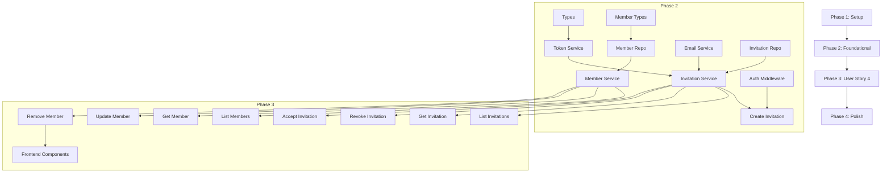

# Tasks: Family Member Management

**Feature**: 003-member-management  
**Date**: 2025-12-10  
**Input**: Design documents from `/specs/003-member-management/`  
**Prerequisites**: plan.md ✓, spec.md ✓, research.md ✓, data-model.md ✓, contracts/api-spec.yaml ✓, quickstart.md ✓

## Format: `[ID] [P?] [Story] Description`

- **[P]**: Can run in parallel (different files, no dependencies)
- **[US4]**: User Story 4 - Family Member Management (the only story in this feature)
- Include exact file paths in descriptions

## Path Conventions

Based on plan.md project structure:
- **Backend**: `src/handlers/`, `src/services/`, `src/lib/`, `src/types/`
- **Frontend**: `src/app/`, `src/components/`
- **Tests**: `tests/unit/`, `tests/integration/`, `tests/contract/`

---

## Phase 1: Setup (Infrastructure & Configuration)

**Purpose**: AWS infrastructure setup and secrets configuration required before any code implementation

- [X] T001 Verify DynamoDB TTL is enabled on `ttl` attribute for InventoryManagement table
- [X] T002 Create Secrets Manager secret for HMAC signing key at `/inventory-mgmt/{env}/invitation-hmac-secret`
- [X] T003 [P] Create Parameter Store value for invitation expiration at `/inventory-mgmt/{env}/invitation-expiration-seconds` (604800 = 7 days)
- [X] T004 [P] Create Parameter Store value for TTL grace period at `/inventory-mgmt/{env}/invitation-ttl-grace-seconds` (604800 = 7 days)
- [X] T005 [P] Create Parameter Store value for email template at `/inventory-mgmt/{env}/email-templates/invitation`
- [ ] ~~T006 Verify SES domain verification and sender email configuration~~ **MOVED TO SPEC 007** - Email domain configuration is now part of domain integration feature
- [X] T007 Verify GSI1 index exists on InventoryManagement table for token lookup pattern

**Checkpoint**: Infrastructure ready - code implementation can begin

---

## Phase 2: Foundational (Types, Utilities, Shared Services)

**Purpose**: Core types and utilities that MUST be complete before ANY API implementation

**⚠️ CRITICAL**: No handler or service work can begin until this phase is complete

### Type Definitions

- [X] T008 [P] Create Invitation type definitions with Zod schemas in `src/types/invitation.ts`
- [X] T009 [P] Extend Member type definitions with version attribute in `src/types/member.ts`

### Core Utilities

- [X] T010 Create HMAC utility functions in `src/lib/hmac.ts`
- [X] T011 Create token service with generate/validate functions in `src/services/tokenService.ts`
- [ ] T012 [P] Create token service unit tests in `tests/unit/services/tokenService.test.ts`

### Email Service

- [X] T013 Create email service for invitation emails in `src/services/emailService.ts`
- [ ] T014 [P] Create email service unit tests in `tests/unit/services/emailService.test.ts`

### Repository Layer

- [X] T015 Create invitation repository with DynamoDB operations in `src/models/invitation.ts`
- [ ] T016 [P] Create invitation repository unit tests in `tests/unit/models/invitation.test.ts`
- [X] T017 Extend member repository with version support in `src/models/member.ts`
- [ ] T018 [P] Create member repository unit tests in `tests/unit/models/member.test.ts`

### Authorization Middleware

- [X] T019 Create requireAdmin middleware for role-based access in `src/lib/authorization.ts`
- [ ] T020 [P] Create authorization middleware unit tests in `tests/unit/middleware/authorization.test.ts`

**Checkpoint**: Foundation ready - API handler implementation can now begin

---

## Phase 3: User Story 4 - Family Member Management (Priority: P2)

**Goal**: Enable family admins to invite, manage, and remove family members with role-based permissions

**Independent Test**: Can be tested by adding members with different roles, verifying each role has appropriate permissions, and removing a member to confirm access is revoked

### 3.1 Invitation Service Layer

- [X] T021 [US4] Create invitation service with business logic in `src/services/invitationService.ts`
- [ ] T022 [P] [US4] Create invitation service unit tests in `tests/unit/services/invitationService.test.ts`

### 3.2 Member Service Layer

- [X] T023 [US4] Create member service with business logic in `src/services/memberService.ts`
- [ ] T024 [P] [US4] Create member service unit tests in `tests/unit/services/memberService.test.ts`

### 3.3 Invitation API Handlers

- [X] T025 [US4] Implement createInvitation handler in `src/handlers/invitations/createInvitation.ts`
- [ ] T026 [P] [US4] Create createInvitation handler tests in `tests/unit/handlers/invitations/createInvitation.test.ts`
- [X] T027 [US4] Implement listInvitations handler in `src/handlers/invitations/listInvitations.ts`
- [ ] T028 [P] [US4] Create listInvitations handler tests in `tests/unit/handlers/invitations/listInvitations.test.ts`
- [X] T029 [US4] Implement getInvitation handler in `src/handlers/invitations/getInvitation.ts`
- [ ] T030 [P] [US4] Create getInvitation handler tests in `tests/unit/handlers/invitations/getInvitation.test.ts`
- [X] T031 [US4] Implement revokeInvitation handler in `src/handlers/invitations/revokeInvitation.ts`
- [ ] T032 [P] [US4] Create revokeInvitation handler tests in `tests/unit/handlers/invitations/revokeInvitation.test.ts`
- [X] T033 [US4] Implement acceptInvitation handler (public endpoint) in `src/handlers/invitations/acceptInvitation.ts`
- [ ] T034 [P] [US4] Create acceptInvitation handler tests in `tests/unit/handlers/invitations/acceptInvitation.test.ts`

### 3.4 Member API Handlers

- [X] T035 [US4] Implement listMembers handler in `src/handlers/members/listMembers.ts`
- [ ] T036 [P] [US4] Create listMembers handler tests in `tests/unit/handlers/members/listMembers.test.ts`
- [X] T037 [US4] Implement getMember handler in `src/handlers/members/getMember.ts`
- [ ] T038 [P] [US4] Create getMember handler tests in `tests/unit/handlers/members/getMember.test.ts`
- [X] T039 [US4] Implement updateMember handler with optimistic locking in `src/handlers/members/updateMember.ts`
- [ ] T040 [P] [US4] Create updateMember handler tests in `tests/unit/handlers/members/updateMember.test.ts`
- [X] T041 [US4] Implement removeMember handler with last admin protection in `src/handlers/members/removeMember.ts`
- [ ] T042 [P] [US4] Create removeMember handler tests in `tests/unit/handlers/members/removeMember.test.ts`

### 3.5 SAM Template Updates

- [X] T043 [US4] Add CreateInvitationFunction to template.yaml with SES, Secrets Manager, SSM policies
- [X] T044 [P] [US4] Add ListInvitationsFunction to template.yaml with DynamoDB read policy
- [X] T045 [P] [US4] Add GetInvitationFunction to template.yaml with DynamoDB read policy
- [X] T046 [P] [US4] Add RevokeInvitationFunction to template.yaml with DynamoDB write policy
- [X] T047 [US4] Add AcceptInvitationFunction to template.yaml with Cognito, DynamoDB, Secrets Manager policies (public endpoint)
- [X] T048 [P] [US4] Add ListMembersFunction to template.yaml with DynamoDB read policy
- [X] T049 [P] [US4] Add GetMemberFunction to template.yaml with DynamoDB read policy
- [X] T050 [P] [US4] Add UpdateMemberFunction to template.yaml with DynamoDB write policy
- [X] T051 [US4] Add RemoveMemberFunction to template.yaml with DynamoDB, Cognito policies

### 3.6 Integration Tests

- [ ] T052 [US4] Create invitation API integration tests in `tests/integration/api/invitations.test.ts`
- [ ] T053 [P] [US4] Create member API integration tests in `tests/integration/api/members.test.ts`

### 3.7 Contract Tests

- [ ] T054 [US4] Create invitation API contract tests in `tests/contract/invitationApi.contract.test.ts`
- [ ] T055 [P] [US4] Create member API contract tests in `tests/contract/memberApi.contract.test.ts`

**Checkpoint**: Backend API complete - frontend implementation can begin

### 3.8 Frontend Components

- [X] T056 [P] [US4] Create MemberList component in `src/components/members/MemberList.tsx`
- [X] T057 [P] [US4] Create MemberCard component in `src/components/members/MemberCard.tsx`
- [X] T058 [P] [US4] Create InviteMemberForm component in `src/components/members/InviteMemberForm.tsx`
- [X] T059 [P] [US4] Create InvitationList component in `src/components/members/InvitationList.tsx`
- [X] T060 [P] [US4] Create RoleSelector component in `src/components/members/RoleSelector.tsx`
- [X] T061 [P] [US4] Create RemoveMemberDialog component in `src/components/members/RemoveMemberDialog.tsx`

### 3.9 Frontend Component Tests

- [ ] T062 [P] [US4] Create MemberList component tests in `src/components/members/__tests__/MemberList.test.tsx`
- [ ] T063 [P] [US4] Create MemberCard component tests in `src/components/members/__tests__/MemberCard.test.tsx`
- [ ] T064 [P] [US4] Create InviteMemberForm component tests in `src/components/members/__tests__/InviteMemberForm.test.tsx`
- [ ] T065 [P] [US4] Create InvitationList component tests in `src/components/members/__tests__/InvitationList.test.tsx`
- [ ] T066 [P] [US4] Create RoleSelector component tests in `src/components/members/__tests__/RoleSelector.test.tsx`
- [ ] T067 [P] [US4] Create RemoveMemberDialog component tests in `src/components/members/__tests__/RemoveMemberDialog.test.tsx`

### 3.10 Frontend Pages

- [X] T068 [US4] Create members dashboard page in `src/app/dashboard/members/page.tsx`
- [ ] T069 [US4] Create member detail page in `src/app/dashboard/members/[memberId]/page.tsx` (SKIPPED - not needed for MVP)
- [ ] T070 [US4] Create invitations management page in `src/app/dashboard/invitations/page.tsx` (SKIPPED - integrated into members page)
- [X] T071 [US4] Create public invitation acceptance page in `src/app/accept-invitation/page.tsx`

### 3.11 Frontend API Client

- [X] T072 [P] [US4] Create invitations API client in `src/lib/api/invitations.ts`
- [X] T073 [P] [US4] Create members API client in `src/lib/api/members.ts`

**Checkpoint**: User Story 4 complete - all member management functionality implemented

---

## Phase 4: Polish & Cross-Cutting Concerns

**Purpose**: Improvements that affect multiple components and final validation

### Error Handling & Logging

- [X] T074 Add structured logging for all invitation operations
- [X] T075 Add structured logging for all member operations
- [X] T076 Implement rate limiting for token validation endpoint

### Security Hardening

- [X] T077 Implement token masking in logs (never log full tokens)
- [X] T078 Add security headers to all API responses
- [X] T079 Verify HTTPS-only for all invitation links

### Documentation

- [X] T080 [P] Update quickstart.md with any implementation changes
- [X] T081 [P] Add inline code documentation for complex logic

### Validation

- [ ] T082 Run full test suite and verify 80% coverage on critical paths
- [ ] T083 Validate against checklists/requirements.md
- [ ] T084 Perform manual testing of complete invitation flow
- [ ] T085 Verify last admin protection in all edge cases

---

## Dependencies & Execution Order

### Phase Dependencies

### Critical Path

1. **T001-T007**: Infrastructure setup (blocks all code)
2. **T008-T020**: Foundational types and utilities (blocks services)
3. **T021-T024**: Service layer (blocks handlers)
4. **T025-T055**: API handlers and tests (blocks frontend)
5. **T056-T073**: Frontend implementation
6. **T074-T085**: Polish and validation

### Parallel Opportunities

**Phase 1 (Infrastructure)**:
- T003, T004, T005 can run in parallel (Parameter Store values)

**Phase 2 (Foundational)**:
- T008, T009 can run in parallel (type definitions)
- T012, T014, T016, T018, T020 can run in parallel (unit tests)

**Phase 3 (User Story 4)**:
- All handler tests (T026, T028, T030, T032, T034, T036, T038, T040, T042) can run in parallel
- SAM template updates T044, T045, T046, T048, T049, T050 can run in parallel
- All frontend components (T056-T061) can run in parallel
- All frontend component tests (T062-T067) can run in parallel
- API clients T072, T073 can run in parallel

**Phase 4 (Polish)**:
- T080, T081 can run in parallel (documentation)

---

## Implementation Strategy

### MVP First Approach

1. Complete Phase 1: Setup (infrastructure)
2. Complete Phase 2: Foundational (types, utilities, services)
3. Implement invitation flow first:
   - T025 (createInvitation) → T033 (acceptInvitation)
   - This enables end-to-end invitation testing
4. Implement member management:
   - T035 (listMembers) → T039 (updateMember) → T041 (removeMember)
5. Add frontend after backend is stable

### Test-First Development

For each handler:
1. Write unit test first (ensure it fails)
2. Implement handler
3. Verify test passes
4. Add integration test

### Critical Path Focus

Prioritize these tasks for fastest path to working feature:
1. T011 (tokenService) - Required for all invitation operations
2. T021 (invitationService) - Core business logic
3. T025 (createInvitation) - Entry point for invitations
4. T033 (acceptInvitation) - Completes invitation flow
5. T041 (removeMember) - Most complex with last admin protection

---

## Summary

| Phase | Task Count | Parallel Tasks | Description |
|-------|------------|----------------|-------------|
| Phase 1: Setup | 7 | 3 | Infrastructure configuration |
| Phase 2: Foundational | 13 | 7 | Types, utilities, repositories |
| Phase 3: User Story 4 | 55 | 35 | API handlers, tests, frontend |
| Phase 4: Polish | 12 | 2 | Error handling, security, docs |
| **Total** | **87** | **47** | |

### Key Metrics

- **Total Tasks**: 87
- **Parallelizable Tasks**: 47 (54%)
- **User Story 4 Tasks**: 55
- **Test Tasks**: 28 (32% of total)
- **Frontend Tasks**: 18
- **Backend Tasks**: 51
- **Infrastructure Tasks**: 7

---

## Notes

- [P] tasks = different files, no dependencies
- [US4] label maps task to User Story 4 (the only story in this feature)
- All handlers require corresponding SAM template entries
- Constitution requires 80% test coverage for critical paths
- Token validation and last admin protection are critical paths requiring thorough testing
- Commit after each task or logical group
- Stop at any checkpoint to validate independently