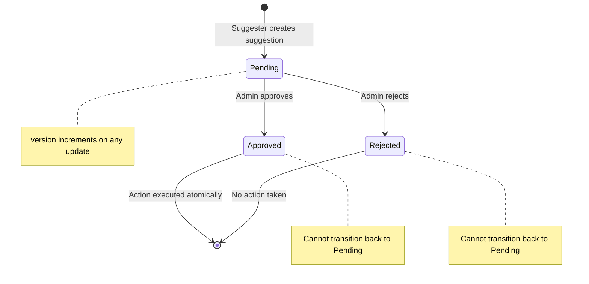
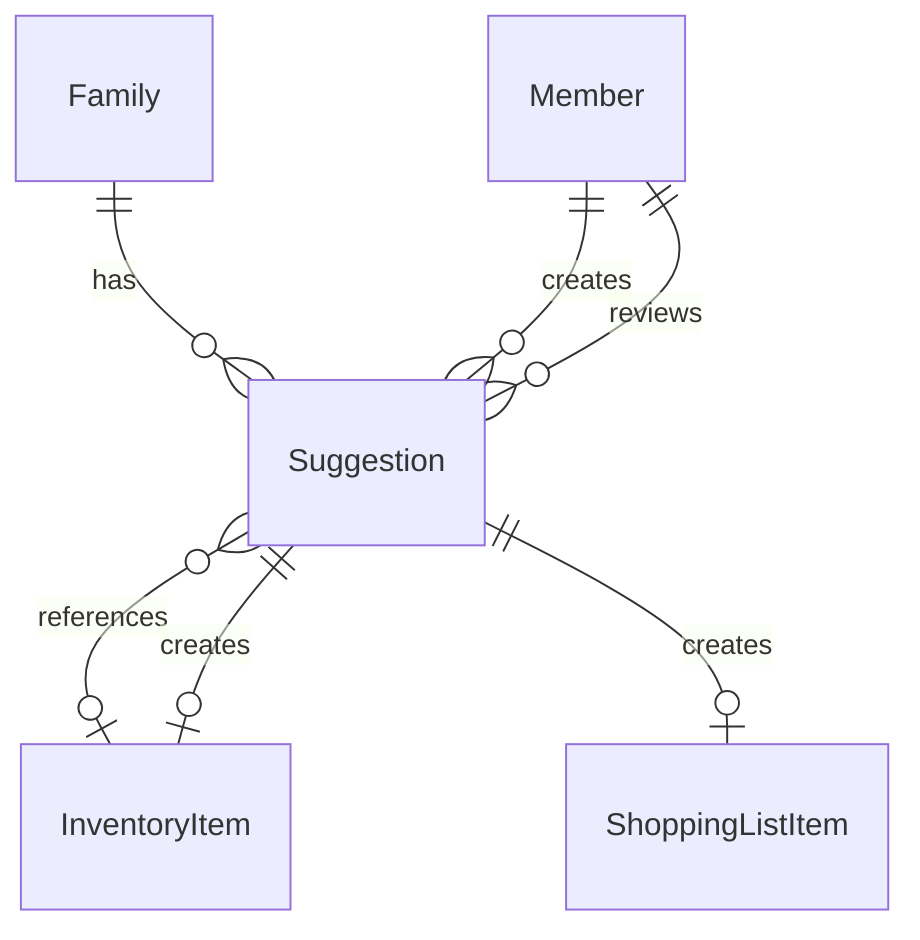

# Data Model: Suggester Workflow

**Feature**: 004-suggester-workflow  
**Date**: 2025-12-10  
**Database**: Amazon DynamoDB (Single-Table Design)  
**Parent Feature**: 001-family-inventory-mvp, 003-member-management

## Overview

This document defines the data model extensions for the Suggester Workflow feature. It documents the **Suggestion** entity (originally defined in 001-family-inventory-mvp) with additional attributes and access patterns specific to this feature's implementation.

### Entities in This Feature

| Entity | Purpose | New/Extended |
|--------|---------|--------------|
| Suggestion | Tracks suggester requests for shopping list additions or new inventory items | **Extended** (adds `version`, `itemNameSnapshot`, `suggestedByName` attributes) |

### Related Entities (from Parent Features)

| Entity | Source | Relationship |
|--------|--------|--------------|
| Family | 001-family-inventory-mvp | Suggestions belong to a family |
| Member | 003-member-management | Suggesters create, admins review |
| InventoryItem | 001-family-inventory-mvp | Referenced by add_to_shopping suggestions |
| ShoppingListItem | 001-family-inventory-mvp | Created when add_to_shopping approved |

---

## Suggestion Entity

A request from a suggester to add an item to the shopping list or create a new inventory item. Requires admin approval.

### Access Patterns

| Access Pattern | Query Type | Keys Used |
|----------------|-----------|-----------|
| List suggestions by family | Query | PK = `FAMILY#{familyId}`, SK begins_with `SUGGESTION#` |
| Get suggestion by ID | GetItem | PK = `FAMILY#{familyId}`, SK = `SUGGESTION#{suggestionId}` |
| List pending suggestions | Query | GSI2: PK = `FAMILY#{familyId}#SUGGESTIONS`, SK begins_with `STATUS#pending` |
| List suggestions by status | Query | GSI2: PK = `FAMILY#{familyId}#SUGGESTIONS`, SK begins_with `STATUS#{status}` |
| List suggestions ordered by date | Query | GSI2: PK = `FAMILY#{familyId}#SUGGESTIONS`, SK begins_with `STATUS#{status}#CREATED#` |

### Key Structure

- **PK**: `FAMILY#{familyId}`
- **SK**: `SUGGESTION#{suggestionId}`
- **GSI2PK**: `FAMILY#{familyId}#SUGGESTIONS`
- **GSI2SK**: `STATUS#{status}#CREATED#{createdAt}`

### Attributes

```typescript
{
  // Primary identifiers
  suggestionId: string;           // UUID v4
  familyId: string;               // UUID v4
  
  // Suggester information
  suggestedBy: string;            // memberId of suggester (must be suggester role)
  suggestedByName: string;        // Snapshot of suggester name for display after removal
  
  // Suggestion type and status
  type: 'add_to_shopping' | 'create_item';
  status: 'pending' | 'approved' | 'rejected';
  
  // For add_to_shopping type
  itemId: string | null;          // UUID of existing InventoryItem
  itemNameSnapshot: string | null; // Snapshot of item name for orphan handling
  
  // For create_item type
  proposedItemName: string | null;     // Name for new item (1-100 chars)
  proposedQuantity: number | null;     // Quantity for new item (integer >= 0)
  proposedThreshold: number | null;    // Threshold for new item (integer >= 0)
  
  // Optional notes
  notes: string | null;           // Suggester notes (0-500 chars)
  rejectionNotes: string | null;  // Admin rejection reason (0-500 chars)
  
  // Review information
  reviewedBy: string | null;      // memberId of admin who reviewed
  reviewedAt: string | null;      // ISO 8601 timestamp when reviewed
  
  // Optimistic locking
  version: number;                // Starting at 1, incremented on each update
  
  // Standard fields
  entityType: 'Suggestion';
  createdAt: string;              // ISO 8601 timestamp
  updatedAt: string;              // ISO 8601 timestamp
}
```

### Validation Rules

| Field | Rule | Error Message |
|-------|------|---------------|
| `suggestionId` | UUID v4 format | "Invalid suggestion ID format" |
| `familyId` | UUID v4 format | "Invalid family ID format" |
| `suggestedBy` | UUID v4 format, must be suggester role | "Invalid suggester ID or not a suggester" |
| `suggestedByName` | 1-100 characters | "Suggester name must be 1-100 characters" |
| `type` | 'add_to_shopping' or 'create_item' | "Type must be 'add_to_shopping' or 'create_item'" |
| `status` | 'pending', 'approved', or 'rejected' | "Invalid suggestion status" |
| `itemId` | Required for add_to_shopping, null for create_item | "Item ID required for add_to_shopping type" |
| `proposedItemName` | Required for create_item (1-100 chars), null for add_to_shopping | "Proposed item name required for create_item type" |
| `proposedQuantity` | Integer >= 0 or null | "Quantity must be a non-negative integer" |
| `proposedThreshold` | Integer >= 0 or null | "Threshold must be a non-negative integer" |
| `notes` | 0-500 characters or null | "Notes must be 500 characters or less" |
| `rejectionNotes` | 0-500 characters or null | "Rejection notes must be 500 characters or less" |
| `reviewedBy` | UUID v4 format, must be admin role (when reviewed) | "Invalid reviewer ID or not an admin" |
| `version` | Integer >= 1 | "Version must be a positive integer" |

### Validation Rules by Type

**For 'add_to_shopping' suggestions:**
- `itemId` MUST reference a valid, active InventoryItem
- `itemNameSnapshot` MUST be populated from the referenced item
- `proposedItemName`, `proposedQuantity`, `proposedThreshold` MUST be null

**For 'create_item' suggestions:**
- `proposedItemName` MUST be provided (1-100 characters)
- `proposedQuantity` SHOULD be provided (integer >= 0, defaults to 0 if null)
- `proposedThreshold` SHOULD be provided (integer >= 0, defaults to 0 if null)
- `itemId`, `itemNameSnapshot` MUST be null

### State Transitions



| Transition | Trigger | Side Effects |
|------------|---------|--------------|
| Create → Pending | POST /suggestions | Set version=1, suggestedByName snapshot, itemNameSnapshot if applicable |
| Pending → Approved | POST /suggestions/{id}/approve | Set reviewedBy/reviewedAt, increment version, execute action atomically |
| Pending → Rejected | POST /suggestions/{id}/reject | Set reviewedBy/reviewedAt, rejectionNotes, increment version |

### Relationships



- **Belongs to**: One Family (via `familyId`)
- **Created by**: One Member with suggester role (via `suggestedBy`)
- **Reviewed by**: One Member with admin role (via `reviewedBy`, when reviewed)
- **References**: One InventoryItem (via `itemId`, for add_to_shopping type)
- **Creates**: One ShoppingListItem (when add_to_shopping approved)
- **Creates**: One InventoryItem (when create_item approved)

### DynamoDB Example Items

#### Pending "add_to_shopping" Suggestion

```json
{
  "PK": "FAMILY#f47ac10b-58cc-4372-a567-0e02b2c3d479",
  "SK": "SUGGESTION#af14e45f-ceea-467a-9b36-34f6c3b3e7d3",
  "GSI2PK": "FAMILY#f47ac10b-58cc-4372-a567-0e02b2c3d479#SUGGESTIONS",
  "GSI2SK": "STATUS#pending#CREATED#2025-12-10T13:00:00Z",
  "suggestionId": "af14e45f-ceea-467a-9b36-34f6c3b3e7d3",
  "familyId": "f47ac10b-58cc-4372-a567-0e02b2c3d479",
  "suggestedBy": "660e8400-e29b-41d4-a716-446655440001",
  "suggestedByName": "Emma Smith",
  "type": "add_to_shopping",
  "status": "pending",
  "itemId": "6ba7b810-9dad-11d1-80b4-00c04fd430c8",
  "itemNameSnapshot": "Paper Towels",
  "proposedItemName": null,
  "proposedQuantity": null,
  "proposedThreshold": null,
  "notes": "We're almost out!",
  "rejectionNotes": null,
  "reviewedBy": null,
  "reviewedAt": null,
  "version": 1,
  "entityType": "Suggestion",
  "createdAt": "2025-12-10T13:00:00Z",
  "updatedAt": "2025-12-10T13:00:00Z"
}
```

#### Pending "create_item" Suggestion

```json
{
  "PK": "FAMILY#f47ac10b-58cc-4372-a567-0e02b2c3d479",
  "SK": "SUGGESTION#bf14e45f-ceea-467a-9b36-34f6c3b3e7d4",
  "GSI2PK": "FAMILY#f47ac10b-58cc-4372-a567-0e02b2c3d479#SUGGESTIONS",
  "GSI2SK": "STATUS#pending#CREATED#2025-12-10T14:00:00Z",
  "suggestionId": "bf14e45f-ceea-467a-9b36-34f6c3b3e7d4",
  "familyId": "f47ac10b-58cc-4372-a567-0e02b2c3d479",
  "suggestedBy": "660e8400-e29b-41d4-a716-446655440001",
  "suggestedByName": "Emma Smith",
  "type": "create_item",
  "status": "pending",
  "itemId": null,
  "itemNameSnapshot": null,
  "proposedItemName": "Snack Bars",
  "proposedQuantity": 10,
  "proposedThreshold": 5,
  "notes": "We're running low on after-school snacks",
  "rejectionNotes": null,
  "reviewedBy": null,
  "reviewedAt": null,
  "version": 1,
  "entityType": "Suggestion",
  "createdAt": "2025-12-10T14:00:00Z",
  "updatedAt": "2025-12-10T14:00:00Z"
}
```

#### Approved Suggestion

```json
{
  "PK": "FAMILY#f47ac10b-58cc-4372-a567-0e02b2c3d479",
  "SK": "SUGGESTION#cf14e45f-ceea-467a-9b36-34f6c3b3e7d5",
  "GSI2PK": "FAMILY#f47ac10b-58cc-4372-a567-0e02b2c3d479#SUGGESTIONS",
  "GSI2SK": "STATUS#approved#CREATED#2025-12-09T10:00:00Z",
  "suggestionId": "cf14e45f-ceea-467a-9b36-34f6c3b3e7d5",
  "familyId": "f47ac10b-58cc-4372-a567-0e02b2c3d479",
  "suggestedBy": "660e8400-e29b-41d4-a716-446655440001",
  "suggestedByName": "Emma Smith",
  "type": "add_to_shopping",
  "status": "approved",
  "itemId": "7ba7b810-9dad-11d1-80b4-00c04fd430c9",
  "itemNameSnapshot": "Milk",
  "proposedItemName": null,
  "proposedQuantity": null,
  "proposedThreshold": null,
  "notes": "Need more milk for cereal",
  "rejectionNotes": null,
  "reviewedBy": "550e8400-e29b-41d4-a716-446655440000",
  "reviewedAt": "2025-12-09T11:30:00Z",
  "version": 2,
  "entityType": "Suggestion",
  "createdAt": "2025-12-09T10:00:00Z",
  "updatedAt": "2025-12-09T11:30:00Z"
}
```

#### Rejected Suggestion

```json
{
  "PK": "FAMILY#f47ac10b-58cc-4372-a567-0e02b2c3d479",
  "SK": "SUGGESTION#df14e45f-ceea-467a-9b36-34f6c3b3e7d6",
  "GSI2PK": "FAMILY#f47ac10b-58cc-4372-a567-0e02b2c3d479#SUGGESTIONS",
  "GSI2SK": "STATUS#rejected#CREATED#2025-12-08T09:00:00Z",
  "suggestionId": "df14e45f-ceea-467a-9b36-34f6c3b3e7d6",
  "familyId": "f47ac10b-58cc-4372-a567-0e02b2c3d479",
  "suggestedBy": "660e8400-e29b-41d4-a716-446655440001",
  "suggestedByName": "Emma Smith",
  "type": "create_item",
  "status": "rejected",
  "itemId": null,
  "itemNameSnapshot": null,
  "proposedItemName": "Candy",
  "proposedQuantity": 20,
  "proposedThreshold": 10,
  "notes": "I want candy!",
  "rejectionNotes": "We already have enough sweets at home",
  "reviewedBy": "550e8400-e29b-41d4-a716-446655440000",
  "reviewedAt": "2025-12-08T10:00:00Z",
  "version": 2,
  "entityType": "Suggestion",
  "createdAt": "2025-12-08T09:00:00Z",
  "updatedAt": "2025-12-08T10:00:00Z"
}
```

---

## Access Patterns Summary

### Suggestion Access Patterns

| Access Pattern | Query Type | Keys Used | Use Case |
|----------------|-----------|-----------|----------|
| List all suggestions | Query | PK = `FAMILY#{familyId}`, SK begins_with `SUGGESTION#` | Admin views all suggestions |
| Get suggestion by ID | GetItem | PK = `FAMILY#{familyId}`, SK = `SUGGESTION#{suggestionId}` | View suggestion details |
| List pending suggestions | Query | GSI2: PK = `FAMILY#{familyId}#SUGGESTIONS`, SK begins_with `STATUS#pending` | Admin reviews pending |
| List approved suggestions | Query | GSI2: PK = `FAMILY#{familyId}#SUGGESTIONS`, SK begins_with `STATUS#approved` | View approval history |
| List rejected suggestions | Query | GSI2: PK = `FAMILY#{familyId}#SUGGESTIONS`, SK begins_with `STATUS#rejected` | View rejection history |

### Related Entity Access Patterns (from Parent Features)

| Access Pattern | Query Type | Keys Used | Use Case |
|----------------|-----------|-----------|----------|
| Get inventory item | GetItem | PK = `FAMILY#{familyId}`, SK = `ITEM#{itemId}` | Validate add_to_shopping reference |
| List inventory items | Query | PK = `FAMILY#{familyId}`, SK begins_with `ITEM#` | Suggester views inventory |
| Get member | GetItem | PK = `FAMILY#{familyId}`, SK = `MEMBER#{memberId}` | Validate suggester/admin role |

---

## Global Secondary Indexes

### GSI2: Family-Scoped Queries (from Parent Feature)

**Purpose**: Efficiently query suggestion collections within a family with status filtering and date ordering.

| Attribute | Value |
|-----------|-------|
| **GSI2PK** | `FAMILY#{familyId}#SUGGESTIONS` |
| **GSI2SK** | `STATUS#{status}#CREATED#{createdAt}` |
| **Projection** | ALL (all attributes projected) |

**Use Cases**:
- Query pending suggestions for admin review
- Query suggestions by status with date ordering
- Count pending suggestions for notification badge

**Query Examples**:

```typescript
// List pending suggestions, newest first
const result = await docClient.send(new QueryCommand({
  TableName: 'InventoryManagement',
  IndexName: 'GSI2',
  KeyConditionExpression: 'GSI2PK = :pk AND begins_with(GSI2SK, :skPrefix)',
  ExpressionAttributeValues: {
    ':pk': `FAMILY#${familyId}#SUGGESTIONS`,
    ':skPrefix': 'STATUS#pending'
  },
  ScanIndexForward: false  // Newest first
}));

// List all suggestions by status
const result = await docClient.send(new QueryCommand({
  TableName: 'InventoryManagement',
  IndexName: 'GSI2',
  KeyConditionExpression: 'GSI2PK = :pk AND begins_with(GSI2SK, :skPrefix)',
  ExpressionAttributeValues: {
    ':pk': `FAMILY#${familyId}#SUGGESTIONS`,
    ':skPrefix': `STATUS#${status}`
  }
}));
```

---

## TypeScript Type Definitions

```typescript
import { z } from 'zod';

// ============================================
// Suggestion Entity
// ============================================

export const SuggestionTypeSchema = z.enum(['add_to_shopping', 'create_item']);
export type SuggestionType = z.infer<typeof SuggestionTypeSchema>;

export const SuggestionStatusSchema = z.enum(['pending', 'approved', 'rejected']);
export type SuggestionStatus = z.infer<typeof SuggestionStatusSchema>;

export const SuggestionSchema = z.object({
  // Primary identifiers
  suggestionId: z.string().uuid(),
  familyId: z.string().uuid(),
  
  // Suggester information
  suggestedBy: z.string().uuid(),
  suggestedByName: z.string().min(1).max(100),
  
  // Suggestion type and status
  type: SuggestionTypeSchema,
  status: SuggestionStatusSchema,
  
  // For add_to_shopping type
  itemId: z.string().uuid().nullable(),
  itemNameSnapshot: z.string().min(1).max(100).nullable(),
  
  // For create_item type
  proposedItemName: z.string().min(1).max(100).nullable(),
  proposedQuantity: z.number().int().min(0).nullable(),
  proposedThreshold: z.number().int().min(0).nullable(),
  
  // Optional notes
  notes: z.string().max(500).nullable(),
  rejectionNotes: z.string().max(500).nullable(),
  
  // Review information
  reviewedBy: z.string().uuid().nullable(),
  reviewedAt: z.string().datetime().nullable(),
  
  // Optimistic locking
  version: z.number().int().min(1),
  
  // Standard fields
  entityType: z.literal('Suggestion'),
  createdAt: z.string().datetime(),
  updatedAt: z.string().datetime(),
});

export type Suggestion = z.infer<typeof SuggestionSchema>;

// ============================================
// Request Schemas
// ============================================

// Create add_to_shopping suggestion
export const CreateAddToShoppingSuggestionRequestSchema = z.object({
  type: z.literal('add_to_shopping'),
  itemId: z.string().uuid(),
  notes: z.string().max(500).optional(),
});

export type CreateAddToShoppingSuggestionRequest = z.infer<typeof CreateAddToShoppingSuggestionRequestSchema>;

// Create create_item suggestion
export const CreateItemSuggestionRequestSchema = z.object({
  type: z.literal('create_item'),
  proposedItemName: z.string().min(1).max(100),
  proposedQuantity: z.number().int().min(0).optional(),
  proposedThreshold: z.number().int().min(0).optional(),
  notes: z.string().max(500).optional(),
});

export type CreateItemSuggestionRequest = z.infer<typeof CreateItemSuggestionRequestSchema>;

// Union type for create suggestion request
export const CreateSuggestionRequestSchema = z.discriminatedUnion('type', [
  CreateAddToShoppingSuggestionRequestSchema,
  CreateItemSuggestionRequestSchema,
]);

export type CreateSuggestionRequest = z.infer<typeof CreateSuggestionRequestSchema>;

// Approve suggestion request
export const ApproveSuggestionRequestSchema = z.object({
  version: z.number().int().min(1), // Required for optimistic locking
});

export type ApproveSuggestionRequest = z.infer<typeof ApproveSuggestionRequestSchema>;

// Reject suggestion request
export const RejectSuggestionRequestSchema = z.object({
  version: z.number().int().min(1), // Required for optimistic locking
  rejectionNotes: z.string().max(500).optional(),
});

export type RejectSuggestionRequest = z.infer<typeof RejectSuggestionRequestSchema>;

// ============================================
// Response Schemas
// ============================================

export const SuggestionResponseSchema = SuggestionSchema.extend({
  // Additional computed fields for response
  suggesterStatus: z.enum(['active', 'removed']).optional(),
  itemStatus: z.enum(['active', 'archived', 'deleted']).optional(),
});

export type SuggestionResponse = z.infer<typeof SuggestionResponseSchema>;

export const SuggestionListResponseSchema = z.object({
  suggestions: z.array(SuggestionResponseSchema),
  nextToken: z.string().optional(),
});

export type SuggestionListResponse = z.infer<typeof SuggestionListResponseSchema>;

// ============================================
// DynamoDB Key Schemas
// ============================================

export const SuggestionKeysSchema = z.object({
  PK: z.string().regex(/^FAMILY#[0-9a-f-]{36}$/),
  SK: z.string().regex(/^SUGGESTION#[0-9a-f-]{36}$/),
  GSI2PK: z.string().regex(/^FAMILY#[0-9a-f-]{36}#SUGGESTIONS$/),
  GSI2SK: z.string().regex(/^STATUS#(pending|approved|rejected)#CREATED#.+$/),
});

export type SuggestionKeys = z.infer<typeof SuggestionKeysSchema>;

// ============================================
// Helper Functions
// ============================================

export function buildSuggestionKeys(familyId: string, suggestionId: string, status: SuggestionStatus, createdAt: string): SuggestionKeys {
  return {
    PK: `FAMILY#${familyId}`,
    SK: `SUGGESTION#${suggestionId}`,
    GSI2PK: `FAMILY#${familyId}#SUGGESTIONS`,
    GSI2SK: `STATUS#${status}#CREATED#${createdAt}`,
  };
}

export function parseSuggestionKeys(pk: string, sk: string): { familyId: string; suggestionId: string } {
  const familyId = pk.replace('FAMILY#', '');
  const suggestionId = sk.replace('SUGGESTION#', '');
  return { familyId, suggestionId };
}
```

---

## Data Integrity Rules

### Family Isolation
- All queries MUST filter by `familyId` to ensure data isolation
- Lambda authorizer MUST inject `familyId` from JWT claims
- Cross-family access MUST be prevented at the application layer

### Suggestion Constraints
- Only members with 'suggester' role can create suggestions
- Only members with 'admin' role can approve/reject suggestions
- Approved/rejected suggestions cannot be modified (status is final)
- All updates MUST use optimistic locking with version check

### Atomic Approval Execution
- Approval of add_to_shopping MUST atomically create ShoppingListItem
- Approval of create_item MUST atomically create InventoryItem
- Use DynamoDB TransactWriteItems for atomic multi-item updates
- On transaction failure, suggestion status remains unchanged

### Orphan Handling
- Store `itemNameSnapshot` on add_to_shopping suggestion creation
- Store `suggestedByName` on all suggestion creation
- If referenced item is deleted/archived, approval fails gracefully
- Suggestions remain viewable even if suggester is removed

---

## Migration Notes

### From Parent Feature (001-family-inventory-mvp)

The Suggestion entity was originally defined in 001-family-inventory-mvp (lines 463-539). This feature extends it with:

1. **New attributes**:
   - `version`: Optimistic locking (integer, default 1)
   - `itemNameSnapshot`: Item name snapshot for orphan handling (string, nullable)
   - `suggestedByName`: Suggester name snapshot for display after removal (string)
   - `rejectionNotes`: Admin rejection reason (string, nullable)

2. **Existing suggestions migration**:
   - If `version` is undefined, treat as `version = 1`
   - If `suggestedByName` is undefined, populate from Member lookup
   - If `itemNameSnapshot` is undefined for add_to_shopping, populate from InventoryItem lookup

```typescript
// Read-time migration example
function migrateSuggestion(suggestion: Partial<Suggestion>, member?: Member, item?: InventoryItem): Suggestion {
  return {
    ...suggestion,
    version: suggestion.version ?? 1,
    suggestedByName: suggestion.suggestedByName ?? member?.name ?? 'Unknown',
    itemNameSnapshot: suggestion.type === 'add_to_shopping' 
      ? (suggestion.itemNameSnapshot ?? item?.name ?? 'Unknown Item')
      : null,
    rejectionNotes: suggestion.rejectionNotes ?? null,
  } as Suggestion;
}
```

---

**Data Model Complete**: 2025-12-10  
**Status**: Ready for API contract generation