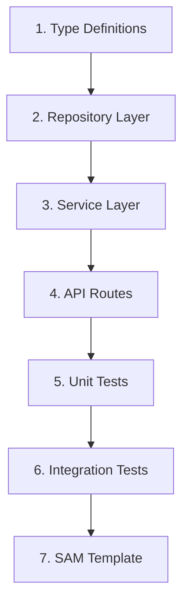

# Quickstart: Suggester Workflow

**Feature**: 004-suggester-workflow  
**Date**: 2025-12-10  
**Status**: Ready for Implementation

## Overview

This guide provides step-by-step instructions for implementing the Suggester Workflow feature. It covers the key components, implementation order, and code examples to help developers get started quickly.

---

## Table of Contents

1. [Prerequisites](#1-prerequisites)
2. [Project Structure](#2-project-structure)
3. [Implementation Order](#3-implementation-order)
4. [Type Definitions](#4-type-definitions)
5. [Repository Layer](#5-repository-layer)
6. [Service Layer](#6-service-layer)
7. [API Routes](#7-api-routes)
8. [Testing Strategy](#8-testing-strategy)
9. [SAM Template Updates](#9-sam-template-updates)

---

## 1. Prerequisites

### Required Dependencies

Ensure the following are installed from parent features:

```bash
# From 001-family-inventory-mvp
npm install @aws-sdk/client-dynamodb @aws-sdk/lib-dynamodb zod uuid

# TypeScript types
npm install -D @types/uuid
```

### Environment Variables

```bash
# .env.local
DYNAMODB_TABLE_NAME=InventoryManagement
AWS_REGION=us-east-1
```

### Parent Feature Dependencies

This feature requires:
- **001-family-inventory-mvp**: DynamoDB table, Family, InventoryItem, ShoppingListItem entities
- **003-member-management**: Member entity with role-based permissions, Lambda authorizer

---

## 2. Project Structure

```text
src/
├── app/
│   └── api/
│       └── families/
│           └── [familyId]/
│               ├── inventory/
│               │   └── route.ts           # GET inventory (read-only)
│               └── suggestions/
│                   ├── route.ts           # GET list, POST create
│                   └── [suggestionId]/
│                       ├── route.ts       # GET details
│                       ├── approve/
│                       │   └── route.ts   # POST approve
│                       └── reject/
│                           └── route.ts   # POST reject
├── lib/
│   └── dynamodb/
│       └── suggestionRepository.ts
├── services/
│   └── suggestionService.ts
└── types/
    └── suggestion.ts

tests/
├── unit/
│   ├── services/
│   │   └── suggestionService.test.ts
│   └── lib/
│       └── suggestionRepository.test.ts
├── integration/
│   └── api/
│       └── suggestions.test.ts
└── contract/
    └── suggestionApi.contract.test.ts
```

---

## 3. Implementation Order

Follow this order to ensure dependencies are satisfied:



| Step | Component | Description |
|------|-----------|-------------|
| 1 | Type Definitions | Zod schemas and TypeScript types |
| 2 | Repository Layer | DynamoDB operations for Suggestion entity |
| 3 | Service Layer | Business logic for suggestion workflow |
| 4 | API Routes | Next.js route handlers |
| 5 | Unit Tests | Test service and repository logic |
| 6 | Integration Tests | Test API endpoints |
| 7 | SAM Template | Lambda function definitions |

---

## 4. Type Definitions

### File: `src/types/suggestion.ts`

```typescript
import { z } from 'zod';

// ============================================
// Enums
// ============================================

export const SuggestionTypeSchema = z.enum(['add_to_shopping', 'create_item']);
export type SuggestionType = z.infer<typeof SuggestionTypeSchema>;

export const SuggestionStatusSchema = z.enum(['pending', 'approved', 'rejected']);
export type SuggestionStatus = z.infer<typeof SuggestionStatusSchema>;

// ============================================
// Suggestion Entity
// ============================================

export const SuggestionSchema = z.object({
  suggestionId: z.string().uuid(),
  familyId: z.string().uuid(),
  suggestedBy: z.string().uuid(),
  suggestedByName: z.string().min(1).max(100),
  type: SuggestionTypeSchema,
  status: SuggestionStatusSchema,
  itemId: z.string().uuid().nullable(),
  itemNameSnapshot: z.string().min(1).max(100).nullable(),
  proposedItemName: z.string().min(1).max(100).nullable(),
  proposedQuantity: z.number().int().min(0).nullable(),
  proposedThreshold: z.number().int().min(0).nullable(),
  notes: z.string().max(500).nullable(),
  rejectionNotes: z.string().max(500).nullable(),
  reviewedBy: z.string().uuid().nullable(),
  reviewedAt: z.string().datetime().nullable(),
  version: z.number().int().min(1),
  entityType: z.literal('Suggestion'),
  createdAt: z.string().datetime(),
  updatedAt: z.string().datetime(),
});

export type Suggestion = z.infer<typeof SuggestionSchema>;

// ============================================
// Request Schemas
// ============================================

export const CreateAddToShoppingSuggestionRequestSchema = z.object({
  type: z.literal('add_to_shopping'),
  itemId: z.string().uuid(),
  notes: z.string().max(500).optional(),
});

export const CreateItemSuggestionRequestSchema = z.object({
  type: z.literal('create_item'),
  proposedItemName: z.string().min(1).max(100),
  proposedQuantity: z.number().int().min(0).optional(),
  proposedThreshold: z.number().int().min(0).optional(),
  notes: z.string().max(500).optional(),
});

export const CreateSuggestionRequestSchema = z.discriminatedUnion('type', [
  CreateAddToShoppingSuggestionRequestSchema,
  CreateItemSuggestionRequestSchema,
]);

export type CreateSuggestionRequest = z.infer<typeof CreateSuggestionRequestSchema>;

export const ApproveSuggestionRequestSchema = z.object({
  version: z.number().int().min(1),
});

export type ApproveSuggestionRequest = z.infer<typeof ApproveSuggestionRequestSchema>;

export const RejectSuggestionRequestSchema = z.object({
  version: z.number().int().min(1),
  rejectionNotes: z.string().max(500).optional(),
});

export type RejectSuggestionRequest = z.infer<typeof RejectSuggestionRequestSchema>;

// ============================================
// DynamoDB Key Helpers
// ============================================

export function buildSuggestionKeys(
  familyId: string,
  suggestionId: string,
  status: SuggestionStatus,
  createdAt: string
) {
  return {
    PK: `FAMILY#${familyId}`,
    SK: `SUGGESTION#${suggestionId}`,
    GSI2PK: `FAMILY#${familyId}#SUGGESTIONS`,
    GSI2SK: `STATUS#${status}#CREATED#${createdAt}`,
  };
}
```

---

## 5. Repository Layer

### File: `src/lib/dynamodb/suggestionRepository.ts`

```typescript
import { DynamoDBDocumentClient, GetCommand, PutCommand, QueryCommand, UpdateCommand, TransactWriteCommand } from '@aws-sdk/lib-dynamodb';
import { DynamoDBClient } from '@aws-sdk/client-dynamodb';
import { v4 as uuid } from 'uuid';
import { Suggestion, SuggestionStatus, buildSuggestionKeys } from '@/types/suggestion';

const client = new DynamoDBClient({});
const docClient = DynamoDBDocumentClient.from(client);
const TABLE_NAME = process.env.DYNAMODB_TABLE_NAME!;

export interface CreateSuggestionInput {
  familyId: string;
  suggestedBy: string;
  suggestedByName: string;
  type: 'add_to_shopping' | 'create_item';
  itemId?: string;
  itemNameSnapshot?: string;
  proposedItemName?: string;
  proposedQuantity?: number;
  proposedThreshold?: number;
  notes?: string;
}

export async function createSuggestion(input: CreateSuggestionInput): Promise<Suggestion> {
  const now = new Date().toISOString();
  const suggestionId = uuid();
  
  const suggestion: Suggestion = {
    suggestionId,
    familyId: input.familyId,
    suggestedBy: input.suggestedBy,
    suggestedByName: input.suggestedByName,
    type: input.type,
    status: 'pending',
    itemId: input.itemId ?? null,
    itemNameSnapshot: input.itemNameSnapshot ?? null,
    proposedItemName: input.proposedItemName ?? null,
    proposedQuantity: input.proposedQuantity ?? null,
    proposedThreshold: input.proposedThreshold ?? null,
    notes: input.notes ?? null,
    rejectionNotes: null,
    reviewedBy: null,
    reviewedAt: null,
    version: 1,
    entityType: 'Suggestion',
    createdAt: now,
    updatedAt: now,
  };

  const keys = buildSuggestionKeys(input.familyId, suggestionId, 'pending', now);

  await docClient.send(new PutCommand({
    TableName: TABLE_NAME,
    Item: { ...keys, ...suggestion },
    ConditionExpression: 'attribute_not_exists(PK)',
  }));

  return suggestion;
}

export async function getSuggestion(familyId: string, suggestionId: string): Promise<Suggestion | null> {
  const result = await docClient.send(new GetCommand({
    TableName: TABLE_NAME,
    Key: {
      PK: `FAMILY#${familyId}`,
      SK: `SUGGESTION#${suggestionId}`,
    },
  }));

  return result.Item as Suggestion | null;
}

export async function listSuggestions(
  familyId: string,
  status?: SuggestionStatus,
  limit: number = 25,
  nextToken?: string
): Promise<{ suggestions: Suggestion[]; nextToken?: string }> {
  const result = await docClient.send(new QueryCommand({
    TableName: TABLE_NAME,
    IndexName: 'GSI2',
    KeyConditionExpression: status
      ? 'GSI2PK = :pk AND begins_with(GSI2SK, :skPrefix)'
      : 'GSI2PK = :pk',
    ExpressionAttributeValues: {
      ':pk': `FAMILY#${familyId}#SUGGESTIONS`,
      ...(status && { ':skPrefix': `STATUS#${status}` }),
    },
    Limit: limit,
    ScanIndexForward: false, // Newest first
    ExclusiveStartKey: nextToken ? JSON.parse(Buffer.from(nextToken, 'base64').toString()) : undefined,
  }));

  return {
    suggestions: result.Items as Suggestion[],
    nextToken: result.LastEvaluatedKey
      ? Buffer.from(JSON.stringify(result.LastEvaluatedKey)).toString('base64')
      : undefined,
  };
}

export async function approveSuggestionWithTransaction(
  suggestion: Suggestion,
  reviewerId: string,
  createdItemId: string
): Promise<Suggestion> {
  const now = new Date().toISOString();
  const newVersion = suggestion.version + 1;

  // Build transaction items based on suggestion type
  const transactItems = [
    // Update suggestion status
    {
      Update: {
        TableName: TABLE_NAME,
        Key: {
          PK: `FAMILY#${suggestion.familyId}`,
          SK: `SUGGESTION#${suggestion.suggestionId}`,
        },
        UpdateExpression: `
          SET #status = :approved,
              #reviewedBy = :reviewerId,
              #reviewedAt = :now,
              #version = :newVersion,
              #updatedAt = :now,
              GSI2SK = :newGsi2Sk
        `,
        ConditionExpression: '#status = :pending AND #version = :expectedVersion',
        ExpressionAttributeNames: {
          '#status': 'status',
          '#reviewedBy': 'reviewedBy',
          '#reviewedAt': 'reviewedAt',
          '#version': 'version',
          '#updatedAt': 'updatedAt',
        },
        ExpressionAttributeValues: {
          ':approved': 'approved',
          ':pending': 'pending',
          ':reviewerId': reviewerId,
          ':now': now,
          ':newVersion': newVersion,
          ':expectedVersion': suggestion.version,
          ':newGsi2Sk': `STATUS#approved#CREATED#${suggestion.createdAt}`,
        },
      },
    },
  ];

  // Add created item based on type
  if (suggestion.type === 'add_to_shopping') {
    transactItems.push({
      Put: {
        TableName: TABLE_NAME,
        Item: {
          PK: `FAMILY#${suggestion.familyId}`,
          SK: `SHOPPING#${createdItemId}`,
          GSI2PK: `FAMILY#${suggestion.familyId}#SHOPPING`,
          GSI2SK: `STORE#null#STATUS#pending`,
          shoppingItemId: createdItemId,
          familyId: suggestion.familyId,
          itemId: suggestion.itemId,
          name: suggestion.itemNameSnapshot,
          storeId: null,
          status: 'pending',
          quantity: null,
          notes: `Added from suggestion by ${suggestion.suggestedByName}`,
          entityType: 'ShoppingListItem',
          createdAt: now,
          updatedAt: now,
          addedBy: reviewerId,
        },
        ConditionExpression: 'attribute_not_exists(PK)',
      },
    });
  } else if (suggestion.type === 'create_item') {
    const quantity = suggestion.proposedQuantity ?? 0;
    const paddedQuantity = quantity.toString().padStart(10, '0');
    
    transactItems.push({
      Put: {
        TableName: TABLE_NAME,
        Item: {
          PK: `FAMILY#${suggestion.familyId}`,
          SK: `ITEM#${createdItemId}`,
          GSI2PK: `FAMILY#${suggestion.familyId}#ITEMS`,
          GSI2SK: `STATUS#active#QUANTITY#${paddedQuantity}`,
          itemId: createdItemId,
          familyId: suggestion.familyId,
          name: suggestion.proposedItemName,
          quantity: quantity,
          threshold: suggestion.proposedThreshold ?? 0,
          locationId: null,
          preferredStoreId: null,
          alternateStoreIds: [],
          status: 'active',
          entityType: 'InventoryItem',
          createdAt: now,
          updatedAt: now,
          createdBy: reviewerId,
        },
        ConditionExpression: 'attribute_not_exists(PK)',
      },
    });
  }

  await docClient.send(new TransactWriteCommand({ TransactItems: transactItems }));

  return {
    ...suggestion,
    status: 'approved',
    reviewedBy: reviewerId,
    reviewedAt: now,
    version: newVersion,
    updatedAt: now,
  };
}

export async function rejectSuggestion(
  suggestion: Suggestion,
  reviewerId: string,
  rejectionNotes?: string
): Promise<Suggestion> {
  const now = new Date().toISOString();
  const newVersion = suggestion.version + 1;

  await docClient.send(new UpdateCommand({
    TableName: TABLE_NAME,
    Key: {
      PK: `FAMILY#${suggestion.familyId}`,
      SK: `SUGGESTION#${suggestion.suggestionId}`,
    },
    UpdateExpression: `
      SET #status = :rejected,
          #reviewedBy = :reviewerId,
          #reviewedAt = :now,
          #rejectionNotes = :rejectionNotes,
          #version = :newVersion,
          #updatedAt = :now,
          GSI2SK = :newGsi2Sk
    `,
    ConditionExpression: '#status = :pending AND #version = :expectedVersion',
    ExpressionAttributeNames: {
      '#status': 'status',
      '#reviewedBy': 'reviewedBy',
      '#reviewedAt': 'reviewedAt',
      '#rejectionNotes': 'rejectionNotes',
      '#version': 'version',
      '#updatedAt': 'updatedAt',
    },
    ExpressionAttributeValues: {
      ':rejected': 'rejected',
      ':pending': 'pending',
      ':reviewerId': reviewerId,
      ':now': now,
      ':rejectionNotes': rejectionNotes ?? null,
      ':newVersion': newVersion,
      ':expectedVersion': suggestion.version,
      ':newGsi2Sk': `STATUS#rejected#CREATED#${suggestion.createdAt}`,
    },
  }));

  return {
    ...suggestion,
    status: 'rejected',
    reviewedBy: reviewerId,
    reviewedAt: now,
    rejectionNotes: rejectionNotes ?? null,
    version: newVersion,
    updatedAt: now,
  };
}
```

---

## 6. Service Layer

### File: `src/services/suggestionService.ts`

```typescript
import { v4 as uuid } from 'uuid';
import * as suggestionRepo from '@/lib/dynamodb/suggestionRepository';
import { getMember } from '@/lib/dynamodb/memberRepository';
import { getInventoryItem } from '@/lib/dynamodb/inventoryRepository';
import { CreateSuggestionRequest, Suggestion, SuggestionStatus } from '@/types/suggestion';

export class ForbiddenError extends Error {
  constructor(message: string) {
    super(message);
    this.name = 'ForbiddenError';
  }
}

export class NotFoundError extends Error {
  constructor(message: string) {
    super(message);
    this.name = 'NotFoundError';
  }
}

export class ConflictError extends Error {
  currentState?: Suggestion;
  constructor(message: string, currentState?: Suggestion) {
    super(message);
    this.name = 'ConflictError';
    this.currentState = currentState;
  }
}

export class UnprocessableError extends Error {
  itemStatus?: string;
  constructor(message: string, itemStatus?: string) {
    super(message);
    this.name = 'UnprocessableError';
    this.itemStatus = itemStatus;
  }
}

export async function createSuggestion(
  familyId: string,
  memberId: string,
  request: CreateSuggestionRequest
): Promise<Suggestion> {
  // Validate member role (defense in depth)
  const member = await getMember(familyId, memberId);
  
  if (!member || member.status !== 'active') {
    throw new ForbiddenError('Member not found or inactive');
  }
  
  if (member.role !== 'suggester') {
    throw new ForbiddenError('Only suggesters can create suggestions');
  }

  // Build input based on type
  if (request.type === 'add_to_shopping') {
    // Validate referenced item exists
    const item = await getInventoryItem(familyId, request.itemId);
    if (!item || item.status !== 'active') {
      throw new NotFoundError('Inventory item not found or archived');
    }

    return suggestionRepo.createSuggestion({
      familyId,
      suggestedBy: memberId,
      suggestedByName: member.name,
      type: 'add_to_shopping',
      itemId: request.itemId,
      itemNameSnapshot: item.name,
      notes: request.notes,
    });
  } else {
    return suggestionRepo.createSuggestion({
      familyId,
      suggestedBy: memberId,
      suggestedByName: member.name,
      type: 'create_item',
      proposedItemName: request.proposedItemName,
      proposedQuantity: request.proposedQuantity,
      proposedThreshold: request.proposedThreshold,
      notes: request.notes,
    });
  }
}

export async function getSuggestion(
  familyId: string,
  suggestionId: string
): Promise<Suggestion> {
  const suggestion = await suggestionRepo.getSuggestion(familyId, suggestionId);
  
  if (!suggestion) {
    throw new NotFoundError('Suggestion not found');
  }
  
  return suggestion;
}

export async function listSuggestions(
  familyId: string,
  status?: SuggestionStatus,
  limit?: number,
  nextToken?: string
): Promise<{ suggestions: Suggestion[]; nextToken?: string }> {
  return suggestionRepo.listSuggestions(familyId, status, limit, nextToken);
}

export async function approveSuggestion(
  familyId: string,
  suggestionId: string,
  reviewerId: string,
  expectedVersion: number
): Promise<{ suggestion: Suggestion; createdItem: { type: string; id: string; name: string } }> {
  // Validate reviewer is admin
  const reviewer = await getMember(familyId, reviewerId);
  
  if (!reviewer || reviewer.status !== 'active') {
    throw new ForbiddenError('Reviewer not found or inactive');
  }
  
  if (reviewer.role !== 'admin') {
    throw new ForbiddenError('Only admins can approve suggestions');
  }

  // Get suggestion
  const suggestion = await suggestionRepo.getSuggestion(familyId, suggestionId);
  
  if (!suggestion) {
    throw new NotFoundError('Suggestion not found');
  }
  
  if (suggestion.status !== 'pending') {
    throw new ConflictError('Suggestion already reviewed', suggestion);
  }
  
  if (suggestion.version !== expectedVersion) {
    throw new ConflictError('Suggestion modified by another user', suggestion);
  }

  // For add_to_shopping, validate item still exists
  if (suggestion.type === 'add_to_shopping' && suggestion.itemId) {
    const item = await getInventoryItem(familyId, suggestion.itemId);
    if (!item) {
      throw new UnprocessableError(
        `Cannot approve: Referenced item "${suggestion.itemNameSnapshot}" no longer exists`,
        'deleted'
      );
    }
    if (item.status === 'archived') {
      throw new UnprocessableError(
        `Cannot approve: Referenced item "${suggestion.itemNameSnapshot}" is archived`,
        'archived'
      );
    }
  }

  // Execute approval with transaction
  const createdItemId = uuid();
  const updatedSuggestion = await suggestionRepo.approveSuggestionWithTransaction(
    suggestion,
    reviewerId,
    createdItemId
  );

  return {
    suggestion: updatedSuggestion,
    createdItem: {
      type: suggestion.type === 'add_to_shopping' ? 'ShoppingListItem' : 'InventoryItem',
      id: createdItemId,
      name: suggestion.type === 'add_to_shopping' 
        ? suggestion.itemNameSnapshot! 
        : suggestion.proposedItemName!,
    },
  };
}

export async function rejectSuggestion(
  familyId: string,
  suggestionId: string,
  reviewerId: string,
  expectedVersion: number,
  rejectionNotes?: string
): Promise<Suggestion> {
  // Validate reviewer is admin
  const reviewer = await getMember(familyId, reviewerId);
  
  if (!reviewer || reviewer.status !== 'active') {
    throw new ForbiddenError('Reviewer not found or inactive');
  }
  
  if (reviewer.role !== 'admin') {
    throw new ForbiddenError('Only admins can reject suggestions');
  }

  // Get suggestion
  const suggestion = await suggestionRepo.getSuggestion(familyId, suggestionId);
  
  if (!suggestion) {
    throw new NotFoundError('Suggestion not found');
  }
  
  if (suggestion.status !== 'pending') {
    throw new ConflictError('Suggestion already reviewed', suggestion);
  }
  
  if (suggestion.version !== expectedVersion) {
    throw new ConflictError('Suggestion modified by another user', suggestion);
  }

  return suggestionRepo.rejectSuggestion(suggestion, reviewerId, rejectionNotes);
}
```

---

## 7. API Routes

### File: `src/app/api/families/[familyId]/suggestions/route.ts`

```typescript
import { NextRequest, NextResponse } from 'next/server';
import { z } from 'zod';
import * as suggestionService from '@/services/suggestionService';
import { CreateSuggestionRequestSchema, SuggestionStatusSchema } from '@/types/suggestion';

// GET /families/{familyId}/suggestions
export async function GET(
  request: NextRequest,
  { params }: { params: { familyId: string } }
) {
  try {
    const { familyId } = params;
    const searchParams = request.nextUrl.searchParams;
    
    const status = searchParams.get('status');
    const limit = searchParams.get('limit');
    const nextToken = searchParams.get('nextToken');

    // Validate status if provided
    const validatedStatus = status 
      ? SuggestionStatusSchema.parse(status) 
      : undefined;

    const result = await suggestionService.listSuggestions(
      familyId,
      validatedStatus,
      limit ? parseInt(limit, 10) : undefined,
      nextToken ?? undefined
    );

    return NextResponse.json(result);
  } catch (error) {
    if (error instanceof z.ZodError) {
      return NextResponse.json(
        { error: 'Bad Request', message: 'Invalid parameters', details: error.errors },
        { status: 400 }
      );
    }
    console.error('Error listing suggestions:', error);
    return NextResponse.json(
      { error: 'Internal Server Error', message: 'An unexpected error occurred' },
      { status: 500 }
    );
  }
}

// POST /families/{familyId}/suggestions
export async function POST(
  request: NextRequest,
  { params }: { params: { familyId: string } }
) {
  try {
    const { familyId } = params;
    const memberId = request.headers.get('x-member-id')!; // Set by Lambda authorizer
    
    const body = await request.json();
    const validatedRequest = CreateSuggestionRequestSchema.parse(body);

    const suggestion = await suggestionService.createSuggestion(
      familyId,
      memberId,
      validatedRequest
    );

    return NextResponse.json(suggestion, { status: 201 });
  } catch (error) {
    if (error instanceof z.ZodError) {
      return NextResponse.json(
        { error: 'Bad Request', message: 'Invalid request body', details: error.errors },
        { status: 400 }
      );
    }
    if (error instanceof suggestionService.ForbiddenError) {
      return NextResponse.json(
        { error: 'Forbidden', message: error.message },
        { status: 403 }
      );
    }
    if (error instanceof suggestionService.NotFoundError) {
      return NextResponse.json(
        { error: 'Not Found', message: error.message },
        { status: 404 }
      );
    }
    console.error('Error creating suggestion:', error);
    return NextResponse.json(
      { error: 'Internal Server Error', message: 'An unexpected error occurred' },
      { status: 500 }
    );
  }
}
```

### File: `src/app/api/families/[familyId]/suggestions/[suggestionId]/approve/route.ts`

```typescript
import { NextRequest, NextResponse } from 'next/server';
import { z } from 'zod';
import * as suggestionService from '@/services/suggestionService';
import { ApproveSuggestionRequestSchema } from '@/types/suggestion';

// POST /families/{familyId}/suggestions/{suggestionId}/approve
export async function POST(
  request: NextRequest,
  { params }: { params: { familyId: string; suggestionId: string } }
) {
  try {
    const { familyId, suggestionId } = params;
    const reviewerId = request.headers.get('x-member-id')!;
    
    const body = await request.json();
    const { version } = ApproveSuggestionRequestSchema.parse(body);

    const result = await suggestionService.approveSuggestion(
      familyId,
      suggestionId,
      reviewerId,
      version
    );

    return NextResponse.json(result);
  } catch (error) {
    if (error instanceof z.ZodError) {
      return NextResponse.json(
        { error: 'Bad Request', message: 'Invalid request body', details: error.errors },
        { status: 400 }
      );
    }
    if (error instanceof suggestionService.ForbiddenError) {
      return NextResponse.json(
        { error: 'Forbidden', message: error.message },
        { status: 403 }
      );
    }
    if (error instanceof suggestionService.NotFoundError) {
      return NextResponse.json(
        { error: 'Not Found', message: error.message },
        { status: 404 }
      );
    }
    if (error instanceof suggestionService.ConflictError) {
      return NextResponse.json(
        { error: 'Conflict', message: error.message, currentState: error.currentState },
        { status: 409 }
      );
    }
    if (error instanceof suggestionService.UnprocessableError) {
      return NextResponse.json(
        { error: 'Unprocessable Entity', message: error.message, itemStatus: error.itemStatus },
        { status: 422 }
      );
    }
    console.error('Error approving suggestion:', error);
    return NextResponse.json(
      { error: 'Internal Server Error', message: 'An unexpected error occurred' },
      { status: 500 }
    );
  }
}
```

---

## 8. Testing Strategy

### Test Coverage Requirements

| Component | Coverage Target | Critical Paths |
|-----------|----------------|----------------|
| suggestionService | 80% | Role validation, atomic approval, conflict handling |
| suggestionRepository | 80% | Transaction execution, optimistic locking |
| API Routes | 80% | Error responses, authorization |

### Unit Test Example

```typescript
// tests/unit/services/suggestionService.test.ts
import { describe, it, expect, jest, beforeEach } from '@jest/globals';
import * as suggestionService from '@/services/suggestionService';
import * as suggestionRepo from '@/lib/dynamodb/suggestionRepository';
import * as memberRepo from '@/lib/dynamodb/memberRepository';

jest.mock('@/lib/dynamodb/suggestionRepository');
jest.mock('@/lib/dynamodb/memberRepository');

describe('suggestionService', () => {
  before