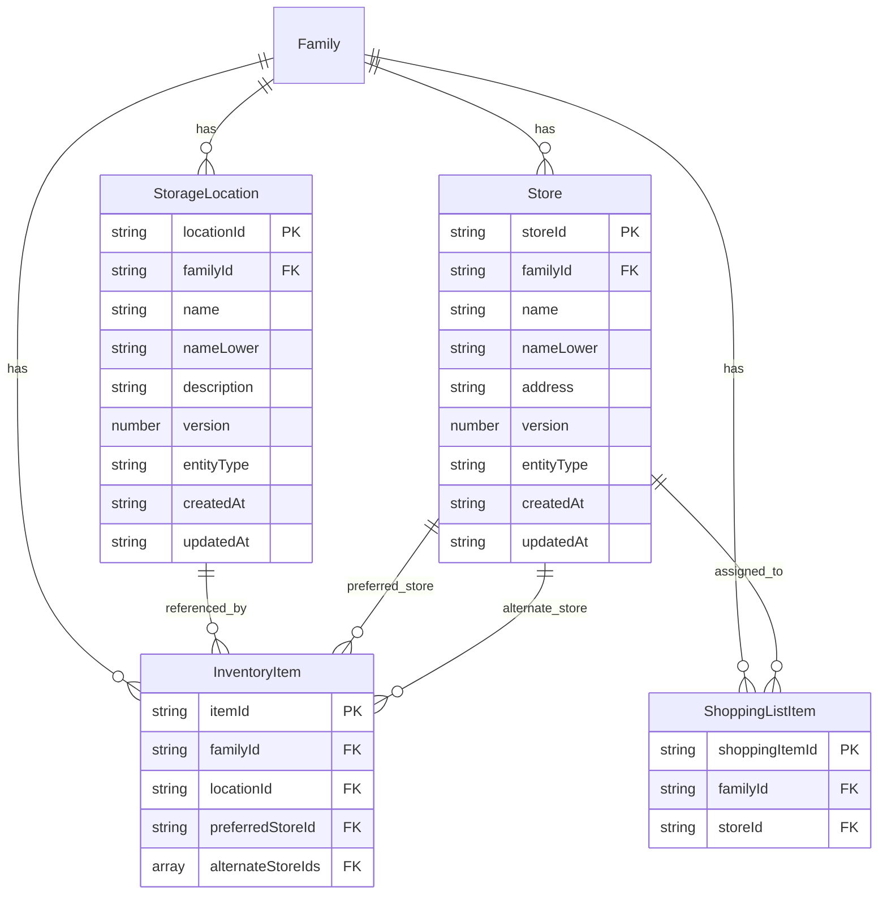

# Data Model: Reference Data Management

**Feature**: 005-reference-data  
**Date**: 2025-12-10  
**Database**: Amazon DynamoDB (Single-Table Design)  
**Parent Feature**: 001-family-inventory-mvp

## Overview

This document defines the data model extensions for the Reference Data Management feature. This feature extends the existing StorageLocation and Store entities from the parent feature with additional attributes for optimistic locking and case-insensitive uniqueness enforcement.

The entities continue to use the existing `InventoryManagement` table with the single-table design pattern established in 001-family-inventory-mvp.

---

## Table Structure

**Table Name**: `InventoryManagement` (shared with parent feature)

This feature uses the existing single-table design. No new tables or GSIs are required.

---

## Entity Extensions

### 1. StorageLocation (Extended)

A reference location where items are kept (e.g., pantry, garage, refrigerator). Defined per family.

**Access Patterns**:
- List all locations for a family
- Get location by ID
- Check name uniqueness (case-insensitive)
- Check references before deletion

**Key Structure**:
- PK: `FAMILY#{familyId}`
- SK: `LOCATION#{locationId}`

**Attributes**:
```typescript
{
  // Primary identifiers
  locationId: string;           // UUID v4
  familyId: string;             // UUID v4
  
  // Display attributes
  name: string;                 // Location name (1-50 chars, original casing)
  description: string | null;   // Optional description (0-200 chars)
  
  // NEW: Case-insensitive uniqueness (from research.md)
  nameLower: string;            // Lowercase normalized name for uniqueness checks
  
  // NEW: Optimistic locking (from research.md)
  version: number;              // Starting at 1, incremented on each update
  
  // Metadata
  entityType: 'StorageLocation';
  createdAt: string;            // ISO 8601 timestamp
  updatedAt: string;            // ISO 8601 timestamp
}
```

**Validation Rules**:
- `locationId`: UUID v4 format, required
- `familyId`: UUID v4 format, required
- `name`: 1-50 characters, required, unique per family (case-insensitive)
- `nameLower`: Lowercase version of `name`, auto-generated, used for uniqueness checks
- `description`: 0-200 characters, optional (null if not provided)
- `version`: Integer >= 1, auto-managed for optimistic locking
- Leading/trailing whitespace automatically trimmed from `name` and `description`

**Relationships**:
- Belongs to one Family
- Referenced by zero or more InventoryItems (via `locationId`)

**DynamoDB Example**:
```json
{
  "PK": "FAMILY#f47ac10b-58cc-4372-a567-0e02b2c3d479",
  "SK": "LOCATION#7c9e6679-7425-40de-944b-e07fc1f90ae7",
  "locationId": "7c9e6679-7425-40de-944b-e07fc1f90ae7",
  "familyId": "f47ac10b-58cc-4372-a567-0e02b2c3d479",
  "name": "Kitchen Pantry",
  "nameLower": "kitchen pantry",
  "description": "Main pantry cabinet in the kitchen",
  "version": 1,
  "entityType": "StorageLocation",
  "createdAt": "2025-12-10T10:00:00Z",
  "updatedAt": "2025-12-10T10:00:00Z"
}
```

---

### 2. Store (Extended)

A reference location where items can be purchased (e.g., grocery store, hardware store). Defined per family.

**Access Patterns**:
- List all stores for a family
- Get store by ID
- Check name uniqueness (case-insensitive)
- Check references before deletion (InventoryItems and ShoppingListItems)

**Key Structure**:
- PK: `FAMILY#{familyId}`
- SK: `STORE#{storeId}`

**Attributes**:
```typescript
{
  // Primary identifiers
  storeId: string;              // UUID v4
  familyId: string;             // UUID v4
  
  // Display attributes
  name: string;                 // Store name (1-100 chars, original casing)
  address: string | null;       // Optional address (0-200 chars)
  
  // NEW: Case-insensitive uniqueness (from research.md)
  nameLower: string;            // Lowercase normalized name for uniqueness checks
  
  // NEW: Optimistic locking (from research.md)
  version: number;              // Starting at 1, incremented on each update
  
  // Metadata
  entityType: 'Store';
  createdAt: string;            // ISO 8601 timestamp
  updatedAt: string;            // ISO 8601 timestamp
}
```

**Validation Rules**:
- `storeId`: UUID v4 format, required
- `familyId`: UUID v4 format, required
- `name`: 1-100 characters, required, unique per family (case-insensitive)
- `nameLower`: Lowercase version of `name`, auto-generated, used for uniqueness checks
- `address`: 0-200 characters, optional (null if not provided)
- `version`: Integer >= 1, auto-managed for optimistic locking
- Leading/trailing whitespace automatically trimmed from `name` and `address`

**Relationships**:
- Belongs to one Family
- Referenced by zero or more InventoryItems (via `preferredStoreId` or `alternateStoreIds`)
- Referenced by zero or more ShoppingListItems (via `storeId`)

**DynamoDB Example**:
```json
{
  "PK": "FAMILY#f47ac10b-58cc-4372-a567-0e02b2c3d479",
  "SK": "STORE#123e4567-e89b-12d3-a456-426614174000",
  "storeId": "123e4567-e89b-12d3-a456-426614174000",
  "familyId": "f47ac10b-58cc-4372-a567-0e02b2c3d479",
  "name": "Whole Foods Market",
  "nameLower": "whole foods market",
  "address": "123 Main St, Anytown, USA",
  "version": 2,
  "entityType": "Store",
  "createdAt": "2025-12-10T10:00:00Z",
  "updatedAt": "2025-12-10T14:30:00Z"
}
```

---

## TypeScript Interfaces

### StorageLocation Interface

```typescript
import { z } from 'zod';

// Validation schemas
export const StorageLocationNameSchema = z
  .string()
  .trim()
  .min(1, 'Name is required')
  .max(50, 'Name must be 50 characters or less');

export const StorageLocationDescriptionSchema = z
  .string()
  .trim()
  .max(200, 'Description must be 200 characters or less')
  .optional()
  .nullable()
  .transform(val => val || null);

// Full entity schema
export const StorageLocationSchema = z.object({
  locationId: z.string().uuid(),
  familyId: z.string().uuid(),
  name: StorageLocationNameSchema,
  nameLower: z.string().min(1).max(50),
  description: z.string().max(200).nullable(),
  version: z.number().int().min(1),
  entityType: z.literal('StorageLocation'),
  createdAt: z.string().datetime(),
  updatedAt: z.string().datetime(),
});

export type StorageLocation = z.infer<typeof StorageLocationSchema>;

// Create request schema
export const CreateStorageLocationSchema = z.object({
  name: StorageLocationNameSchema,
  description: StorageLocationDescriptionSchema,
});

export type CreateStorageLocationRequest = z.infer<typeof CreateStorageLocationSchema>;

// Update request schema
export const UpdateStorageLocationSchema = z.object({
  name: StorageLocationNameSchema,
  description: StorageLocationDescriptionSchema,
  version: z.number().int().min(1), // Required for optimistic locking
});

export type UpdateStorageLocationRequest = z.infer<typeof UpdateStorageLocationSchema>;
```

### Store Interface

```typescript
import { z } from 'zod';

// Validation schemas
export const StoreNameSchema = z
  .string()
  .trim()
  .min(1, 'Name is required')
  .max(100, 'Name must be 100 characters or less');

export const StoreAddressSchema = z
  .string()
  .trim()
  .max(200, 'Address must be 200 characters or less')
  .optional()
  .nullable()
  .transform(val => val || null);

// Full entity schema
export const StoreSchema = z.object({
  storeId: z.string().uuid(),
  familyId: z.string().uuid(),
  name: StoreNameSchema,
  nameLower: z.string().min(1).max(100),
  address: z.string().max(200).nullable(),
  version: z.number().int().min(1),
  entityType: z.literal('Store'),
  createdAt: z.string().datetime(),
  updatedAt: z.string().datetime(),
});

export type Store = z.infer<typeof StoreSchema>;

// Create request schema
export const CreateStoreSchema = z.object({
  name: StoreNameSchema,
  address: StoreAddressSchema,
});

export type CreateStoreRequest = z.infer<typeof CreateStoreSchema>;

// Update request schema
export const UpdateStoreSchema = z.object({
  name: StoreNameSchema,
  address: StoreAddressSchema,
  version: z.number().int().min(1), // Required for optimistic locking
});

export type UpdateStoreRequest = z.infer<typeof UpdateStoreSchema>;
```

---

## Access Patterns Summary

| Access Pattern | Query Type | Keys Used | Notes |
|----------------|-----------|-----------|-------|
| List all storage locations for family | Query | PK = `FAMILY#{familyId}`, SK begins_with `LOCATION#` | Returns all locations |
| Get storage location by ID | GetItem | PK = `FAMILY#{familyId}`, SK = `LOCATION#{locationId}` | Single item lookup |
| Check location references | Query + Filter | PK = `FAMILY#{familyId}`, SK begins_with `ITEM#`, Filter: `locationId = :locationId` | Before deletion |
| List all stores for family | Query | PK = `FAMILY#{familyId}`, SK begins_with `STORE#` | Returns all stores |
| Get store by ID | GetItem | PK = `FAMILY#{familyId}`, SK = `STORE#{storeId}` | Single item lookup |
| Check store references (inventory) | Query + Filter | PK = `FAMILY#{familyId}`, SK begins_with `ITEM#`, Filter: `preferredStoreId = :storeId OR contains(alternateStoreIds, :storeId)` | Before deletion |
| Check store references (shopping) | Query + Filter | PK = `FAMILY#{familyId}`, SK begins_with `SHOPPING#`, Filter: `storeId = :storeId` | Before deletion |

---

## DynamoDB Operations

### Create StorageLocation

```typescript
import { PutCommand, QueryCommand } from '@aws-sdk/lib-dynamodb';
import { v4 as uuidv4 } from 'uuid';

async function createStorageLocation(
  familyId: string,
  name: string,
  description: string | null
): Promise<StorageLocation> {
  const trimmedName = name.trim();
  const nameLower = trimmedName.toLowerCase();
  const locationId = uuidv4();
  const now = new Date().toISOString();

  // Check for existing location with same normalized name
  const existing = await docClient.send(new QueryCommand({
    TableName: 'InventoryManagement',
    KeyConditionExpression: 'PK = :pk AND begins_with(SK, :skPrefix)',
    FilterExpression: 'nameLower = :nameLower',
    ExpressionAttributeValues: {
      ':pk': `FAMILY#${familyId}`,
      ':skPrefix': 'LOCATION#',
      ':nameLower': nameLower
    },
    Limit: 1,
    ProjectionExpression: 'locationId, #name',
    ExpressionAttributeNames: { '#name': 'name' }
  }));

  if ((existing.Items?.length ?? 0) > 0) {
    throw new DuplicateNameError(
      `A storage location named "${existing.Items![0].name}" already exists`
    );
  }

  // Create the new location
  const item: StorageLocation = {
    locationId,
    familyId,
    name: trimmedName,
    nameLower,
    description: description?.trim() || null,
    version: 1,
    entityType: 'StorageLocation',
    createdAt: now,
    updatedAt: now
  };

  await docClient.send(new PutCommand({
    TableName: 'InventoryManagement',
    Item: {
      PK: `FAMILY#${familyId}`,
      SK: `LOCATION#${locationId}`,
      ...item
    },
    ConditionExpression: 'attribute_not_exists(PK)'
  }));

  return item;
}
```

### Update StorageLocation with Optimistic Locking

```typescript
import { UpdateCommand } from '@aws-sdk/lib-dynamodb';

async function updateStorageLocation(
  familyId: string,
  locationId: string,
  name: string,
  description: string | null,
  expectedVersion: number
): Promise<StorageLocation> {
  const trimmedName = name.trim();
  const nameLower = trimmedName.toLowerCase();
  const now = new Date().toISOString();

  // Check for existing location with same normalized name (excluding self)
  const existing = await docClient.send(new QueryCommand({
    TableName: 'InventoryManagement',
    KeyConditionExpression: 'PK = :pk AND begins_with(SK, :skPrefix)',
    FilterExpression: 'nameLower = :nameLower AND locationId <> :selfId',
    ExpressionAttributeValues: {
      ':pk': `FAMILY#${familyId}`,
      ':skPrefix': 'LOCATION#',
      ':nameLower': nameLower,
      ':selfId': locationId
    },
    Limit: 1
  }));

  if ((existing.Items?.length ?? 0) > 0) {
    throw new DuplicateNameError(
      `A storage location named "${existing.Items![0].name}" already exists`
    );
  }

  // Update with optimistic locking
  const result = await docClient.send(new UpdateCommand({
    TableName: 'InventoryManagement',
    Key: {
      PK: `FAMILY#${familyId}`,
      SK: `LOCATION#${locationId}`
    },
    UpdateExpression: 'SET #name = :name, nameLower = :nameLower, description = :description, #version = #version + :one, updatedAt = :now',
    ConditionExpression: '#version = :expectedVersion',
    ExpressionAttributeNames: {
      '#name': 'name',
      '#version': 'version'
    },
    ExpressionAttributeValues: {
      ':name': trimmedName,
      ':nameLower': nameLower,
      ':description': description?.trim() || null,
      ':one': 1,
      ':expectedVersion': expectedVersion,
      ':now': now
    },
    ReturnValues: 'ALL_NEW'
  }));

  return result.Attributes as StorageLocation;
}
```

### Check References Before Deletion

```typescript
interface ReferenceInfo {
  itemId: string;
  name: string;
}

async function hasLocationReferences(
  familyId: string,
  locationId: string
): Promise<boolean> {
  const result = await docClient.send(new QueryCommand({
    TableName: 'InventoryManagement',
    KeyConditionExpression: 'PK = :pk AND begins_with(SK, :skPrefix)',
    FilterExpression: 'locationId = :locationId',
    ExpressionAttributeValues: {
      ':pk': `FAMILY#${familyId}`,
      ':skPrefix': 'ITEM#',
      ':locationId': locationId
    },
    Limit: 1,
    ProjectionExpression: 'itemId'
  }));

  return (result.Items?.length ?? 0) > 0;
}

async function getLocationReferences(
  familyId: string,
  locationId: string
): Promise<ReferenceInfo[]> {
  const result = await docClient.send(new QueryCommand({
    TableName: 'InventoryManagement',
    KeyConditionExpression: 'PK = :pk AND begins_with(SK, :skPrefix)',
    FilterExpression: 'locationId = :locationId',
    ExpressionAttributeValues: {
      ':pk': `FAMILY#${familyId}`,
      ':skPrefix': 'ITEM#',
      ':locationId': locationId
    },
    ProjectionExpression: 'itemId, #name',
    ExpressionAttributeNames: { '#name': 'name' },
    Limit: 50
  }));

  return result.Items?.map(item => ({
    itemId: item.itemId,
    name: item.name
  })) ?? [];
}

async function hasStoreReferences(
  familyId: string,
  storeId: string
): Promise<boolean> {
  // Check InventoryItems
  const inventoryResult = await docClient.send(new QueryCommand({
    TableName: 'InventoryManagement',
    KeyConditionExpression: 'PK = :pk AND begins_with(SK, :skPrefix)',
    FilterExpression: 'preferredStoreId = :storeId OR contains(alternateStoreIds, :storeId)',
    ExpressionAttributeValues: {
      ':pk': `FAMILY#${familyId}`,
      ':skPrefix': 'ITEM#',
      ':storeId': storeId
    },
    Limit: 1,
    ProjectionExpression: 'itemId'
  }));

  if ((inventoryResult.Items?.length ?? 0) > 0) return true;

  // Check ShoppingListItems
  const shoppingResult = await docClient.send(new QueryCommand({
    TableName: 'InventoryManagement',
    KeyConditionExpression: 'PK = :pk AND begins_with(SK, :skPrefix)',
    FilterExpression: 'storeId = :storeId',
    ExpressionAttributeValues: {
      ':pk': `FAMILY#${familyId}`,
      ':skPrefix': 'SHOPPING#',
      ':storeId': storeId
    },
    Limit: 1,
    ProjectionExpression: 'shoppingItemId'
  }));

  return (shoppingResult.Items?.length ?? 0) > 0;
}
```

### Delete with Reference Check

```typescript
import { DeleteCommand } from '@aws-sdk/lib-dynamodb';

async function deleteStorageLocation(
  familyId: string,
  locationId: string
): Promise<void> {
  // Check for references first
  if (await hasLocationReferences(familyId, locationId)) {
    const references = await getLocationReferences(familyId, locationId);
    throw new ReferenceExistsError(
      'Cannot delete storage location that is referenced by inventory items',
      references
    );
  }

  await docClient.send(new DeleteCommand({
    TableName: 'InventoryManagement',
    Key: {
      PK: `FAMILY#${familyId}`,
      SK: `LOCATION#${locationId}`
    },
    ConditionExpression: 'attribute_exists(PK)'
  }));
}
```

---

## Relationships Diagram



---

## Data Integrity Rules

### Uniqueness Enforcement
- Storage location names MUST be unique per family (case-insensitive)
- Store names MUST be unique per family (case-insensitive)
- Uniqueness is enforced via `nameLower` attribute and Query + Filter before create/update

### Referential Integrity
- StorageLocation CANNOT be deleted if referenced by any InventoryItem
- Store CANNOT be deleted if referenced by any InventoryItem or ShoppingListItem
- Reference checks use efficient Query operations with Limit: 1 for existence checks

### Optimistic Locking
- All updates MUST include the expected `version` number
- Updates fail with `ConditionalCheckFailedException` if version mismatch
- Client receives HTTP 409 Conflict with current entity state for retry

### Whitespace Handling
- Leading/trailing whitespace is trimmed from `name`, `description`, and `address`
- Trimming occurs on both client-side (UX) and server-side (security)
- Empty strings after trimming are converted to null for optional fields

---

## Error Types

```typescript
export class DuplicateNameError extends Error {
  constructor(message: string) {
    super(message);
    this.name = 'DuplicateNameError';
  }
}

export class ReferenceExistsError extends Error {
  public readonly references: ReferenceInfo[];
  
  constructor(message: string, references: ReferenceInfo[]) {
    super(message);
    this.name = 'ReferenceExistsError';
    this.references = references;
  }
}

export class VersionConflictError extends Error {
  public readonly currentVersion: number;
  public readonly currentEntity: StorageLocation | Store;
  
  constructor(
    message: string,
    currentVersion: number,
    currentEntity: StorageLocation | Store
  ) {
    super(message);
    this.name = 'VersionConflictError';
    this.currentVersion = currentVersion;
    this.currentEntity = currentEntity;
  }
}
```

---

## Migration Notes

### Existing Data
Existing StorageLocation and Store entities from 001-family-inventory-mvp need to be migrated to include the new attributes:

1. **Add `nameLower`**: Set to lowercase version of existing `name`
2. **Add `version`**: Set to 1 for all existing entities

### Migration Script Pattern
```typescript
async function migrateReferenceData(familyId: string): Promise<void> {
  // Migrate StorageLocations
  const locations = await docClient.send(new QueryCommand({
    TableName: 'InventoryManagement',
    KeyConditionExpression: 'PK = :pk AND begins_with(SK, :skPrefix)',
    ExpressionAttributeValues: {
      ':pk': `FAMILY#${familyId}`,
      ':skPrefix': 'LOCATION#'
    }
  }));

  for (const location of locations.Items ?? []) {
    if (!location.nameLower || !location.version) {
      await docClient.send(new UpdateCommand({
        TableName: 'InventoryManagement',
        Key: { PK: location.PK, SK: location.SK },
        UpdateExpression: 'SET nameLower = :nameLower, #version = :version',
        ExpressionAttributeNames: { '#version': 'version' },
        ExpressionAttributeValues: {
          ':nameLower': location.name.toLowerCase(),
          ':version': 1
        }
      }));
    }
  }

  // Similar migration for Stores...
}
```

---

**Data Model Complete**: 2025-12-10  
**Status**: Ready for API contract generation